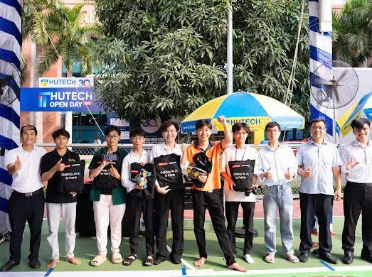

# 🏆 Thành tích

Dưới đây là những thành tích nổi bật mà mình đã đạt được.

---

## 🎓 Thành tích học tập

### 🌟 Sinh viên tiêu biểu

**Đại học Công nghệ Thành phố Hồ Chí Minh - HUTECH**

📅 **Các năm học**

Được vinh danh là **Sinh viên tiêu biểu** các năm học liên tục nhờ thành tích học tập xuất sắc, hoạt động ngoại khóa tích cực và đóng góp cho cộng đồng sinh viên.

**Tiêu chí đạt được:**
- ✅ GPA >= 3.5/4.0
- ✅ Tham gia tích cực các hoạt động ngoại khóa
- ✅ Có dự án nghiên cứu hoặc sáng tạo nổi bật
- ✅ Có tinh thần hỗ trợ và chia sẻ với cộng đồng

---

### ⭐ Sinh viên 5 tốt

**Đại học Công nghệ Thành phố Hồ Chí Minh - HUTECH**

📅 **Năm 2023, 2024**

Đạt danh hiệu **Sinh viên 5 tốt** với 5 tiêu chí:

1. **Đạo đức tốt:** Có lối sống lành mạnh, gương mẫu
2. **Học tập tốt:** Kết quả học tập xuất sắc (GPA >= 3.5)
3. **Thể lực tốt:** Tham gia thể thao, rèn luyện sức khỏe
4. **Tình nguyện tốt:** Tích cực tham gia hoạt động xã hội
5. **Hội nhập tốt:** Kỹ năng mềm, làm việc nhóm hiệu quả

---

## 🏅 Giải thưởng cuộc thi

### 🥇 Vô địch HUTECH Class Race



📅 **Năm học 2023-2024**  
🏫 **Đại học Công nghệ TP.HCM - HUTECH**

**Thành tích:**
- 🏆 **Giải Nhất** cuộc thi HUTECH Class Race
- Vượt qua nhiều đội thi xuất sắc trong trường
- Thể hiện tinh thần đồng đội và kỹ năng giải quyết vấn đề

**Ý nghĩa:**
Cuộc thi này không chỉ kiểm tra kiến thức chuyên môn mà còn rèn luyện kỹ năng làm việc nhóm, tư duy logic và khả năng thuyết trình trước đám đông.

---

## 📊 Tóm tắt

```
Sinh viên tiêu biểu:    Nhiều năm
Sinh viên 5 tốt:        2023, 2024
Giải thưởng cuộc thi:   1 (Vô địch)
GPA hiện tại:           3.55/4.0
```


   