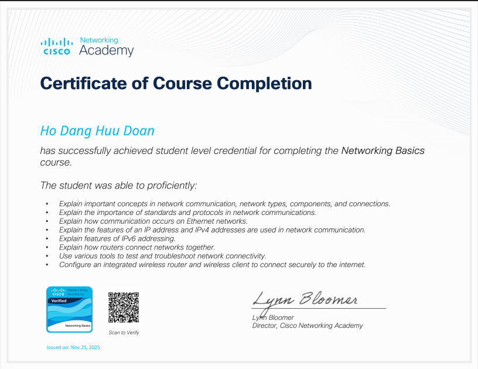
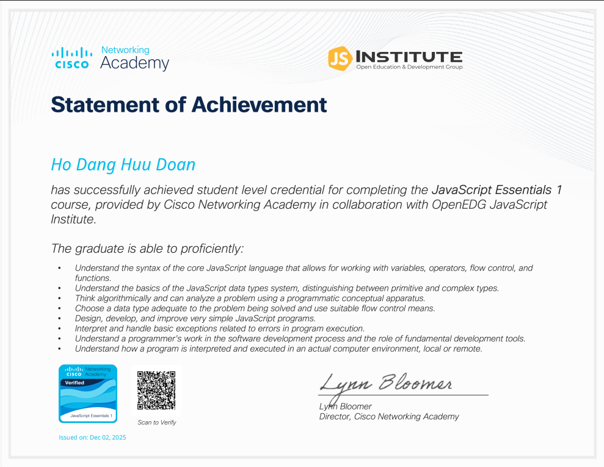
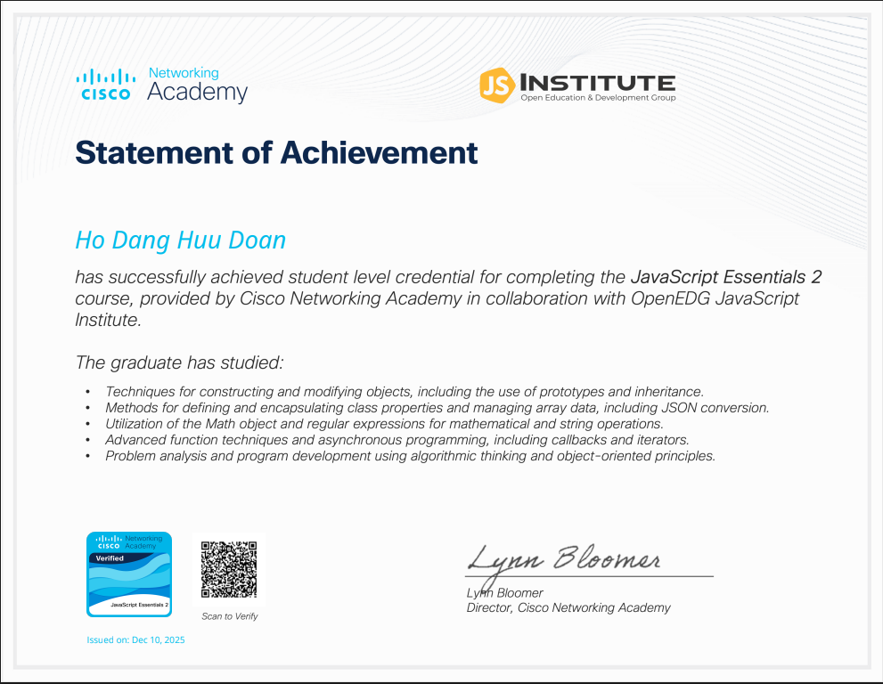

# 🏆 Chứng chỉ

Dưới đây là các chứng chỉ mà mình đã đạt được trong hành trình học tập.

---

## 📜 Chứng chỉ Cisco Networking Academy

### **Networking Basics**



📅 **Ngày cấp:** 25/11/2025  
🏫 **Tổ chức:** Cisco Networking Academy  
🔗 **Verify:** [Cisco Verification](https://www.netacad.com/portal/verify)

**Nội dung đã học:**
- Các khái niệm quan trọng trong giao tiếp mạng, các loại mạng, thành phần và kết nối
- Giải thích tầm quan trọng của các tiêu chuẩn và giao thức trong giao tiếp mạng
- Giải thích cách giao tiếp xảy ra trên mạng Ethernet
- Giải thích các tính năng của địa chỉ IP và cách địa chỉ IPv4 được sử dụng trong giao tiếp mạng
- Giải thích các tính năng của địa chỉ IPv6
- Giải thích cách bộ định tuyến kết nối các mạng với nhau
- Sử dụng các công cụ khác nhau để kiểm tra và khắc phục sự cố kết nối mạng
- Cấu hình bộ định tuyến không dây tích hợp và máy khách không dây để kết nối an toàn với Internet

---

### **JavaScript Essentials 1**



📅 **Ngày cấp:** 06/12/2025  
🏫 **Tổ chức:** Cisco Networking Academy in collaboration with OpenEDG JavaScript Institute  
🔗 **Verify:** [Cisco Verification](https://www.netacad.com/portal/verify)

**Nội dung đã học:**
- Hiểu cú pháp của ngôn ngữ JavaScript cốt lõi cho phép làm việc với biến, toán tử, điều khiển luồng và hàm
- Hiểu kiến thức cơ bản về hệ thống kiểu dữ liệu JavaScript, phân biệt giữa kiểu nguyên thủy và phức tạp
- Suy nghĩ thuật toán và có thể phân tích vấn đề bằng cách sử dụng khái niệm lập trình
- Chọn một kiểu dữ liệu phù hợp với vấn đề đang được giải quyết và sử dụng phương tiện điều khiển luồng phù hợp
- Viết các chương trình đơn giản để tương tác với người dùng và phản hồi các sự kiện trong trang web
- Diễn giải và xử lý các ngoại lệ cơ bản liên quan đến lỗi trong thực thi chương trình
- Hiểu quy trình làm việc của lập trình viên trong quy trình phát triển phần mềm và vai trò của các công cụ phát triển cơ bản
- Hiểu cách một chương trình được diễn giải và thực thi trong môi trường máy tính thực tế, cục bộ hoặc từ xa

---

### **JavaScript Essentials 2**



📅 **Ngày cấp:** 16/12/2025  
🏫 **Tổ chức:** Cisco Networking Academy in collaboration with OpenEDG JavaScript Institute  
🔗 **Verify:** [Cisco Verification](https://www.netacad.com/portal/verify)

**Nội dung đã học:**
- Kỹ thuật xây dựng và sửa đổi các đối tượng, bao gồm việc sử dụng prototypes và kế thừa
- Phương pháp để định nghĩa và đóng gói các thuộc tính của lớp và quản lý dữ liệu mảng, bao gồm chuyển đổi JSON
- Sử dụng đối tượng Math và biểu thức chính quy cho các phép toán toán học và chuỗi
- Kỹ thuật hàm nâng cao và lập trình không đồng bộ, bao gồm callbacks và iterators
- Phân tích vấn đề và phát triển chương trình sử dụng tư duy thuật toán và các nguyên tắc hướng đối tượng

---

## 📊 Tóm tắt

```
Tổng số chứng chỉ:     3
Networking:            1  
Programming:           2
Năm 2025:              3
```

---

