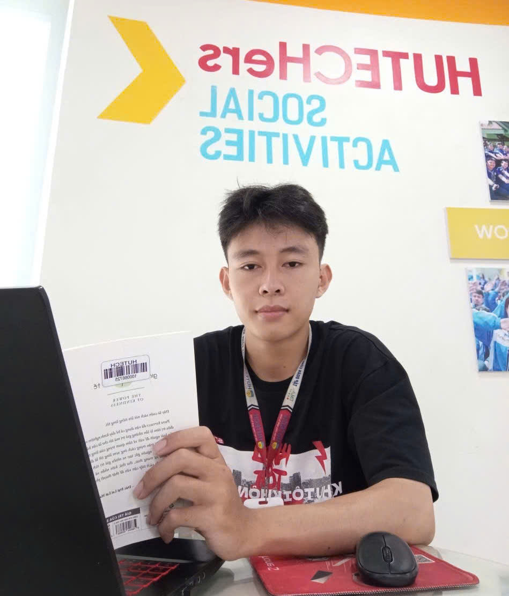

# 👨‍💻 Giới thiệu về mình


*Hữu Đặng Hữu Đoan - Sinh viên CNTT đam mê AIoT*

## Xin chào! Mình là Hữu Đặng Hữu Đoan 👋

Mình hiện tại là **sinh viên năm 4 ngành Công nghệ Thông tin**, chuyên ngành **Máy học và Ứng dụng**. Mình có đam mê lớn trong việc xây dựng các **hệ thống nhúng, IoT** và **kết hợp phần cứng với AI** để tạo ra những sản phẩm thông minh, hữu ích cho cuộc sống.

---

## 🎓 Học vấn

**🏫 Đại học Công nghệ Thành phố Hồ Chí Minh - HUTECH**
- Chuyên ngành: **Máy học và Ứng dụng**
- Năm học: **Năm 4**
- GPA: **3.55/4.0**

**🏆 Thành tích sinh viên:**
- 🌟 **Sinh viên tiêu biểu** các năm học
- ⭐ **Sinh viên 5 tốt** năm 2023, 2024

---

## 💼 Kinh nghiệm làm việc

### **Thực tập sinh - Công ty Điện lực Thủ Đức**
📅 *23/12/2024 - 23/06/2025*

**Dự án: Cánh tay Robot vệ sinh trụ điện**

**Công việc thực hiện:**
- 🔧 Thiết kế cơ cấu cánh tay robot
- ⚡ Triển khai phần cứng (mạch điều khiển, động cơ, cảm biến)
- 💻 Lập trình ESP32 để điều khiển cánh tay robot
- 🤖 Gán nhãn dữ liệu và train AI model chạy trên Raspberry Pi
- 📊 Tối ưu hóa thuật toán để robot tự động nhận diện và vệ sinh trụ điện

**Thành tích:**
- ✅ Hoàn thành prototype robot với độ chính xác 85%
- ✅ Giảm 40% thời gian vệ sinh so với phương pháp thủ công


---

### **Kỹ thuật viên - Lắp đặt hệ thống điện và camera**
📅 *21/08/2025 - 14/09/2025*

**Công việc:**
- ⚡ Lắp đặt hệ thống điện cho công trình đang xây dựng
- 📹 Triển khai hệ thống camera giám sát
- 🔌 Đấu nối và kiểm tra an toàn hệ thống
- 📋 Lập sơ đồ mạch điện và hệ thống camera

---

## 🛠 Kỹ năng

### **Ngôn ngữ lập trình**
```
C/C++        ████████████████░░ 85%
Python       ███████████████░░░ 80%
Dart         ████████████░░░░░░ 65%
```

### **Các ngôn ngữ khác đã từng học**
- C#
- PHP
- Java
- html,css,javascript
### **Điện tử cơ bản**
- ✅ Nắm vững các linh kiện điện tử cơ bản
- ✅ Đọc và vẽ sơ đồ mạch điện
- ✅ Sử dụng thành thạo đồng hồ vạn năng, oscilloscope
- ✅ Hàn mạch through-hole và SMD cơ bản

### **Embedded Systems**
- **MCU/SoC:** ESP32, ESP8266, STM32, Arduino, Raspberry Pi
- **RTOS:** FreeRTOS, Zephyr
- **Giao thức:** UART, I2C, SPI, CAN, MQTT, HTTP, WebSocket, UDP
- **Tools:** PlatformIO, ESP-IDF, STM32CubeIDE, Arduino IDE, Keil C

### **AI & Computer Vision**
- **Frameworks:** TensorFlow, PyTorch, OpenCV, Ultralytics
- **Models:** YOLO (v5, v8, v10), MobileNet, EfficientNet
- **Edge AI:** TensorFlow Lite, ONNX Runtime, Edge Impulse

### **DevOps & Tools**
- Git, GitHub
- Google Colab (cho training AI models)
- VS Code, Jupyter Notebook

### **Hệ điều hành**
- **Linux:** Ubuntu, Raspberry Pi OS
- **Windows:** Windows 10/11
- **Kinh nghiệm:** Quản trị hệ thống Linux cơ bản, Shell scripting, SSH

---

## 🌟 Tính cách & Thái độ làm việc

### Cách nhìn nhận cuộc sống
> "Mặc định mình luôn có cách nhìn vui vẻ, thư thái trong cuộc sống... trừ lúc nó ảnh hưởng tới công việc."

### Phong cách làm việc
- 😊 **Tích cực:** Luôn lạc quan và nhiệt huyết với công việc
- 🧘 **Bình tĩnh:** Giữ được sự điềm tĩnh trong mọi tình huống
- 🔥 **Cầu toàn:** Tự giận bản thân cho đến khi công việc được xử lý tốt đẹp
- 🎯 **Tập trung:** Không bỏ qua chi tiết nhỏ trong dự án
- 🤝 **Teamwork:** Làm việc nhóm hiệu quả, sẵn sàng chia sẻ kiến thức
- 🐺 **Sigma:** Một người chạy theo tính cách Sigma

---

## 🎯 Mục tiêu nghề nghiệp

**Ngắn hạn (2025-2026):**
- Hoàn thành xuất sắc chương trình đại học
- Nâng cao kỹ năng về **Edge AI** và **TinyML**
- Tham gia các cuộc thi về IoT và AI
- Xây dựng 3-5 dự án cá nhân có giá trị

**Dài hạn (2027+):**
- Trở thành **Embedded AI Engineer** chuyên nghiệp
- Đóng góp cho các dự án Smart City
- Xây dựng startup về AIoT solutions
- Chia sẻ kiến thức qua blog và cộng đồng

---

## 📚 Sở thích

- 🤖 Nghiên cứu công nghệ mới về AI và IoT
- 🔧 Làm các dự án DIY với Arduino, ESP32
- 📖 Đọc sách về công nghệ và tự động hóa
- 🎮 Chơi game chiến thuật (thư giãn sau giờ làm việc)
- ✍️ Viết blog chia sẻ kiến thức kỹ thuật

### **Giải trí**
- Câu cá
- Chạy bộ
- Gym
- Bóng đá
- Nấu ăn
- Tụ tập bạn bè

---

## 💬 Quote yêu thích

> "Công nghệ không phải để thay thế con người, mà để giúp con người sống tốt hơn."

> "Một người thiếu giá trị là một người hứa nhiều, thay vào đó hãy chứng minh bằng hành động"

> "Nơi nào có ý chí, nơi đó có con đường"

---

Cảm ơn bạn đã ghé thăm! Nếu có câu hỏi hoặc muốn hợp tác dự án, đừng ngại liên hệ mình nhé! 
