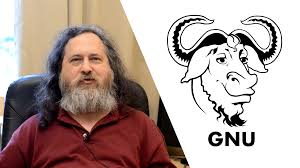
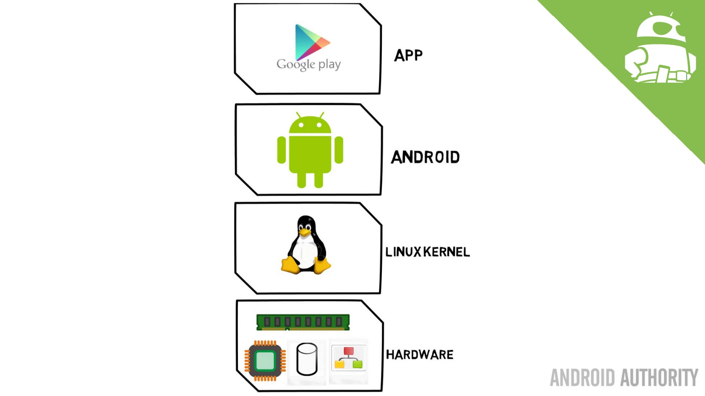
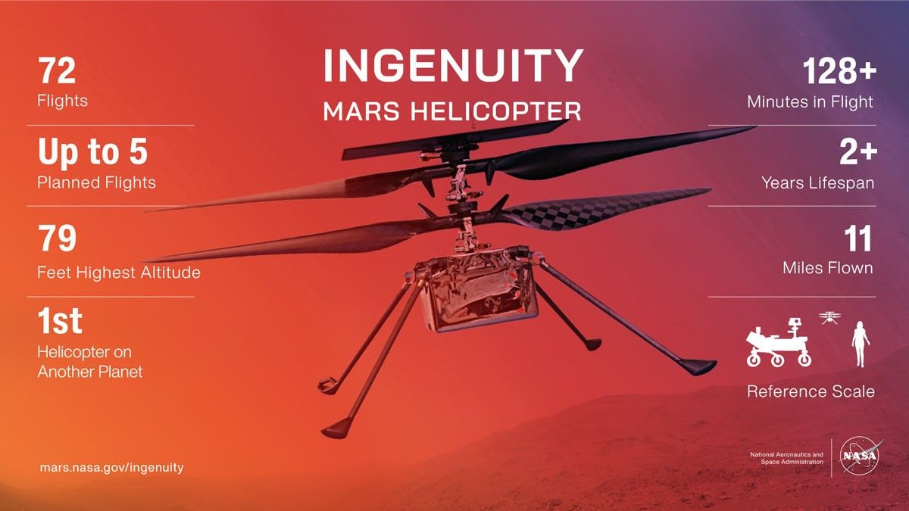

# Huyền Thoại GNU/Linux: Từ Căn Phòng Lạnh Lẽo Đến Kẻ Thống Trị Hành Tinh (Và Cả Sao Hỏa)

<!-- HERO IMAGE: Linux và Linus Torvalds -->

*🖼️ Tìm kiếm: "Linus Torvalds Linux creator" - Cha đẻ của Linux kernel*

{{youtube:ShcR4Zfc6Dw|History of Linux}}

*🎥 Video: "History of Linux" - Hành trình từ dự án sinh viên đến thống trị thế giới*

> **"Linux là minh chứng cho thấy sự chia sẻ kiến thức có thể đánh bại những thế lực độc quyền mạnh nhất thế giới."**

Nếu quay ngược thời gian về năm 1991, tại một căn phòng nhỏ ở Helsinki (Phần Lan), không ai dám tin rằng chàng sinh viên 21 tuổi gầy gò **Linus Torvalds** lại đang gõ những dòng code sẽ thay đổi vận mệnh nhân loại.

Lúc đó, thế giới công nghệ bị chia làm hai cực: Một bên là **Microsoft** hào nhoáng và độc quyền trên máy tính cá nhân. Một bên là **Unix** mạnh mẽ nhưng đắt đỏ và già cỗi trong các tập đoàn lớn. Linus chỉ là một hạt cát. Nhưng hạt cát ấy đã tạo nên một cơn bão.

---

## 1. Sự Thật Về Lịch Sử: Khi "Động Cơ" Tìm Thấy "Chiếc Xe"

Chúng ta hay gọi tắt là "Linux" và tôn sùng Linus Torvalds. Nhưng nếu chỉ có mình Linus, cái mà chúng ta có hôm nay chỉ là một đống code vô tri chứ không phải một hệ điều hành. Để hiểu đúng, chúng ta cần công bằng với lịch sử:

### 🚗 Linus Torvalds và "Cái Động Cơ" (Kernel)

<!-- IMAGE: Linux Kernel Architecture -->

*🖼️ Tìm kiếm: "Linux kernel architecture diagram" - Kiến trúc nhân Linux*

Linus tạo ra cái **Nhân (Kernel)**. Nó giống như động cơ của một chiếc siêu xe: 
- 💪 Cực khỏe, biết cách bơm xăng (quản lý RAM)
- ⚙️ Biết cách quay trục máy (quản lý CPU) 
- 🔌 Nói chuyện trực tiếp với phần cứng

Nhưng, một cái động cơ vứt chỏng chơ giữa nhà thì không ai lái đi đâu được.

### 🛠️ Richard Stallman, Dự án GNU và "Chiếc Khung Xe"

<!-- IMAGE: Richard Stallman -->

*🖼️ Tìm kiếm: "Richard Stallman GNU project" - Cha đẻ của Free Software*

Trước Linus cả chục năm, **Richard Stallman** và cộng đồng **GNU** đã kỳ công xây dựng hàng loạt công cụ thiết yếu:
- 🔧 Trình biên dịch (GCC)
- 💻 Giao diện dòng lệnh (Bash Shell)
- 📝 Các công cụ text processing

Đây chính là khung xe, bánh xe và hệ thống lái. Nhưng trớ trêu thay, họ lại thiếu một cái động cơ đủ tốt.

### 💥 Cú Bắt Tay Định Mệnh

Điều kỳ diệu xảy ra khi Linus lắp "động cơ" của mình vào "khung xe" của GNU. 

**Bùm!** 🚀 Một chiếc xe hoàn chỉnh ra đời. 

> **Bài học:** Đó là lý do cái tên chính xác về mặt kỹ thuật phải là **GNU/Linux**. Đừng quên công lao của những người làm "chiếc khung xe".

---

## 2. Cuộc "Xâm Lăng" Thầm Lặng Của Thế Giới Mở

Điều thú vị nhất về chiến thắng của Linux là nó không xảy ra bằng một sự kiện ồn ào như ra mắt iPhone. Nó diễn ra như một cơn sóng ngầm, thấm vào mọi ngóc ngách của cuộc sống.

### 🏛️ Thế Giới "Bazaar" (Cái Chợ) thắng "Cathedral" (Nhà Thờ)

**Mô hình Cathedral (Nhà Thờ) - Kiểu Cũ:**
- 🔒 Microsoft, Apple giữ code kín mít
- 👔 Chỉ có nhân viên nội bộ được sờ vào code
- 🐌 Phát triển chậm vì phụ thuộc vào một nhóm nhỏ

**Mô hình Bazaar (Cái Chợ) - Linux:**
- 📖 Phơi bày mã nguồn ra cho cả thế giới
- 🌍 Hàng ngàn lập trình viên từ khắp nơi nhảy vào:
  - Người vá lỗi
  - Người viết driver
  - Các ông lớn như Google, Intel, IBM góp công
- 🚀 Kết quả: Một hệ thống tiến hóa với tốc độ tên lửa

> **Quan điểm:** Mô hình mở không phải là lãng mạn hay "cộng sản hóa". Đó là **chiến lược thông minh nhất** để tận dụng trí tuệ tập thể toàn cầu.

### 🤝 Kẻ Thù Cũng Phải Cúi Đầu

**Năm 2001:** 
> *"Linux is a cancer"* - Steve Ballmer (CEO Microsoft)

**Năm 2020:** 
> *"Microsoft ❤️ Linux"* - Satya Nadella (CEO Microsoft)

**Điều gì đã xảy ra?**
- ✅ Microsoft tích hợp Linux vào Windows (WSL - Windows Subsystem for Linux)
- ✅ Microsoft trở thành nhà tài trợ lớn cho Linux Foundation
- ✅ Azure (nền tảng cloud của Microsoft) chạy hàng triệu máy ảo Linux

> **Bài học:** Khi sức mạnh của cộng đồng mở quá lớn, ngay cả kẻ thù cũng phải đầu hàng và hợp tác.

---

## 3. Kẻ Thống Trị Từ Túi Quần Đến Vũ Trụ

Hiện tại, Linux không chỉ là một hệ điều hành. Nó là **khí oxy** của thế giới công nghệ:

### 📱 Trong túi quần bạn

<!-- IMAGE: Android Linux -->

*🖼️ Tìm kiếm: "Android Linux kernel" - Android chạy trên nhân Linux*

**Android** được xây dựng trên nhân Linux. 
- 📊 Hơn **3 tỷ thiết bị Android** đang hoạt động
- 🌍 Chiếm **70% thị phần smartphone** toàn cầu

### 🌐 Bộ não Internet

**Cloud & Data Centers:**
- 🔍 Mọi tìm kiếm Google → Server chạy Linux
- 📹 Mọi video TikTok, YouTube bạn lướt → Linux
- ☁️ AWS, Google Cloud, Azure → Phần lớn chạy Linux
- 💻 **100% siêu máy tính mạnh nhất thế giới chạy Linux**

**Con số choáng ngợp:**
- 90% cơ sở hạ tầng cloud chạy Linux
- 96% máy chủ web hàng đầu dùng Linux

### 🚀 Ngoài vũ trụ

<!-- IMAGE: Mars Ingenuity Helicopter -->

*🖼️ Tìm kiếm: "NASA Ingenuity helicopter Mars Linux" - Trực thăng sao Hỏa chạy Linux*

{{youtube:GhsZUZmJvaM|NASA Ingenuity Linux}}

*🎥 Video: "Linux on Mars - Ingenuity Helicopter" - Linux bay trên sao Hỏa*

**NASA và Linux trên Sao Hỏa:**

Khi NASA gửi trực thăng **Ingenuity** lên Sao Hỏa (2021):
- 🚁 Hệ điều hành điều khiển bay: **Linux**
- 🛰️ Framework: **F Prime** (chạy trên Linux)
- 🌌 Nhiệt độ: -90°C ban đêm
- ⚡ Áp suất: 1% Trái Đất

> **Câu hỏi:** Tại sao không dùng Windows? Vì trong vũ trụ không có nút "Ctrl+Alt+Delete". Bạn cần một hệ thống **tuyệt đối ổn định** và có thể **tùy biến hoàn toàn**.

**ISS (Trạm Vũ Trụ Quốc Tế):**
- 🛸 Từ Windows → Chuyển sang Linux (2013)
- ✅ Lý do: Ổn định hơn, bảo mật hơn, kiểm soát tốt hơn

---

## 4. Tại Sao Kỹ Sư Nhúng "Bắt Buộc" Phải Chọn Linux?

Đối với một lập trình viên Nhúng (Embedded Engineer) hay AIoT, việc chọn Linux không phải vì sự lãng mạn của "tự do", mà vì những bài toán **Kinh tế** và **Kỹ thuật** cực kỳ thực dụng:

### 💰 Bài Toán "1 Đô La Nhân Với 1 Triệu" (Chi Phí)

**Tình huống thực tế:**

Bạn đang sản xuất **1 triệu Camera AI** giám sát giao thông.

**Nếu dùng Windows Embedded:**
- 💵 Chi phí bản quyền: **$15-30/thiết bị**
- 📊 Tổng: **$15,000,000 - $30,000,000**

**Nếu dùng Linux:**
- ✅ Chi phí bản quyền: **$0**
- 💚 Tiết kiệm: **Hàng chục triệu đô**

> **Kết luận:** Đây không phải là "tiết kiệm vặt". Đây là sự chênh lệch giữa **lãi** và **lỗ** của cả dự án.

### 🧩 Khả Năng "Cắt Gọt" Vô Đối (Modularity)

**Windows Embedded:**
- 🏠 Giống như căn nhà xây sẵn
- 🚫 Không được đập phá, không được bỏ đi những thứ "không cần"
- 📦 Dung lượng tối thiểu: **~500MB - 2GB**

**Linux:**
- 🧱 Giống như bộ Lego
- ✂️ Có thể vứt bỏ driver máy in
- ✂️ Có thể vứt bỏ giao diện đồ họa
- ✂️ Chỉ giữ lại cái nhân vài MB vừa đủ để chạy nhiệm vụ

**Ví dụ thực tế:**
- 🔥 **BusyBox Linux:** Chỉ **~1-2MB**, đủ để chạy router
- 🐧 **Yocto Linux:** Tùy biến từng thành phần, build hệ thống **< 10MB**

> **Quan điểm:** Khi chip nhúng yếu và ít bộ nhớ (16MB RAM, 4MB Flash), khả năng "cắt gọt" này là **sự sống còn**.

### 🛠️ Thực Hành: Build Minimal Linux Với Buildroot

{{youtube:N7MKNXPI5Do|Buildroot Tutorial}}

*🎥 Video: "Buildroot Tutorial" - Hướng dẫn build Linux minimal*

**Mục tiêu:** Build hệ điều hành Linux < 8MB cho Raspberry Pi

```bash
# Bước 1: Clone Buildroot
git clone https://github.com/buildroot/buildroot.git
cd buildroot

# Bước 2: Cấu hình cho Raspberry Pi Zero
make raspberrypi0_defconfig

# Bước 3: Tùy chỉnh để tối thiểu
make menuconfig
# Tắt:
#   - Package managers (apt, dpkg)
#   - Unused filesystems
#   - Unused drivers
#   - systemd (đổi sang BusyBox init)

# Bước 4: Build (đợi 30-60 phút)
make -j$(nproc)

# Kết quả:
ls -lh output/images/
# rootfs.ext2: ~6MB
# zImage: ~4MB
# Tổng: ~10MB cho cả hệ thống!
```

**So sánh kích thước:**

| Hệ điều hành | Kích thước | Boot time | RAM Usage |
|---------------|------------|-----------|------------|
| **Windows 10 IoT** | ~2GB | 45-90s | 512MB+ |
| **Raspberry Pi OS** | ~1.8GB | 25-40s | 200MB+ |
| **Ubuntu Server** | ~1.2GB | 20-35s | 150MB+ |
| **Buildroot Minimal** | ~10MB | 3-5s | 16MB |
| **BusyBox Only** | ~2MB | 1-2s | 8MB |

### 📊 Benchmark: Linux vs RTOS vs Bare-metal

```c
// Test: GPIO Toggle Speed (Raspberry Pi 4)
// Mục đích: Đo latency điều khiển I/O

#include <stdio.h>
#include <time.h>
#include <bcm2835.h>  // Library BCM2835

#define GPIO_PIN 18
#define NUM_TOGGLES 1000000

int main() {
    bcm2835_init();
    bcm2835_gpio_fsel(GPIO_PIN, BCM2835_GPIO_FSEL_OUTP);
    
    struct timespec start, end;
    clock_gettime(CLOCK_MONOTONIC, &start);
    
    for(int i = 0; i < NUM_TOGGLES; i++) {
        bcm2835_gpio_write(GPIO_PIN, HIGH);
        bcm2835_gpio_write(GPIO_PIN, LOW);
    }
    
    clock_gettime(CLOCK_MONOTONIC, &end);
    
    double elapsed = (end.tv_sec - start.tv_sec) + 
                     (end.tv_nsec - start.tv_nsec) / 1e9;
    double freq_mhz = NUM_TOGGLES / elapsed / 1e6;
    
    printf("1M toggles in %.3f seconds\n", elapsed);
    printf("Toggle frequency: %.2f MHz\n", freq_mhz);
    printf("Period: %.2f µs\n", 1.0 / freq_mhz);
    
    bcm2835_close();
    return 0;
}
```

**Kết quả benchmark (RPi4):**

| Platform | GPIO Toggle | Jitter | Use case |
|----------|-------------|--------|----------|
| **Linux userspace** | 10-20 MHz | High (ms) | Non-critical I/O |
| **Linux + RT patch** | 20-50 MHz | Medium (µs) | Soft real-time |
| **FreeRTOS** | 80-100 MHz | Low (ns) | Hard real-time |
| **Bare-metal** | 100+ MHz | Minimal | Ultra-low latency |

### 🔐 Thực Hành: Secure Boot Với Linux

```bash
# Tạo key pairs cho secure boot
openssl genrsa -out private.pem 2048
openssl rsa -in private.pem -pubout -out public.pem

# Sign kernel image
openssl dgst -sha256 -sign private.pem -out kernel.sig zImage

# Verify (chạy khi boot)
openssl dgst -sha256 -verify public.pem -signature kernel.sig zImage
if [ $? -eq 0 ]; then
    echo "Kernel verified - booting..."
    kexec -l zImage
    kexec -e
else
    echo "SECURITY ALERT: Kernel tampered!"
    poweroff
fi
```

### 🌐 Ngôn Ngữ Của Internet (Networking)

**Sự thật lịch sử:**
- 🌍 Internet sinh ra trên nền tảng **Unix/Linux**
- 📡 Các giao thức TCP/IP, HTTP, SSH được "bản địa hóa" trên Linux

**Làm IoT mà không dùng Linux:**
- ❌ Giống như đi bơi mà mặc áo mưa
- ❌ Vừa nặng nề, vừa khó thao tác

**Ví dụ thực tế:**
- 🔌 MQTT, CoAP, WebSocket → Thư viện Linux có sẵn, tối ưu
- 🔐 SSH, OpenSSL → Bảo mật chuẩn công nghiệp
- 📶 Wi-Fi, Bluetooth stack → Driver Linux phong phú

### 🗿 Sự Ổn Định Của "Hòn Đá Tảng" (Reliability)

**Thách thức của thiết bị nhúng:**

Thiết bị nhúng thường đặt ở nơi khó tiếp cận:
- ⚡ Cột điện cao 20m
- 🌊 Dưới biển sâu 100m
- 🏔️ Trên đỉnh núi
- 🏭 Trong nhà máy hóa chất nguy hiểm

**Bạn không thể:**
- ❌ Chạy ra đó nhấn nút Reset khi máy treo
- ❌ Cắm USB vào để update
- ❌ Restart máy mỗi tuần

**Linux nổi tiếng với:**
- ⏳ **Uptime hàng năm trời** không cần khởi động lại
- 🛡️ Quản lý bộ nhớ tốt → Không bị memory leak
- 🔧 Watchdog timer, tự phục hồi khi lỗi

**Con số thực tế:**
- 📊 Có server Linux chạy **10+ năm liên tục** không restart
- 🚢 Tàu vũ trụ Voyager 1 (1977) vẫn đang bay ngoài vũ trụ nhờ hệ thống tương tự Unix

> **Bài học:** Khi bạn deploy 10,000 thiết bị IoT ra thực địa, chi phí bảo trì một lần trở thành **ác mộng**. Linux giúp bạn ngủ ngon hơn.

---

## Kết Luận: Từ Căn Phòng Lạnh Lẽo Đến Chìa Khóa Kỷ Nguyên Số

Linux là minh chứng cho thấy **sự chia sẻ kiến thức có thể đánh bại những thế lực độc quyền mạnh nhất thế giới**.

### 🎓 Lời Khuyên Cho Sinh Viên và Kỹ Sư Tương Lai

**❌ Đừng học Linux chỉ để:**
- Qua môn
- "Cho oai" 
- Vì thầy bảo phải học

**✅ Hãy học Linux vì:**
- Đó là **công cụ kiếm cơm sắc bén nhất**
- Đó là ngôn ngữ chung của **95% hệ thống nhúng**
- Đó là **chìa khóa** để làm chủ công nghệ, không chỉ "biết dùng"

### 🖥️ Hành Động Cụ Thể

**Bước 1: Thoát khỏi tư duy "thợ click chuột"**
- ❌ Next >> Next >> Finish
- ✅ Mở Terminal lên, gõ từng dòng lệnh
- ✅ Hiểu **tại sao** mọi thứ hoạt động, không chỉ **làm sao** để nó chạy

**Bước 2: Thực hành ngay hôm nay**
- 🍓 Mua một chiếc **Raspberry Pi** ($35)
- 🐧 Cài **Ubuntu/Raspberry Pi OS**
- 📚 Học lệnh cơ bản: `ls`, `cd`, `grep`, `ssh`
- 🔧 Viết script đầu tiên: Bật tắt LED

**Bước 3: Dự án thực tế**
- 📷 Camera AI phát hiện khuôn mặt
- 🌡️ Hệ thống IoT đo nhiệt độ từ xa
- 🚗 Robot tự hành dùng OpenCV

### 🚀 Thông Điệp Cuối Cùng

> **Từ chiếc Raspberry Pi nhỏ xíu trên bàn học cho đến trạm vũ trụ ngoài kia, tất cả đều nói chung một ngôn ngữ. Nắm vững Linux, bạn nắm trong tay chìa khóa của kỷ nguyên số.**

Linus Torvalds không phải siêu nhân. Ông chỉ là sinh viên 21 tuổi với một ý tưởng và sự kiên trì. 

Nếu ông ấy có thể thay đổi thế giới từ căn phòng lạnh lẽo ở Helsinki, **bạn cũng có thể**.

---

**📖 Tài liệu tham khảo:**
- "Just for Fun" - Linus Torvalds (Tự truyện)
- "The Cathedral and the Bazaar" - Eric S. Raymond
- Linux Kernel Documentation: kernel.org
- Embedded Linux Wiki: elinux.org

**🔗 Bài viết liên quan:**
- [Từ Bóng Đèn UV Đến Trí Tuệ Nhân Tạo: Hành Trình Vi Điều Khiển](lo-trinh-detail.html?path=content/goc-cong-nghe/mcu-evolution.md)
- [Lộ Trình Trở Thành Kỹ Sư AIoT](lo-trinh-detail.html?path=content/lo-trinh-aiot/lo-trinh-ky-su-aiot.md)
