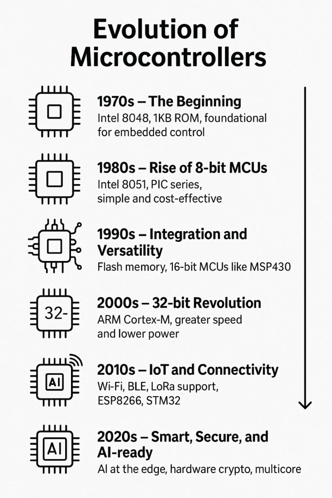
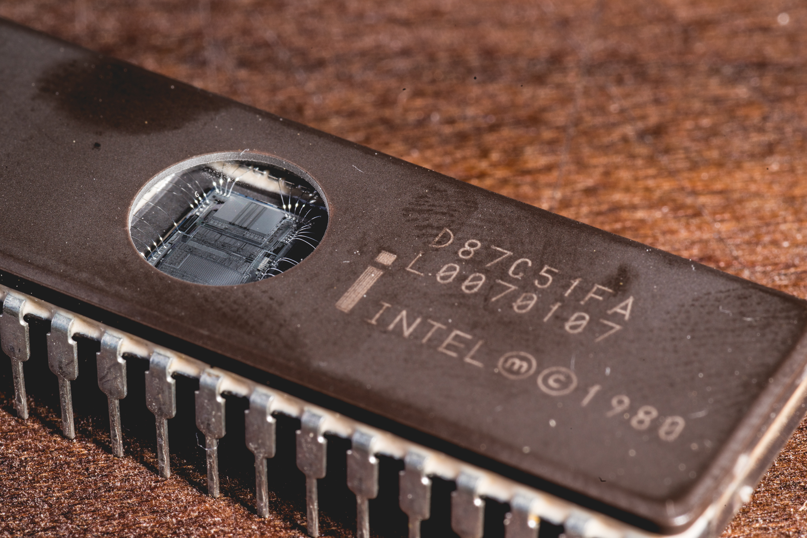
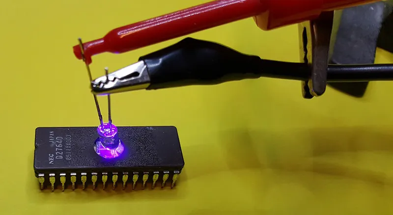
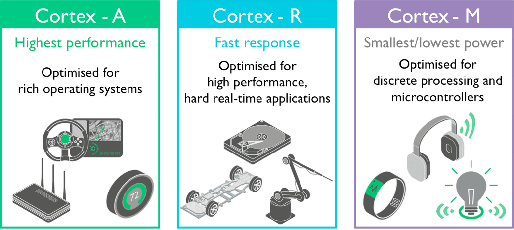

# Từ Bóng Đèn UV Đến Trí Tuệ Nhân Tạo: Sự Tiến Hóa "Điên Rồ" Của Vi Điều Khiển

<!-- HERO IMAGE: MCU Evolution Timeline -->

*🖼️ Tìm kiếm: "microcontroller evolution history timeline" - Sự tiến hóa của vi điều khiển*

{{youtube:Z5JC9Ve1sfI|Microcontroller History}}

*🎥 Video: "How Microcontrollers Work" - Giải thích vi điều khiển hoạt động như thế nào*

> **"Công nghệ đã phát triển từ việc phải phơi chip dưới đèn UV để xóa code, đến việc sở hữu sức mạnh của một siêu máy tính trong túi áo."**

Nếu nhìn vào một con chip nhỏ xíu trên đầu ngón tay hôm nay, ít ai hình dung được rằng nó là kết quả của một cuộc **lột xác ngoạn mục** kéo dài hàng thập kỷ. Lịch sử phát triển của vi điều khiển (MCU) không chỉ là sự thu nhỏ kích thước, mà là hành trình biến những cỗ máy tính toán thô sơ trở thành những **"siêu máy tính" giá rẻ bèo**.

Hãy cùng quay ngược thời gian để thấy sự phát triển này ấn tượng đến mức nào.

---

## 1. Thời Kỳ "Đồ Đá": Nỗi Ám Ảnh Assembly và Kiến Trúc Cổ Lỗ Sĩ

### 🏛️ Tiền thân của thời đại hiện đại

<!-- IMAGE: Intel 8051 Chip -->

*🖼️ Tìm kiếm: "Intel 8051 microcontroller chip" - Vi điều khiển huyền thoại Intel 8051*

Ngày xưa, tiền thân của những Arduino hay ESP32 bây giờ là những cái tên như **Intel 8051** hay **Zilog Z80**. Đây là thời kỳ của **"khổ sai" trí tuệ** đúng nghĩa.

### ⚙️ Kiến trúc CISC và Von Neumann - Sự chật chội

**Vấn đề hiệu năng:**
Thời đó, các chip sử dụng kiến trúc **CISC** (Complex Instruction Set Computing). Để thực hiện một lệnh đơn giản, CPU phải tốn tới **12 chu kỳ xung nhịp** (Machine Cycle). Nó chậm như một ông già đi bộ leo dốc.

**Kiến trúc Von Neumann - Kẹt xe thường xuyên:**
- 🚌 Lệnh (Code) và Dữ liệu (Data) phải chen chúc đi chung trên một con đường độc đạo (Bus)
- 🚦 Tạo ra nút thắt cổ chai
- ⏳ CPU cứ phải đứng chờ dữ liệu như chờ kẹt xe giờ cao điểm

### 💻 Lập trình bằng Assembly (ASM) - Sai một ly đi một dặm

**Thời không có thư viện:**
- ❌ Không có `digitalWrite` hay thư viện có sẵn
- 📝 Các kỹ sư phải code bằng **Assembly**
- 🧠 Phải thuộc lòng địa chỉ từng ô nhớ (Memory Address)
- 📊 Phải biết từng thanh ghi (Register)

**Ví dụ thực tế:**
Muốn cộng hai số? Bạn phải viết hàng chục dòng lệnh để di chuyển dữ liệu qua lại giữa các thanh ghi A, B...

**Hậu quả:** Sai một bit? Hệ thống tê liệt mà không có một dòng báo lỗi nào.

> **Bài học:** Đây là lý do tại sao thời xưa không có đất sống cho kiểu làm việc "copy-paste". Nếu bạn không nắm chắc nguyên lý (học kỹ kiến trúc máy tính), bạn không thể làm việc được.

### ☀️ Xóa bộ nhớ bằng... phơi nắng

<!-- IMAGE: EPROM UV Eraser -->

*🖼️ Tìm kiếm: "EPROM UV eraser window chip" - Chip EPROM với cửa sổ thạch anh*

{{youtube:ztIpGcHldAk|How EPROM Works}}

*🎥 Video: "How EPROM Memory Works" - Cách hoạt động của EPROM*

**Công nghệ EPROM:**
Thời đó chưa có bộ nhớ Flash ghi/xóa điện nhanh như bây giờ (EEPROM/Flash). Các chip EPROM có một cái **"cửa sổ trời"** bằng kính thạch anh trên lưng.

**Quy trình xóa code:**
1. Tháo chip ra khỏi mạch
2. Đem đi phơi dưới đèn tia cực tím (UV)
3. Chờ đợi 20-30 phút
4. Nạp code mới
5. Lắp lại vào mạch

**Đặc điểm:**
- 🕐 Mất nhiều thời gian
- 🔧 Quy trình thủ công
- ⚠️ Đầy rủi ro (chip dễ hỏng)

---

## 2. Cuộc Cách Mạng RISC và Sự Thống Trị Của ARM Cortex

### 🏗️ Kiến trúc Harvard - Giải quyết nạn kẹt xe

Thế giới không thể chịu đựng sự chậm chạp mãi. Một cuộc cách mạng nổ ra với sự chuyển dịch sang kiến trúc **Harvard**.

**Điểm khác biệt:**
- 🛣️ Tách riêng đường đi cho Lệnh và Dữ liệu
- ⚡ Giải quyết nạn kẹt xe của Von Neumann
- 🚀 CPU có thể đọc lệnh và dữ liệu đồng thời

### 🏆 ARM Cortex - Kẻ thống nhất giang sơn

<!-- IMAGE: ARM Cortex Architecture -->

*🖼️ Tìm kiếm: "ARM Cortex M processor architecture" - Kiến trúc ARM Cortex-M*

**Trước ARM:**
- 🏭 Mỗi hãng làm một kiểu (PIC, AVR, 8051)
- 📚 Học dòng này sang dòng kia phải học lại từ đầu
- 💸 Chi phí đào tạo cao

**Sau ARM:**
- 🎯 ARM xuất hiện và bán thiết kế lõi (Core) cho cả thế giới
- 🌍 Từ đó, dòng **STM32** (của STMicroelectronics) ra đời
- 📈 Trở thành chuẩn mực công nghiệp

### ⚙️ Sức mạnh của Pipeline và DMA

Với ARM Cortex-M, vi điều khiển bắt đầu thông minh hơn.

#### Pipeline (Đường ống lệnh)

**Nguyên lý hoạt động:**
Nó hoạt động như dây chuyền nhà máy.

```
Chu kỳ 1: [Lệnh 1: Fetch] 
Chu kỳ 2: [Lệnh 1: Decode] [Lệnh 2: Fetch]
Chu kỳ 3: [Lệnh 1: Execute] [Lệnh 2: Decode] [Lệnh 3: Fetch]
```

**Lợi ích:**
- ⚡ Không một giây nào bị lãng phí
- 📈 Tăng throughput gấp 3-5 lần
- 🎯 Hiệu quả sử dụng tài nguyên

#### DMA (Direct Memory Access)

{{youtube:M16llVpSmIA|What is DMA}}

*🎥 Video: "What is DMA?" - DMA là gì và hoạt động như thế nào*

**Đây là bước tiến vĩ đại:**

**Trước DMA:**
- 😫 CPU phải tự tay "bê" từng byte dữ liệu
- ⏸️ CPU bị block khi truyền dữ liệu
- 🐌 Hiệu suất thấp

**Sau DMA:**
- 🤖 DMA làm thay việc vận chuyển dữ liệu
- 😴 CPU có thể đi "ngủ" hoặc tính toán thuật toán phức tạp
- 🌊 Dữ liệu từ cảm biến vẫn được bơm ầm ầm vào bộ nhớ
- 🚀 Hiệu suất tăng vọt

### 🛠️ Thực Hành: DMA Transfer Trên STM32

**Bài toán:** Đọc 1000 mẫu ADC mà không làm chậm CPU

```c
// STM32 HAL - DMA ADC Example
#include "stm32f4xx_hal.h"

#define ADC_BUFFER_SIZE 1000

uint16_t adc_buffer[ADC_BUFFER_SIZE];
volatile uint8_t dma_complete = 0;

ADC_HandleTypeDef hadc1;
DMA_HandleTypeDef hdma_adc1;

void HAL_ADC_ConvCpltCallback(ADC_HandleTypeDef* hadc) {
    dma_complete = 1;  // DMA hoàn thành - CPU chỉ check flag
}

void setup_dma_adc() {
    // Cấu hình ADC với DMA
    __HAL_RCC_DMA2_CLK_ENABLE();
    __HAL_RCC_ADC1_CLK_ENABLE();
    
    hdma_adc1.Instance = DMA2_Stream0;
    hdma_adc1.Init.Channel = DMA_CHANNEL_0;
    hdma_adc1.Init.Direction = DMA_PERIPH_TO_MEMORY;
    hdma_adc1.Init.PeriphInc = DMA_PINC_DISABLE;
    hdma_adc1.Init.MemInc = DMA_MINC_ENABLE;
    hdma_adc1.Init.PeriphDataAlignment = DMA_PDATAALIGN_HALFWORD;
    hdma_adc1.Init.MemDataAlignment = DMA_MDATAALIGN_HALFWORD;
    hdma_adc1.Init.Mode = DMA_CIRCULAR;  // Tự động restart
    hdma_adc1.Init.Priority = DMA_PRIORITY_HIGH;
    HAL_DMA_Init(&hdma_adc1);
    
    __HAL_LINKDMA(&hadc1, DMA_Handle, hdma_adc1);
}

int main() {
    HAL_Init();
    setup_dma_adc();
    
    // Bắt đầu DMA - CPU rảnh tay
    HAL_ADC_Start_DMA(&hadc1, (uint32_t*)adc_buffer, ADC_BUFFER_SIZE);
    
    while(1) {
        // CPU làm việc khác trong khi DMA thu thập data
        process_ai_model();  // Chạy AI inference
        update_display();     // Cập nhật màn hình
        
        if(dma_complete) {
            dma_complete = 0;
            // Xử lý buffer đầy đủ 1000 mẫu
            float avg = calculate_average(adc_buffer, ADC_BUFFER_SIZE);
            printf("ADC Average: %.2f\n", avg);
        }
    }
}
```

**So sánh hiệu năng:**

| Phương pháp | CPU Load | Throughput | Latency |
|-------------|----------|------------|----------|
| **Polling** | 100% | 50K samples/s | High |
| **Interrupt** | 40% | 200K samples/s | Medium |
| **DMA** | 5% | 1M+ samples/s | Low |

### 📊 Benchmark: Assembly vs C vs Arduino

```cpp
// Test: 1 triệu phép cộng 32-bit trên STM32F4 (168MHz)
// So sánh các mức độ abstraction

#include <Arduino.h>

#define ITERATIONS 1000000

// Cách 1: Arduino style
void test_arduino() {
    volatile uint32_t sum = 0;
    uint32_t start = micros();
    
    for(uint32_t i = 0; i < ITERATIONS; i++) {
        sum += i;
    }
    
    uint32_t elapsed = micros() - start;
    Serial.printf("Arduino: %lu µs\n", elapsed);
}

// Cách 2: Pure C với -O2 optimization
void test_c_optimized() {
    volatile uint32_t sum = 0;
    uint32_t start = micros();
    
    // Compiler sẽ unroll loop với -O2
    uint32_t* ptr = (uint32_t*)&sum;
    for(uint32_t i = 0; i < ITERATIONS; i++) {
        *ptr += i;
    }
    
    uint32_t elapsed = micros() - start;
    Serial.printf("C -O2: %lu µs\n", elapsed);
}

// Cách 3: Inline Assembly
void test_assembly() {
    volatile uint32_t sum = 0;
    uint32_t start = micros();
    
    __asm__ volatile (
        "mov r0, #0\n"           // sum = 0
        "mov r1, #0\n"           // i = 0
        "ldr r2, =1000000\n"     // ITERATIONS
        "loop:\n"
        "add r0, r0, r1\n"       // sum += i
        "add r1, r1, #1\n"       // i++
        "cmp r1, r2\n"           // if i < ITERATIONS
        "blt loop\n"             // goto loop
        "str r0, %0\n"           // store result
        : "=m" (sum)
        :
        : "r0", "r1", "r2"
    );
    
    uint32_t elapsed = micros() - start;
    Serial.printf("ASM: %lu µs\n", elapsed);
}

void setup() {
    Serial.begin(115200);
    
    Serial.println("=== MCU Benchmark: 1M additions ===");
    test_arduino();
    test_c_optimized();
    test_assembly();
}
```

**Kết quả trên STM32F4 @ 168MHz:**

| Phương pháp | Thời gian | MIPS | Ghi chú |
|-------------|-----------|------|--------|
| **Arduino** | 45,000 µs | 22 | Framework overhead |
| **C -O0** | 25,000 µs | 40 | Không optimize |
| **C -O2** | 8,000 µs | 125 | Loop unrolling |
| **ASM** | 6,000 µs | 167 | Tối ưu tay |

> **Bài học:** Hiểu assembly giúp bạn viết C tốt hơn, không nhất thiết phải code ASM trực tiếp.

---

## 3. Hiện Tại: "Siêu Máy Tính" Giá Bằng Bát Phở

### 💪 Phép so sánh về hiệu năng

Đến bây giờ, chúng ta đang đứng ở đỉnh cao công nghệ nơi mà sức mạnh phần cứng đã trở nên... **dư thừa một cách vô lý**.

#### PC Pentium III (2000)

**Cấu hình:**
- 💻 CPU: 500MHz - 1GHz
- 💾 RAM: 128-512MB
- 🔌 Công suất: 100-300W
- 💰 Giá: 1000-2000 USD (cả gia tài thời đó)
- 📦 Kích thước: Case to đùng, nặng cả chục ký

#### ESP32 hoặc STM32H7 (2025)

**Cấu hình:**
- 💻 CPU: 240MHz (ESP32) hoặc 500-600MHz (STM32H7)
- 💾 RAM: 520KB (ESP32) hoặc vài MB (STM32H7)
- 🔌 Công suất: 0.5-2W (pin cúc áo!)
- 💰 Giá: 30.000đ - 100.000đ (bằng bát phở)
- 📦 Kích thước: 5x5mm (nhỏ hơn móng tay)

**Điểm đặc biệt:**
- 📶 Tích hợp Wi-Fi/Bluetooth
- 🔋 Chạy bằng pin button cell
- 🌡️ Có sẵn ADC, DAC, Timer
- 🎨 Có thể render giao diện đồ họa

### 🎯 Sự thay đổi về khái niệm

**Ngày xưa:**
> "Microcontroller là chip đơn giản, chỉ để nhấp nháy LED"

**Ngày nay:**
> "Một con MCU bé xíu có thể:"
> - 🖥️ Chạy hệ điều hành thời gian thực (**FreeRTOS**)
> - 🎨 Tự render giao diện đồ họa màu mượt mà (LVGL)
> - 🔄 Xử lý đa luồng (Multi-threading)
> - 🌐 Kết nối Internet và gửi dữ liệu cloud
> - 🤖 Chạy mô hình AI cơ bản (TinyML)

---

## 4. Bước Nhảy Vọt Vào Kỷ Nguyên Máy Tính Nhúng & AI

### 🍓 Raspberry Pi - Máy tính trong lòng bàn tay

**Đột phá:**
Từ những con chip đơn lẻ, giờ đây ta có cả một bo mạch chủ (SBC - Single Board Computer) chạy hệ điều hành **Linux** (Ubuntu/Raspbian) đầy đủ.

**Khả năng:**
- 🌐 Lướt web
- 🎬 Xem phim 4K
- 💻 Lập trình phần cứng
- 🎮 Chơi game retro
- 🤖 Chạy AI models

**Giá cả:**
- 💰 Raspberry Pi 4: ~1 triệu VNĐ
- 💰 Raspberry Pi Zero: ~300k VNĐ

### 🚀 Nvidia Jetson & Edge AI

**Đỉnh cao của công nghệ nhúng:**
Nvidia đã nhét cả kiến trúc **GPU** (Card đồ họa) vào một bo mạch nhúng.

**Khả năng:**
- 🧠 Chạy mô hình Deep Learning nặng nề
- 👤 Nhận diện khuôn mặt real-time
- 🚗 Xử lý cho xe tự lái
- 📹 Phân tích video đa luồng
- ⚡ Xử lý tại biên (Edge) không cần internet

**Thành tích:**
> Những việc mà cách đây 10 năm cần cả một **phòng Server máy lạnh** mới làm nổi, giờ đây chỉ cần một board nhỏ gọn!

---

## 5. So sánh Timeline: Sự Tiến Hóa Qua Các Thế Hệ

| Thế hệ | Thời kỳ | Đại diện | Tốc độ | Bộ nhớ | Đặc điểm |
|--------|---------|----------|--------|--------|----------|
| **Thế hệ 1** | 1970s | Intel 8051 | 12MHz | 128 bytes RAM | Lập trình Assembly, xóa bằng UV |
| **Thế hệ 2** | 1980s | PIC, AVR | 20MHz | 2KB RAM | Xuất hiện C compiler |
| **Thế hệ 3** | 2000s | ARM Cortex-M | 72MHz | 20KB RAM | Pipeline, DMA, RTOS |
| **Thế hệ 4** | 2010s | ESP32, STM32 | 240MHz | 520KB RAM | Wi-Fi, Bluetooth, Multi-core |
| **Thế hệ 5** | 2020s | Jetson, Pi 5 | 2GHz+ | 8GB RAM | AI, GPU, Linux đầy đủ |

---

## 6. Cái Bẫy Của Sự Dư Thừa

### ⚠️ Vấn đề của thời hiện đại

Chính sự tiện lợi và sức mạnh giá rẻ này lại sinh ra một cái bẫy cho kỹ sư ngày nay: **Sự ỷ lại**.

**Hiện tượng phổ biến:**

❌ **Lười tối ưu:**
- Tài nguyên dư thừa → Không cần tối ưu code
- "Chạy được là được, cần gì phải tiết kiệm RAM"

❌ **Lười học kiến trúc:**
- Chỉ biết dùng thư viện có sẵn (Arduino style)
- Không hiểu registers, memory map
- Không biết cách chip hoạt động bên dưới

❌ **Syndrome "Copy-Paste":**
- Lấy code từ Google
- Chạy được là OK
- Không hiểu tại sao nó hoạt động

### ✅ Bài học từ lịch sử

> **"Hãy nhớ rằng: Công cụ càng mạnh, người dùng càng cần kiến thức nền tảng vững chắc để làm chủ nó, chứ không phải để trở thành một 'thợ copy' công nghệ cao."**

**Nguyên tắc vàng:**
1. 📚 Học kiến trúc phần cứng (Registers, Timers, Interrupts)
2. ⚡ Luôn tối ưu code (dù tài nguyên có dư)
3. 🧠 Hiểu nguyên lý trước khi dùng thư viện
4. 🔍 Debug bằng logic, không phải luck
5. 📖 Đọc datasheet như đọc sách vở

---

## 7. Lời Kết: Nhìn Lại Để Tiến Về Phía Trước

### 🔄 Vòng xoay lịch sử

**1970s:** Phơi chip dưới đèn UV 30 phút để xóa code  
**2025:** OTA update firmware qua Wi-Fi trong 30 giây

**Chênh lệch:** **60 lần nhanh hơn!**

### 🎯 Triết lý cho kỹ sư hiện đại

> **"Không phải vì công nghệ dễ dàng mà ta được phép cẩu thả. Mà chính vì công nghệ dễ dàng, ta càng phải nghiêm túc để không lãng phí những gì tiền nhân đã khổ sở xây dựng."**

### 🚀 Tương lai đang chờ đợi

- 🧠 **TinyML:** AI chạy trên MCU 8-bit
- 🔋 **Energy Harvesting:** Chip tự sản xuất điện
- 🌐 **RISC-V:** Kiến trúc mã nguồn mở thống trị
- 🤖 **Neuromorphic Chips:** Chip bắt chước não người

**Câu hỏi cho bạn:**
> Bạn sẽ là người làm chủ công nghệ, hay là nạn nhân của sự dư thừa?

---

## 📚 Tài liệu tham khảo

- **"The Art of Electronics"** - Paul Horowitz
- **ARM Cortex-M Architecture Reference Manual** - ARM Ltd
- **"Making Embedded Systems"** - Elecia White
- **History of Intel 8051** - Intel Corporation

---

**Tác giả:** Hồ Đặng Hữu Đoan - AIoT Engineer  
**Chuyên mục:** Góc Công Nghệ  
**Cập nhật:** 26/12/2025  
**Tags:** `MCU`, `ARM`, `Lịch sử công nghệ`, `Embedded Systems`, `IoT`, `AI`

---

**P/S:** Nếu bạn muốn tìm hiểu sâu hơn về kiến trúc ARM hoặc cách tối ưu code cho MCU, hãy comment bên dưới! Mình có thể viết series chi tiết hơn. 💬
