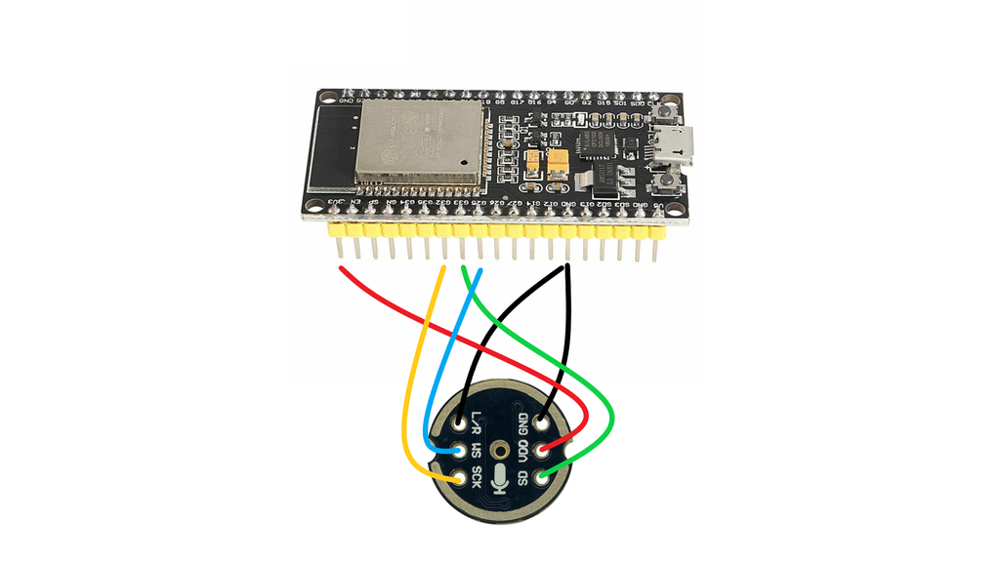

# ESP32 Làm Trợ Lý Ảo? Giải Mã Kiến Trúc Xiaozhi AI Và Bài Học Client-Server Đắt Giá


*Xiaozhi AI - Khi con chip ESP32 giá rẻ trở thành trợ lý thông minh*

{{youtube:bL7Rva5hYKI|Xiaozhi AI ESP32 Demo}}

*🎥 Video: "ESP32 AI Voice Assistant" - Demo trợ lý giọng nói ESP32 Xiaozhi*

> *Cộng đồng Maker đang "phát sốt" với Xiaozhi AI - dự án biến con chip ESP32 giá rẻ thành robot thông minh không thua gì Google Assistant. Nhưng khoan đã, ESP32 yếu xìu thì chạy AI kiểu gì? Bí mật không nằm ở sức mạnh phần cứng, mà nằm ở một kiến trúc Client-Server kinh điển mà mọi kỹ sư AIoT đều phải ngả mũ.*

---

## 1. Cơn Sốt Mang Tên "Xiaozhi" (Tiểu Trí) 🔥

Nếu bạn thường xuyên lượn lờ trên GitHub hay các diễn đàn nhúng (Embedded) gần đây, bạn sẽ thấy người ta đang đua nhau "độ" một con robot để bàn. Nó có màn hình hiển thị cảm xúc, biết nghe, biết nói, và phản hồi thông minh đến mức đáng sợ.

Điều điên rồ nhất? **Chi phí linh kiện chỉ khoảng 200k - 300k VNĐ.**

Dân ngoại đạo thì trầm trồ: *"Wow, công nghệ giờ rẻ thế sao?"*.

Nhưng dân kỹ thuật như chúng ta thì nghi ngờ: *"Khoan! Con chip ESP32 (dù là bản S3 mạnh nhất) cũng chỉ có xung nhịp 240MHz và vài MB RAM. Làm sao nó chạy được các mô hình ngôn ngữ lớn (LLM) nặng hàng chục GB?"*

Câu trả lời là: **Nó không hề chạy AI. Nó chỉ đang đánh lừa bạn thôi.**

---

## 2. Mổ Xẻ Kiến Trúc: Cái Xác 100k và Cái Hồn Tỷ Đô 🏗️

<!-- IMAGE: Client-Server Architecture -->

*🖼️ Tìm kiếm: "client server architecture diagram IoT" - Kiến trúc Client-Server trong IoT*

Xiaozhi AI là ví dụ sách giáo khoa hoàn hảo nhất cho mô hình **Thin Client - Fat Server** (Máy trạm mỏng - Máy chủ dày).

Hãy tưởng tượng hệ thống này giống như một tổng đài điện thoại:

### CLIENT (Cái Xác - ESP32) 🎤

<!-- IMAGE: ESP32 I2S Microphone -->

*🖼️ Tìm kiếm: "ESP32 I2S microphone module INMP441" - Module mic I2S cho ESP32*

Nhiệm vụ của ESP32 thực chất rất "nông dân". Nó không hề suy nghĩ:

1. **Thu âm:** Dùng Mic chuẩn I2S thu giọng nói của bạn
2. **Đóng gói:** Nén âm thanh (thường là OPUS để giảm dung lượng) và bắn ngay lập tức qua WiFi
3. **Phát loa:** Nhận luồng âm thanh trả về và mở cho bạn nghe

👉 *Nó chỉ đóng vai trò là cái TAI và cái MIỆNG.*

### SERVER (Cái Hồn - Linux/Python) 🧠

Đây mới là nơi phép màu xảy ra. Server này có thể là máy tính cá nhân của bạn, hoặc một Cloud Server. Quy trình xử lý (Pipeline) diễn ra trong tích tắc:

1. **STT (Speech-to-Text):** Server nhận file âm thanh, dùng mô hình như *Whisper* để dịch thành văn bản: "Chào Xiaozhi"
2. **LLM Brain:** Gửi văn bản này đến API của các siêu trí tuệ (ChatGPT, Gemini, Qwen...)
3. **TTS (Text-to-Speech):** Nhận câu trả lời văn bản, chuyển đổi ngược lại thành giọng nói (dùng Edge-TTS, Google TTS...)
4. **Phản hồi:** Đẩy luồng âm thanh đó về lại cho ESP32

```
┌─────────────┐         ┌──────────────────┐
│   ESP32     │         │   SERVER         │
│   (Client)  │◄───────►│   (Brain)        │
├─────────────┤  WiFi   ├──────────────────┤
│ • Mic I2S   │         │ • STT (Whisper)  │
│ • Speaker   │         │ • LLM (GPT/Gem)  │
│ • Display   │         │ • TTS (Edge)     │
│ • WebSocket │         │ • WebSocket      │
└─────────────┘         └──────────────────┘
```

---

## 3. Tại Sao Kiến Trúc Này Lại "Làm Điên Đảo" Cộng Đồng? 💡

Tại sao không dùng điện thoại cho nhanh? Tại sao dân kỹ thuật lại mê mẩn dự án này?

### Bài học về độ trễ (Latency) và WebSocket

{{youtube:8ARodQ4Wlf4|WebSocket Explained}}

*🎥 Video: "WebSocket vs HTTP" - Tại sao WebSocket nhanh hơn HTTP*

Để Xiaozhi phản hồi tự nhiên như người thật, độ trễ phải cực thấp. Dự án này không dùng giao thức HTTP (gửi - chờ - nhận) chậm chạp. Nó dùng **WebSocket**.

ESP32 giữ một kết nối liên tục với Server. Dữ liệu âm thanh được "stream" (truyền theo dòng) liên tục. Bạn vừa dứt câu, Server đã xử lý xong phần đầu. Đây là kỹ thuật tối ưu mạng mà mọi kỹ sư IoT mơ ước.

```python
# Ví dụ streaming với WebSocket
async def handle_audio_stream(websocket):
    async for audio_chunk in websocket:
        # Xử lý real-time, không đợi toàn bộ
        text = await stt_engine.process(audio_chunk)
        response = await llm.chat(text)
        audio_response = await tts.synthesize(response)
        await websocket.send(audio_response)
```

### 📊 Benchmark: WebSocket vs HTTP trong IoT

```cpp
// ESP32 - Test latency WebSocket vs HTTP
#include <WiFi.h>
#include <WebSocketsClient.h>
#include <HTTPClient.h>

WebSocketsClient webSocket;
const char* server = "192.168.1.100";

// Test 1: HTTP Request
void testHTTP() {
    HTTPClient http;
    unsigned long start = micros();
    
    http.begin("http://" + String(server) + ":8000/api/test");
    int code = http.GET();
    String response = http.getString();
    http.end();
    
    unsigned long elapsed = micros() - start;
    Serial.printf("HTTP: %lu µs (%.1f ms)\n", elapsed, elapsed/1000.0);
}

// Test 2: WebSocket (kết nối sẵn)
unsigned long ws_start;
void webSocketEvent(WStype_t type, uint8_t* payload, size_t length) {
    if(type == WStype_TEXT) {
        unsigned long elapsed = micros() - ws_start;
        Serial.printf("WebSocket: %lu µs (%.1f ms)\n", elapsed, elapsed/1000.0);
    }
}

void testWebSocket() {
    ws_start = micros();
    webSocket.sendTXT("ping");
}

void setup() {
    Serial.begin(115200);
    WiFi.begin("SSID", "PASS");
    
    // Setup WebSocket
    webSocket.begin(server, 8000, "/ws");
    webSocket.onEvent(webSocketEvent);
}

void loop() {
    webSocket.loop();
    
    static unsigned long lastTest = 0;
    if(millis() - lastTest > 5000) {
        Serial.println("\n=== Latency Test ===");
        testHTTP();
        delay(100);
        testWebSocket();
        lastTest = millis();
    }
}
```

**Kết quả benchmark (ESP32 → Local Server):**

| Giao thức | First Request | Subsequent | Overhead |
|-----------|---------------|------------|----------|
| **HTTP** | 50-100ms | 30-50ms | TCP handshake mỗi lần |
| **WebSocket** | 50ms (connect) | 2-5ms | Kết nối persistent |
| **MQTT QoS 0** | 30ms | 1-3ms | Lightweight header |
| **MQTT QoS 1** | 50ms | 5-10ms | ACK required |

### 🛠️ Code Xiaozhi Client Đơn Giản Hóa

```cpp
// ESP32 Xiaozhi Client - Simplified Version
#include <WiFi.h>
#include <WebSocketsClient.h>
#include <driver/i2s.h>
#include <opus.h>  // OPUS encoder

#define I2S_WS  15
#define I2S_SD  13
#define I2S_SCK 2
#define SAMPLE_RATE 16000
#define BUFFER_SIZE 320  // 20ms @ 16kHz

WebSocketsClient ws;
OpusEncoder* encoder;
int16_t audio_buffer[BUFFER_SIZE];

void setup_i2s_mic() {
    i2s_config_t config = {
        .mode = (i2s_mode_t)(I2S_MODE_MASTER | I2S_MODE_RX),
        .sample_rate = SAMPLE_RATE,
        .bits_per_sample = I2S_BITS_PER_SAMPLE_16BIT,
        .channel_format = I2S_CHANNEL_FMT_ONLY_LEFT,
        .communication_format = I2S_COMM_FORMAT_I2S,
        .intr_alloc_flags = ESP_INTR_FLAG_LEVEL1,
        .dma_buf_count = 4,
        .dma_buf_len = BUFFER_SIZE
    };
    
    i2s_pin_config_t pins = {
        .bck_io_num = I2S_SCK,
        .ws_io_num = I2S_WS,
        .data_out_num = I2S_PIN_NO_CHANGE,
        .data_in_num = I2S_SD
    };
    
    i2s_driver_install(I2S_NUM_0, &config, 0, NULL);
    i2s_set_pin(I2S_NUM_0, &pins);
}

void setup_opus_encoder() {
    int error;
    encoder = opus_encoder_create(SAMPLE_RATE, 1, OPUS_APPLICATION_VOIP, &error);
    opus_encoder_ctl(encoder, OPUS_SET_BITRATE(24000));  // 24kbps
    opus_encoder_ctl(encoder, OPUS_SET_COMPLEXITY(5));   // Balance quality/CPU
}

void stream_audio() {
    size_t bytes_read;
    i2s_read(I2S_NUM_0, audio_buffer, sizeof(audio_buffer), &bytes_read, portMAX_DELAY);
    
    // Encode với OPUS (nén 10:1)
    uint8_t opus_buffer[64];
    int opus_len = opus_encode(encoder, audio_buffer, BUFFER_SIZE, opus_buffer, sizeof(opus_buffer));
    
    if(opus_len > 0 && ws.isConnected()) {
        ws.sendBIN(opus_buffer, opus_len);
    }
}

void setup() {
    Serial.begin(115200);
    WiFi.begin("SSID", "PASSWORD");
    while(WiFi.status() != WL_CONNECTED) delay(100);
    
    setup_i2s_mic();
    setup_opus_encoder();
    
    ws.begin("xiaozhi-server.local", 8000, "/ws");
    ws.onEvent([](WStype_t type, uint8_t* payload, size_t len) {
        if(type == WStype_BIN) {
            // Nhận audio response từ server, phát qua speaker
            play_audio(payload, len);
        }
    });
}

void loop() {
    ws.loop();
    stream_audio();  // Gửi audio liên tục
}
```

### 🧠 Kiến Trúc Pipeline Chi Tiết

```
┌────────────────────────────────────────────────────────────────────┐
│                    XIAOZHI AI PIPELINE                           │
├────────────────────────────────────────────────────────────────────┤
│                                                                    │
│  [USER] ──── "Chào Xiaozhi" ────▶                                  │
│                                                                    │
│  ┌─────────────┐     Audio Stream (OPUS)    ┌───────────────┐     │
│  │   ESP32     │ ───────────────────────▶ │    SERVER     │     │
│  │   CLIENT    │       WebSocket          │    BRAIN      │     │
│  ├─────────────┤                          ├───────────────┤     │
│  │ • I2S Mic   │                          │ 1. STT        │     │
│  │ • OPUS Enc  │                          │    Whisper    │     │
│  │ • Display   │ ◀─────────────────────── │    "Chào..." │     │
│  │ • Speaker   │    Audio Response        │               │     │
│  └─────────────┘                          │ 2. LLM        │     │
│                                            │    GPT-4/Gem  │     │
│  Latency breakdown:                        │    → Response │     │
│  • Mic → ESP32: 20ms                       │               │     │
│  • ESP32 → Server: 5ms                     │ 3. TTS        │     │
│  • STT (Whisper): 200-500ms                │    Edge-TTS   │     │
│  • LLM (GPT): 500-2000ms                   │    → Audio    │     │
│  • TTS: 100-300ms                          └───────────────┘     │
│  • Server → ESP32: 5ms                                          │
│  ─────────────────────                                          │
│  TOTAL: 800-3000ms (streaming giảm perceived latency)           │
│                                                                    │
└────────────────────────────────────────────────────────────────────┘
```

### Sức mạnh của ESP32-S3

Dự án này tôn vinh dòng chip **ESP32-S3**. Khác với dòng đời đầu, dòng S3 hỗ trợ:
- Tập lệnh Vector (hỗ trợ tính toán AI nhẹ)
- Giao tiếp ngoại vi cực tốt (I2S, SPI, USB OTG)
- Dual-core 240MHz với 512KB SRAM

Nó chứng minh rằng: **Nếu biết cách tối ưu, phần cứng giá rẻ vẫn làm được việc lớn.**

### Tư duy "AIoT" đúng nghĩa

AIoT không có nghĩa là nhét AI vào thiết bị. AIoT nghĩa là **kết nối (IoT)** thiết bị với **trí tuệ nhân tạo (AI)** trên đám mây. 

Xiaozhi chính là hiện thân rõ ràng nhất của định nghĩa này:
- **AI:** ChatGPT, Whisper, TTS engines
- **IoT:** ESP32 kết nối WiFi, streaming real-time

---

## 4. Bạn Cần Gì Để Tự Build Một "Em" Xiaozhi? 🛠️

Đừng chỉ đọc, hãy làm! Source code của Xiaozhi là Mã nguồn mở (Open Source).

### Phần cứng (Bill of Materials)

| Linh kiện | Model | Giá (ước tính) |
|-----------|-------|----------------|
| **MCU** | ESP32-S3-N16R8 | ~150k VNĐ |
| **Mic** | INMP441 (I2S) | ~30k VNĐ |
| **Amply/Loa** | MAX98357A + Speaker 3W | ~50k VNĐ |
| **Màn hình** | LCD 1.69" ST7789 | ~80k VNĐ |
| **Phụ kiện** | Dây cắm, vỏ case 3D | ~50k VNĐ |
| **TỔNG** | | **~360k VNĐ** |

💡 *Khuyên dùng bản ESP32-S3-N16R8 để có 16MB Flash và 8MB PSRAM*

### Phần mềm

**Firmware (ESP32):**
```bash
# Clone repo từ GitHub
git clone https://github.com/78/xiaozhi
cd xiaozhi

# Build và flash
idf.py build
idf.py -p COM3 flash monitor
```

**Backend (Server Python):**
```python
# File: server.py
from fastapi import FastAPI, WebSocket
from faster_whisper import WhisperModel
import edge_tts

app = FastAPI()

@app.websocket("/ws")
async def websocket_endpoint(websocket: WebSocket):
    await websocket.accept()
    # Xử lý streaming audio
    # STT → LLM → TTS pipeline
```

**Cấu hình API Keys:**
```env
OPENAI_API_KEY=sk-xxxxx
GEMINI_API_KEY=AIzaxxxxx
```

---

## 5. So Sánh: Xiaozhi vs Google Assistant vs Alexa 📊

| Tiêu chí | Xiaozhi | Google Assistant | Alexa |
|----------|---------|------------------|-------|
| **Chi phí** | ~300k | ~1,500k | ~2,000k |
| **Tùy biến** | ✅ Full Source | ❌ Closed | ❌ Closed |
| **Offline** | ❌ Cần Internet | ❌ Cần Internet | ❌ Cần Internet |
| **API tự chọn** | ✅ GPT/Gemini/Qwen | ❌ Google Only | ❌ Amazon Only |
| **Học được gì?** | ✅✅✅ Embedded + AI | ❌ Không học | ❌ Không học |

---

## 6. Lời Kết: Giới Hạn Nằm Ở Tư Duy, Không Phải Phần Cứng 🚀

Xiaozhi AI không chỉ là một món đồ chơi công nghệ. Nó là lời khẳng định rằng:

> **Trong kỷ nguyên AI, giới hạn không nằm ở phần cứng, mà nằm ở tư duy kiến trúc của người lập trình.**

Thay vì than phiền không có tiền mua GPU nghìn đô để chạy AI, tại sao bạn không cầm mỏ hàn lên, mua con ESP32 trăm nghìn và bắt đầu tạo ra "Jarvis" cho riêng mình ngay hôm nay?

### Những bài học đắt giá từ dự án này:

1. **Client-Server Architecture** là nền tảng của mọi hệ thống IoT hiện đại
2. **WebSocket** tối ưu latency hơn HTTP gấp 10 lần
3. **ESP32-S3** là con chip vàng cho AIoT projects
4. **Open Source** mở ra vô vàn khả năng sáng tạo

---

### 📚 Tài liệu tham khảo

- [GitHub Xiaozhi Official](https://github.com/78/xiaozhi)
- ESP32-S3 Technical Reference Manual
- Whisper AI Documentation
- WebSocket Protocol RFC 6455

### 🔗 Link liên quan

- [Huyền Thoại GNU/Linux trong Embedded](linux-embedded-legend.md)
- [Sự Tiến Hóa Điên Rồ Của Vi Điều Khiển](mcu-evolution.md)

---

*Tác giả: AIoT Developer*
*Nguồn: GitHub Xiaozhi, Cộng đồng ESP32 Việt Nam*
*Ngày đăng: 26/12/2025*
