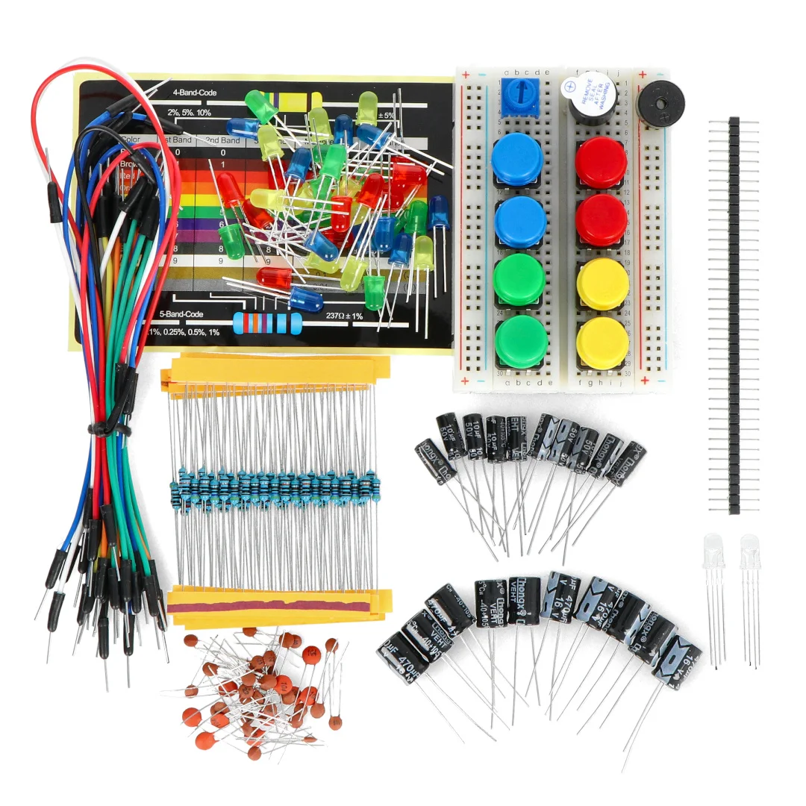
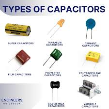
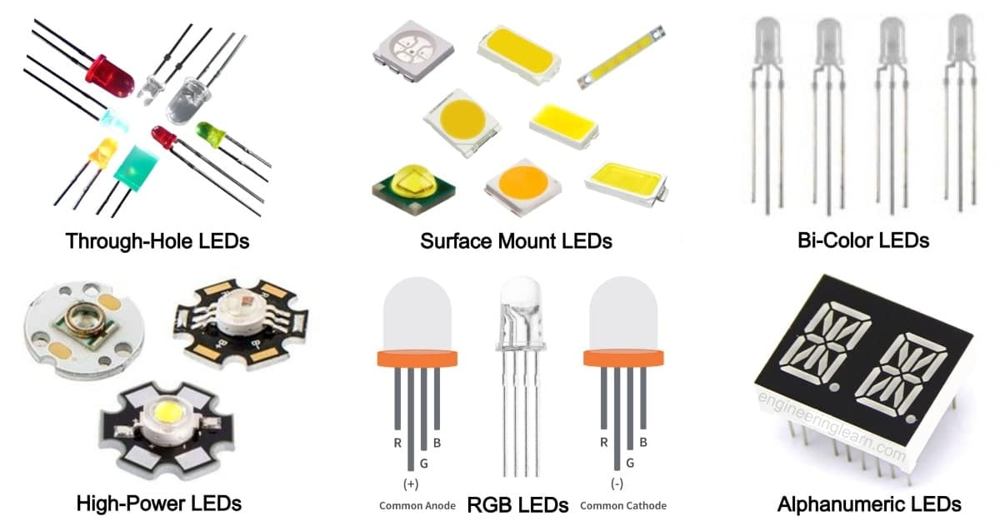
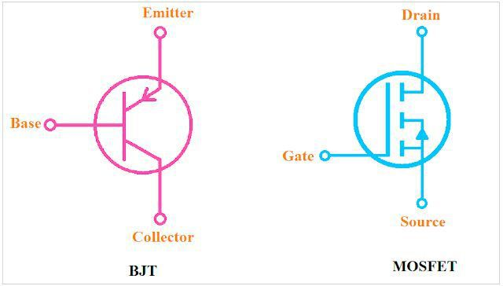
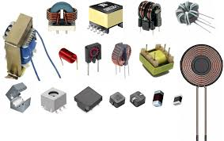
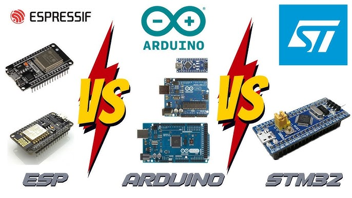

# Các Linh Kiện Điện Tử: Giải Thích Bằng Phương Pháp Feynman

> **"Nếu bạn không thể giải thích điều gì đó một cách đơn giản, nghĩa là bạn chưa hiểu đủ sâu."** — Richard Feynman

<!-- HERO IMAGE: Ảnh tổng quan các linh kiện điện tử -->

*🖼️ Tìm kiếm: "electronic components on PCB board colorful" - Ảnh các linh kiện trên mạch PCB*

{{youtube:6Maq5IyHSuc|How Resistors, Capacitors and Transistors Work}}

*🎥 Video: "How Resistors, Capacitors and Inductors Work" - Giải thích trực quan về cách hoạt động của linh kiện*

Khi nhìn vào một bo mạch điện tử chằng chịt, bạn thấy gì? Những con rết đen sì? Những cái trụ tròn lò xo? Trông nó thật đáng sợ và đầy "ma thuật".

Nhưng hãy dùng **phương pháp Feynman** để lột bỏ lớp vỏ ma thuật đó. Hãy tưởng tượng dòng điện (Electrons) chính là **Dòng nước**, và bo mạch điện tử chính là một **Hệ thống ống nước** khổng lồ. Nhiệm vụ của chúng ta là điều khiển dòng nước này chảy đến đúng chỗ để làm việc (như làm sáng đèn, quay quạt, hay tính toán).

Để điều khiển nước, chúng ta cần các "phụ kiện" sau đây:

---

## 1. Điện Trở (Resistor) - "Đoạn Ống Bóp Nghẹt" 🚰

<!-- ẢNH: Điện trở và mã màu -->

*🖼️ Tìm kiếm: "resistor color code chart" - Bảng mã màu điện trở*

### Nhìn thấy gì trên mạch?

Mấy con nhỏ xíu có vạch màu xanh đỏ tím vàng, trông như kẹo M&M.

### Giải thích kiểu Feynman

Hãy tưởng tượng dòng điện là một dòng nước chảy cực mạnh từ **vòi cứu hỏa**. Nếu bạn chĩa thẳng vòi này vào một bông hoa mỏng manh (ví dụ là đèn LED), bông hoa sẽ nát bét ngay lập tức (cháy đèn).

**Bạn cần làm gì?** Bạn cần bóp nhỏ ống nước lại để nước chảy yếu đi.

**Điện trở chính là cái chỗ bị bóp nghẹt đó.**
- 🔥 Nó cản trở dòng chảy
- 📏 Điện trở càng lớn, ống càng hẹp, nước chảy càng ít
- 🛡️ Nó hy sinh thân mình (tỏa nhiệt) để bảo vệ các linh kiện yếu ớt phía sau

### Công thức thực tế

$$V = I \times R$$

**Dịch ra tiếng người:**
- V (Voltage) = Áp lực nước
- I (Current) = Lượng nước chảy
- R (Resistance) = Độ chật hẹp của ống

### 🛠️ Thực Hành: Tính Điện Trở Cho LED

**Bài toán thực tế:** Bạn có nguồn 5V, LED đỏ (2V, 20mA). Cần điện trở bao nhiêu?

```
Công thức: R = (Vnguồn - VLED) / ILED
         R = (5V - 2V) / 0.02A
         R = 150Ω

Chọn điện trở: 150Ω hoặc 220Ω (an toàn hơn)
```

**Code Arduino kiểm chứng:**
```cpp
// Đo dòng qua LED bằng cách đo điện áp rơi trên điện trở
const int LED_PIN = 13;
const int RESISTOR_PIN = A0;  // Đo điện áp tại đây
const float R_KNOWN = 220.0;  // Điện trở đã biết (Ω)

void setup() {
  Serial.begin(115200);
  pinMode(LED_PIN, OUTPUT);
}

void loop() {
  digitalWrite(LED_PIN, HIGH);
  delay(100);
  
  float voltage = analogRead(RESISTOR_PIN) * (5.0 / 1023.0);
  float current_mA = (voltage / R_KNOWN) * 1000;
  
  Serial.print("Dòng qua LED: ");
  Serial.print(current_mA);
  Serial.println(" mA");
  
  delay(1000);
}
```

### ⚠️ Lỗi Thường Gặp

| Lỗi | Hậu quả | Cách phát hiện |
|-----|---------|----------------|
| Quên điện trở | LED cháy ngay | LED sáng chói rồi tắt |
| Điện trở quá lớn | LED mờ | LED sáng yếu |
| Điện trở quá nhỏ | LED nóng, giảm tuổi thọ | LED rất nóng khi sờ |
| Dùng nhầm giá trị | Mạch hoạt động sai | Đo bằng multimeter |

### 📖 Cách Đọc Mã Màu Điện Trở

```
Ví dụ: Nâu - Đen - Nâu - Vàng
       1     0    x10   ±5%
       = 10 × 10 = 100Ω ± 5%

Bảng màu:
Đen=0, Nâu=1, Đỏ=2, Cam=3, Vàng=4
Xanh lá=5, Xanh dương=6, Tím=7, Xám=8, Trắng=9
```

> **Bài học:** Điện trở là "người hùng thầm lặng". Không có nó, LED của bạn sẽ cháy tan tành ngay lần đầu cắm điện.

---

## 2. Tụ Điện (Capacitor) - "Cái Xô Nước Dự Phòng" 🪣

<!-- ẢNH: Các loại tụ điện -->

*🖼️ Tìm kiếm: "capacitor types electrolytic ceramic tantalum" - Các loại tụ điện phổ biến*

{{youtube:X4EUwTwZ110|How Capacitors Work}}

*🎥 Video: "How Capacitors Work" - Giải thích trực quan về tụ điện*

### Nhìn thấy gì trên mạch?

Hình trụ tròn giống cái thùng phuy (Electrolytic), hoặc dẹt như hạt đậu (Ceramic).

### Giải thích kiểu Feynman

Nguồn nước (Pin/Nguồn điện) đôi khi không ổn định, lúc mạnh lúc yếu (giống như áp lực nước nhà bạn khi hàng xóm bật máy bơm).

Tụ điện giống như một cái **bể chứa nước phụ (hoặc cái xô)** gắn ngay cạnh vòi:

**Khi nước quá mạnh:**
- 📥 Nước tràn vào đầy xô

**Khi nước bỗng nhiên yếu đi:**
- 📤 Nước từ xô sẽ xả ra để bù vào

**Kết quả:** Dòng chảy đầu ra luôn êm ái, mượt mà.

### 🔬 Hiểu Sâu Hơn: Tụ Điện Hoạt Động Như Thế Nào?

**Công thức cơ bản:**
$$Q = C \times V$$
$$I = C \times \frac{dV}{dt}$$

- Q = Điện tích (Coulombs)
- C = Điện dung (Farads)
- V = Điện áp
- dV/dt = Tốc độ thay đổi điện áp

**Dịch nghĩa:** Tụ điện chỉ cho dòng chảy qua khi điện áp **đang thay đổi**. Khi điện áp ổn định → dòng = 0.

### 🛠️ Thực Hành: Bypass Capacitor Cho MCU

**Vấn đề thực tế:** ESP32 đang chạy bỗng nhiên reset liên tục.

**Nguyên nhân:** Khi WiFi bật, dòng điện đột ngột tăng từ 80mA lên 300mA. Nguồn không kịp cung cấp → điện áp sụt → MCU reset.

**Giải pháp:** Đặt tụ bypass ngay cạnh chân VCC của ESP32.

```
Sơ đồ đúng:
                  ┌─────────────┐
    VCC ─────┬────┤ VCC   ESP32 │
             │    │             │
           ─┬─    │             │
      100nF │     │             │
           ─┴─    │             │
             │    │             │
    GND ─────┴────┤ GND         │
                  └─────────────┘
```

**Code test sự khác biệt:**
```cpp
// Test WiFi mà không có tụ bypass → hay bị reset
// Test WiFi với tụ 100nF + 10µF → ổn định

#include <WiFi.h>

void setup() {
  Serial.begin(115200);
  Serial.println("Booting...");
  
  // Đếm số lần boot để phát hiện reset
  RTC_DATA_ATTR static int bootCount = 0;
  bootCount++;
  Serial.printf("Boot count: %d\n", bootCount);
  
  // Connect WiFi - điểm tiêu thụ dòng cao nhất
  WiFi.begin("SSID", "PASSWORD");
  
  while (WiFi.status() != WL_CONNECTED) {
    delay(500);
    Serial.print(".");
  }
  Serial.println("\nWiFi connected!");
}

void loop() {
  // Nếu boot count tăng liên tục → thiếu tụ bypass
}
```

### 📊 Chọn Đúng Loại Tụ

| Loại tụ | Điện dung | Đặc điểm | Ứng dụng |
|---------|-----------|----------|----------|
| **Ceramic** | 1pF - 10µF | Nhỏ, rẻ, ESR thấp | Bypass cao tần, lọc nhiễu |
| **Electrolytic** | 1µF - 10000µF | Lớn, có cực | Lọc nguồn, bulk storage |
| **Tantalum** | 100nF - 1000µF | Ổn định, nhỏ gọn | Thiết bị di động |
| **Film** | 1nF - 10µF | Chính xác, bền | Audio, timer |

### ⚠️ Lỗi Thường Gặp Với Tụ Điện

**1. Cắm ngược tụ hóa (Electrolytic):**
```
❌ SAI: Chân (-) nối VCC → TỤ NỔ!
✅ ĐÚNG: Chân (-) nối GND, chân (+) nối VCC

Cách nhận biết chân (-):
- Vạch trắng/đen trên thân tụ
- Chân ngắn hơn (thường)
```

**2. Quên tụ bypass:**
```
Triệu chứng: MCU reset random, ADC đọc sai, nhiễu audio
Giải pháp: Đặt 100nF ceramic + 10µF electrolytic gần VCC
```

**3. Dùng tụ điện dung sai:**
```
Tụ quá nhỏ → Không đủ năng lượng dự trữ
Tụ quá lớn → Thời gian charge lâu, khởi động chậm
```

### Ứng dụng thực tế

- 🔊 **Trong âm thanh:** Lọc bỏ tiếng xì xèo (nhiễu)
- 💡 **Trong đèn flash:** Tích năng lượng rồi xả cực nhanh tạo ánh sáng chói
- 🔋 **Trong nguồn điện:** Làm phẳng sóng điện áp

> **Bài học:** Tụ điện là "két dự trữ" của mạch điện. Không có nó, mọi thứ sẽ giật cục, không êm.

---

## 3. Đi-ốt (Diode) - "Van Một Chiều" ➡️

<!-- ẢNH: Các loại diode -->

*🖼️ Tìm kiếm: "diode types LED zener schottky" - Các loại diode phổ biến*

{{youtube:Fwj_d3uO5g8|How Diodes Work}}

*🎥 Video: "How Diodes Work" - Nguyên lý hoạt động của diode*

### Nhìn thấy gì trên mạch?

Một ống nhỏ màu đen hoặc cam, có một vạch trắng/đen ở đầu (đánh dấu hướng).

### Giải thích kiểu Feynman

Hãy tưởng tượng cái **cửa xoay ở siêu thị** hay ga tàu điện ngầm. Nó chỉ cho phép bạn đi vào, không cho đi ngược ra.

Đi-ốt cũng vậy. Nó là cái **Van một chiều**:
- ✅ Dòng điện đi đúng hướng → Cho phép đi qua
- ❌ Dòng điện đi ngược → Đóng cửa ngay lập tức

**Tại sao cần nó?**

Nếu dòng điện định quay đầu chạy ngược lại (có thể gây cháy nổ mạch), đi-ốt sẽ đóng cửa: *"Dừng lại, cấm đi ngược chiều!"*

### 🔬 Hiểu Sâu: Đặc Tính V-I Của Diode

```
         I (mA)
          ↑
     100 ─┤        ╱
          │      ╱
      50 ─┤    ╱
          │  ╱
       0 ─┼───────────→ V
         -Vbr  0   0.7V
          │
    -100 ─┤ ← Breakdown (hỏng)
```

**Giải thích:**
- **Vùng thuận (V > 0.7V):** Dẫn điện mạnh
- **Vùng ngược (V < 0):** Chặn hoàn toàn
- **Breakdown (V < -Vbr):** Diode bị đánh thủng → hỏng

### 🛠️ Thực Hành: Mạch Bảo Vệ Cực Tính

**Vấn đề:** Người dùng cắm ngược pin → cháy mạch

**Giải pháp 1: Diode nối tiếp (đơn giản)**
```
     ┌──────┐    1N4007
PIN +├──────┼────►|────┬──── VCC (bảo vệ)
     │      │         │
PIN -├──────┼─────────┴──── GND
     └──────┘

Nhược điểm: Mất 0.7V qua diode
```

**Giải pháp 2: P-MOSFET (hiệu quả hơn)**
```cpp
// Code test mạch bảo vệ
void setup() {
  Serial.begin(115200);
  
  // Đọc điện áp sau diode
  int raw = analogRead(A0);
  float voltage = raw * (5.0 / 1023.0);
  
  Serial.print("Điện áp sau bảo vệ: ");
  Serial.print(voltage);
  Serial.println("V");
  
  // Nếu voltage ≈ 4.3V (5V - 0.7V) → Diode đang hoạt động
}
```

### 📊 Các Loại Diode Thông Dụng

| Loại | Ký hiệu | Đặc điểm | Ứng dụng |
|------|---------|----------|----------|
| **1N4007** | ▷\| | 1A, 1000V, chậm | Chỉnh lưu, bảo vệ |
| **1N5819 (Schottky)** | ▷\| | Vf=0.3V, nhanh | Nguồn switching |
| **Zener** | ▷\|◁ | Ổn áp ngược | Voltage reference |
| **LED** | ▷\|💡 | Phát sáng | Hiển thị |
| **Photodiode** | ▷\|☀️ | Nhạy sáng | Sensor ánh sáng |

### 🛠️ Thực Hành: Mạch Flyback Diode Cho Relay

**Vấn đề nghiêm trọng:** Khi tắt relay, cuộn dây tạo điện áp ngược cực cao (có thể lên 100V) → phá hủy transistor/MCU!

```
Sơ đồ SAI (không có diode):
    VCC
     │
     ├──[ Relay Coil ]──┬── Collector
     │                   │      ↑
     │                   │   SPIKE 100V!
     │                   │   Transistor chết
    GND                 GND

Sơ đồ ĐÚNG (có flyback diode):
    VCC
     │
     ├──[ Relay Coil ]──┬── Collector
     │        ↑         │
     │    ──►|──        │  ← 1N4007 ngược
     │   Flyback diode  │
    GND                GND
```

**Code Arduino an toàn:**
```cpp
#define RELAY_PIN 5

void setup() {
  pinMode(RELAY_PIN, OUTPUT);
}

void loop() {
  // BẬT relay
  digitalWrite(RELAY_PIN, HIGH);
  delay(1000);
  
  // TẮT relay - lúc này flyback diode bảo vệ
  digitalWrite(RELAY_PIN, LOW);
  // Không có diode → MCU có thể reset/hỏng
  // Có diode → An toàn
  delay(1000);
}
```

### Biến thể đặc biệt: LED 💡

**LED (Light Emitting Diode)** cũng là một loại van một chiều, nhưng khi nước chảy qua thì nó **phát sáng**.

**Thông số quan trọng của LED:**

| Màu | Vf (Forward Voltage) | Dòng thường | Bước sóng |
|-----|---------------------|-------------|-----------|
| Đỏ | 1.8 - 2.2V | 20mA | 620-750nm |
| Cam | 2.0 - 2.2V | 20mA | 590-620nm |
| Vàng | 2.0 - 2.2V | 20mA | 570-590nm |
| Xanh lá | 2.0 - 3.5V | 20mA | 495-570nm |
| Xanh dương | 3.0 - 3.5V | 20mA | 450-495nm |
| Trắng | 3.0 - 3.5V | 20mA | Broadband |

> **Bài học:** Đi-ốt là "bảo vệ" của mạch. Nó chặn dòng điện ngược có thể giết chết mạch của bạn.

---

## 4. Transistor (Bóng Bán Dẫn) - "Cái Vòi Nước Thông Minh" 🔧

<!-- ẢNH: Transistor NPN và MOSFET -->

*🖼️ Tìm kiếm: "transistor NPN PNP MOSFET comparison" - Các loại transistor*

{{youtube:7ukDKVHnac4|How Transistors Work}}

*🎥 Video: "Transistors Explained" - Giải thích người mới về transistor*

### Nhìn thấy gì trên mạch?

Con có 3 chân, nhìn như con bọ 3 chân màu đen. Có khi là chip phẳng (SMD).

### Giải thích kiểu Feynman

Đây là **"bộ não"** của cả thế giới công nghệ, nhưng nguyên lý của nó cực đơn giản: Nó là một cái **Vòi nước (Van điều khiển)**.

Một cái vòi nước có 2 phần:
1. **Đường ống nước to** (Collector → Emitter)
2. **Cái tay vặn** (Base)

**Nguyên lý hoạt động:**

- 👆 Bạn chỉ cần dùng một lực rất nhẹ ở ngón tay (dòng điện cực nhỏ vào chân Base)
- 🌊 Hành động đó lại điều khiển được một dòng nước cực lớn (dòng điện lớn chạy từ Collector sang Emitter)

**Hai trạng thái:**
- 🔴 Vặn khóa chặt → Tắt (Số 0)
- 🟢 Mở hết cỡ → Bật (Số 1)

### 🔬 Hiểu Sâu: NPN vs PNP

```
    NPN (Source là GND)         PNP (Source là VCC)
         VCC                         VCC
          │                           │
          R                     ┌──── E (Emitter)
          │                     │
          C (Collector)         C ←─ Dòng chảy ra
          │                     │
          ▼ Dòng chảy vào      R
    B ───►│                     │
    (Base) │                   GND
          │
         GND

Công thức khuếch đại: Ic = β × Ib
- β (hFE) = 100-300 tùy loại transistor
- Ib = dòng điện vào Base
- Ic = dòng điện qua Collector (dòng tải)
```

**Ví dụ tính toán:**
- Motor cần Ic = 500mA
- Transistor 2N2222 có β = 100
- → Cần Ib = 500/100 = 5mA từ Arduino ✅ (Arduino cấp được max 40mA)

### 🛠️ Thực Hành: Điều Khiển Motor DC Với NPN

**Sơ đồ mạch:**
```
    +12V (Nguồn motor)
      │
    ┌─┴─┐
    │   │  Motor DC
    │ M │
    │   │
    └─┬─┘
      │
      │ D ← Flyback Diode (1N4007)
     ┌┴┐ │
    B│ │ ▲ 2N2222
     └┬┘ │
      │ E
      │
     GND

Arduino Pin 9 ────[1KΩ]────► B (Base)
```

**Code PWM điều khiển tốc độ motor:**
```cpp
#define MOTOR_PIN 9
#define POT_PIN A0

void setup() {
  pinMode(MOTOR_PIN, OUTPUT);
  Serial.begin(115200);
  Serial.println("=== Motor Control với Transistor ===");
}

void loop() {
  // Đọc potentiometer để điều chỉnh tốc độ
  int potValue = analogRead(POT_PIN);
  int pwmValue = map(potValue, 0, 1023, 0, 255);
  
  // Xuất PWM điều khiển transistor
  analogWrite(MOTOR_PIN, pwmValue);
  
  // Tính toán dòng Base (Ib)
  // Vout = 5V * (pwmValue/255) (trung bình)
  // Ib = (Vout - Vbe) / Rb = (Vout - 0.7) / 1000
  float vOut = 5.0 * pwmValue / 255.0;
  float iBase = max(0.0f, (vOut - 0.7f) / 1000.0f); // Ampere
  float iCollector = iBase * 100; // β ≈ 100
  
  Serial.print("PWM: "); Serial.print(pwmValue);
  Serial.print(" | Ib: "); Serial.print(iBase * 1000, 2);
  Serial.print(" mA | Ic (max): "); Serial.print(iCollector * 1000, 1);
  Serial.println(" mA");
  
  delay(200);
}
```

### 📊 Transistor Thông Dụng Cho Maker

| Loại | Kiểu | Ic max | Vce | hFE (β) | Package | Ứng dụng |
|------|------|--------|-----|---------|---------|----------|
| **2N2222** | NPN | 800mA | 40V | 100-300 | TO-92 | LED, relay nhỏ |
| **2N3904** | NPN | 200mA | 40V | 100-300 | TO-92 | Tín hiệu, switching nhẹ |
| **TIP120** | NPN Darlington | 5A | 60V | 1000+ | TO-220 | Motor DC, LED strip |
| **TIP122** | NPN Darlington | 5A | 100V | 1000+ | TO-220 | Tải công suất cao |
| **2N2907** | PNP | 600mA | 60V | 100-300 | TO-92 | High-side switch |
| **BD139** | NPN | 1.5A | 80V | 40-160 | TO-126 | Audio power |

### 🔥 MOSFET - "Transistor Hiện Đại" Không Tốn Công

**Tại sao MOSFET dần thay thế BJT?**
- ❌ **BJT:** Điều khiển bằng **dòng điện** (tốn năng lượng cho Base)
- ✅ **MOSFET:** Điều khiển bằng **điện áp** (Gate hầu như không tiêu thụ dòng)

```
    N-Channel MOSFET           Ví dụ: IRLZ44N (Logic Level)
         D (Drain)                  +12V Motor
         │                            │
    G ──┤│←──────                   Motor
    (Gate)│      │                    │
         │       R (10K pulldown)     D
         S       │                G──┤│←── Arduino Pin 9
   (Source)     GND                   S
         │                            │
        GND                          GND
```

**Thông số MOSFET quan trọng:**
- **Vgs(th):** Điện áp Gate để bật (Logic level: 1-2V, Standard: 4-5V)
- **Rds(on):** Điện trở khi dẫn (càng thấp càng ít tỏa nhiệt)
- **Id max:** Dòng Drain tối đa

**Code điều khiển MOSFET với soft-start:**
```cpp
#define GATE_PIN 9
#define CURRENT_SENSE A0  // Qua shunt resistor 0.1Ω

void setup() {
  pinMode(GATE_PIN, OUTPUT);
  Serial.begin(115200);
}

void softStart() {
  Serial.println("Soft starting motor...");
  for(int pwm = 0; pwm <= 255; pwm += 5) {
    analogWrite(GATE_PIN, pwm);
    
    // Đo dòng qua shunt resistor 0.1Ω
    float vSense = analogRead(CURRENT_SENSE) * (5.0 / 1023.0);
    float current = vSense / 0.1;  // I = V/R
    
    Serial.print("PWM: "); Serial.print(pwm);
    Serial.print(" | I = "); Serial.print(current, 2);
    Serial.println(" A");
    
    delay(30);
  }
}

void softStop() {
  Serial.println("Soft stopping motor...");
  for(int pwm = 255; pwm >= 0; pwm -= 5) {
    analogWrite(GATE_PIN, pwm);
    delay(30);
  }
}

void loop() {
  softStart();
  delay(3000);
  softStop();
  delay(2000);
}
```

### ⚠️ Sai Lầm Thường Gặp Với Transistor/MOSFET

| Lỗi | Triệu chứng | Nguyên nhân | Giải pháp |
|-----|-------------|-------------|-----------|
| **Transistor nóng ran** | Nhiệt độ > 60°C | Vbe không đủ → hoạt động vùng Active | Giảm Rb để tăng Ib, gắn heatsink |
| **Motor không quay** | Không phản ứng | MOSFET cần Vgs > Vth | Dùng Logic-level MOSFET (IRLZ44N) |
| **MCU bị reset** | Arduino tự khởi động lại | Thiếu flyback diode | Thêm 1N4007 song song tải cảm |
| **MOSFET nổ** | Cháy, khói | Gate thả nổi hoặc quá dòng | Thêm pulldown 10K ở Gate |
| **Điều khiển sai chiều** | NPN dùng như PNP | Không hiểu cấu trúc | Xem lại datasheet |

### Sức mạnh kinh hoàng

Hàng **tỷ cái "vòi nước" tí hon** này bật/tắt liên tục tạo nên bộ vi xử lý máy tính của bạn.

**Ví dụ:** 
- Intel Core i9 có **~20 tỷ transistor** trong chip nhỏ như móng tay
- Mỗi giây chúng bật/tắt **hàng tỷ lần**

> **Bài học:** Transistor là "trái tim" của cách mạng số. Không có nó, không có máy tính, không có smartphone, không có Internet.

---

## 5. Cuộn Cảm (Inductor) - "Bánh Đà Cứng Đầu" 🎡

<!-- ẢNH: Các loại cuộn cảm -->

*🖼️ Tìm kiếm: "inductor types toroidal ferrite SMD" - Các loại cuộn cảm*

{{youtube:KSylo01n5FY|How Inductors Work}}

*🎥 Video: "How Inductors Work" - Nguyên lý hoạt động của cuộn cảm*

### Nhìn thấy gì trên mạch?

Một cuộn dây đồng quấn quanh một cái lõi (có khi là lõi sắt từ).

### Giải thích kiểu Feynman

Hãy tưởng tượng dòng nước chảy qua một cái **Bánh guồng nước (Paddle wheel)** rất nặng.

**Lúc mới mở nước:**
- ⏱️ Dòng nước bị chặn lại vì cái bánh guồng quá nặng
- 🔄 Nó cần thời gian để bắt đầu quay từ từ
- 🛑 **Kết quả:** Cản trở dòng điện tăng đột ngột

**Lúc tắt nước:**
- 🌀 Dù bạn đã khóa vòi, cái bánh guồng vẫn quay tít theo quán tính
- 💧 Tiếp tục đẩy nước đi thêm một lúc nữa
- 🛑 **Kết quả:** Cản trở dòng điện giảm đột ngột

### 🔬 Hiểu Sâu: Công Thức Cơ Bản

```
V = L × (dI/dt)

- V = Điện áp cảm ứng (Volt)
- L = Độ tự cảm (Henry)
- dI/dt = Tốc độ thay đổi dòng điện (A/s)
```

**Ý nghĩa thực tế:**
- Dòng điện thay đổi nhanh → Cuộn cảm tạo điện áp ngược LỚN
- Dòng điện ổn định → Cuộn cảm như dây dẫn bình thường

**⚡ Hiện tượng nguy hiểm: Voltage Spike**
```
Khi transistor tắt đột ngột:
    dI/dt rất lớn (ví dụ: 1A trong 1µs = 1,000,000 A/s)
    V = 100µH × 1,000,000 = 100V ← SPIKE!
    
→ Đây là lý do cần flyback diode cho tải cảm
```

### 🛠️ Thực Hành: Mạch Buck Converter Đơn Giản

**Tại sao cần Buck Converter?**
- Bạn có 12V, cần 5V cho MCU
- Linear regulator (7805) lãng phí: Hiệu suất = 5/12 = 42%
- Buck converter: Hiệu suất 85-95%

```
Sơ đồ Buck Converter cơ bản:

    Vin 12V                         Vout 5V
       │                               │
       └──[MOSFET]──┬──[Inductor]──┬───┴───┐
                    │     100µH    │       │
                ───►|───           ─┬─     Load
             Diode Schottky      Cout│
                    │             ─┴─      │
                   GND             │      GND
                                  GND
```

**Công thức tính toán:**
```
Duty Cycle: D = Vout / Vin = 5/12 ≈ 0.42 (42%)

Chọn cuộn cảm:
L = (Vout × (1-D)) / (f × ΔI)
  = (5 × 0.58) / (100kHz × 0.5A)
  = 58µH → Chọn 100µH

Chọn tụ output:
Cout = ΔI / (8 × f × ΔVout)
     = 0.5 / (8 × 100k × 0.05)
     = 12.5µF → Chọn 22µF
```

**Code tạo PWM cho Buck Converter (ESP32):**
```cpp
// CẢNH BÁO: Đây chỉ là ví dụ học tập
// Buck converter thực tế cần feedback loop

#define PWM_PIN 5
#define FREQ 100000  // 100kHz
#define RESOLUTION 8

void setup() {
  Serial.begin(115200);
  
  // Cấu hình PWM channel
  ledcSetup(0, FREQ, RESOLUTION);
  ledcAttachPin(PWM_PIN, 0);
  
  // Duty cycle 42% cho 12V → 5V
  int dutyCycle = (int)(0.42 * 255);
  ledcWrite(0, dutyCycle);
  
  Serial.print("Buck Converter: 12V -> ~5V");
  Serial.print(" | Duty: ");
  Serial.print(dutyCycle * 100 / 255);
  Serial.println("%");
}

void loop() {
  // Trong thực tế cần đọc Vout và điều chỉnh duty
  // Đây gọi là closed-loop control
}
```

### 📊 Các Loại Cuộn Cảm

| Loại | Đặc điểm | L range | Ứng dụng |
|------|----------|---------|----------|
| **Air Core** | Không lõi, Q cao | nH - µH | RF, cao tần |
| **Ferrite Core** | Lõi ferrite, nhỏ gọn | µH - mH | DC-DC, lọc EMI |
| **Iron Core** | Lõi sắt, L lớn | mH - H | Biến áp, nguồn |
| **Toroidal** | Hình xuyến, ít nhiễu | µH - mH | Audio, nguồn sạch |
| **SMD Power** | Nhỏ, dòng cao | µH | DC-DC trên PCB |

### 🔄 Ứng Dụng Thực Tế

**1. Lọc EMI (Electromagnetic Interference):**
```
USB Cable với Ferrite Bead:
    ┌─────────────────────────┐
    │  ┌───────────────────┐  │
    │  │                   │  │
===─┼──┤ FERRITE BEAD     ├──┼─===
    │  │  (Cuộn cảm SMD)   │  │
    │  └───────────────────┘  │
    └─────────────────────────┘

Chức năng: Chặn nhiễu cao tần, cho DC và tín hiệu qua
```

**2. LC Filter cho nguồn:**
```cpp
// Tính toán LC filter cho nguồn 5V
// Mục tiêu: Loại bỏ ripple 100kHz từ switching

// Tần số cắt: fc = 1 / (2π√(LC))
// Với L = 100µH, C = 100µF
// fc = 1 / (2 × 3.14 × √(100e-6 × 100e-6))
//    = 1.6 kHz

// Ripple 100kHz sẽ bị suy giảm:
// Attenuation = (f/fc)² = (100k/1.6k)² = 3900 lần
// → 20×log10(3900) = 72dB giảm ← Rất tốt!
```

### ⚠️ Lỗi Thường Gặp Với Cuộn Cảm

| Lỗi | Triệu chứng | Nguyên nhân | Giải pháp |
|-----|-------------|-------------|-----------|
| **Bão hòa từ** | Hiệu suất giảm, nóng | Dòng vượt Isat | Chọn L có Isat > Ipeak |
| **Nhiễu EMI** | Các mạch gần bị nhiễu | L không chặn | Dùng toroidal hoặc shielded |
| **Spike phá MOSFET** | MOSFET chết | Thiếu snubber/clamp | Thêm RC snubber hoặc TVS |
| **Hiệu suất thấp** | Nóng, Vout sai | DCR quá cao | Chọn L có DCR thấp |

### Tính cách

Cuộn cảm là kẻ **"bảo thủ"**, nó ghét sự thay đổi. Nó giúp dòng điện luôn ổn định, không bị sốc nảy.

> **Bài học:** Cuộn cảm là "người giữ nhịp". Nó không cho dòng điện thay đổi bất chợt, giúp mạch ổn định.

---

## 6. Vi Điều Khiển (Microcontroller/CPU) - "Ông Nhạc Trưởng" 🎼

<!-- ẢNH: Các loại vi điều khiển -->

*🖼️ Tìm kiếm: "Arduino ESP32 STM32 microcontroller boards" - Các board vi điều khiển phổ biến*

{{youtube:CqrQmQqpHXc|What is a Microcontroller}}

*🎥 Video: "What is a Microcontroller?" - Tổng quan về vi điều khiển cho người mới*

### Nhìn thấy gì trên mạch?

Con chip to nhất, nhiều chân nhất, nằm giữa mạch (thường có nhãn: ATmega, STM32, ESP32...).

### Giải thích kiểu Feynman

Nếu các linh kiện trên là ống nước, vòi nước, cái xô... thì **ai là người đứng đó vặn vòi, xả xô?**

**Đó là Vi điều khiển.**

Nó giống như **Ông Nhạc Trưởng** (hoặc một người công nhân vận hành). Trong đầu ông ta cầm một tờ giấy hướng dẫn (**Code/Lập trình**).

**Kịch bản hoạt động:**
1. 📜 **Dòng 1:** "Mở vòi A (Transistor A) ra"
2. ⏳ **Dòng 2:** "Đợi cái xô B (Tụ điện) đầy"
3. 🔒 **Dòng 3:** "Đóng van C lại"

**Đặc điểm:**
- 🧠 Nó không trực tiếp làm việc nặng
- 👨‍💼 Nhưng nó chỉ đạo tất cả các linh kiện khác làm việc theo kịch bản
- ⚡ Làm việc với tốc độ hàng triệu lệnh mỗi giây

### 🔬 Hiểu Sâu: Kiến Trúc MCU

```
┌────────────────────────────────────────────────────────┐
│                    Vi Điều Khiển (MCU)                 │
│  ┌─────────┐   ┌──────────┐   ┌──────────────────┐   │
│  │   CPU   │   │   RAM    │   │      Flash       │   │
│  │ (Brain) │   │ (Bộ nhớ │   │ (Chứa chương     │   │
│  │         │   │  tạm)    │   │  trình)          │   │
│  └────┬────┘   └────┬─────┘   └────────┬─────────┘   │
│       │             │                   │             │
│       └─────────────┴───────────────────┘             │
│                     │ BUS                             │
│  ┌──────────────────┼──────────────────────────────┐  │
│  │                  │                              │  │
│  ▼                  ▼                              ▼  │
│ GPIO              Timer/PWM                      ADC  │
│ (Chân I/O)        (Đồng hồ)                    (Analog│
│                                                  →Digi│
└──────────────────────────────────────────────────────┘
        │                 │                    │
        ▼                 ▼                    ▼
      LED               Motor               Sensor
```

### 📊 So Sánh Các MCU Phổ Biến

| MCU | Clock | RAM | Flash | GPIO | ADC | Đặc biệt | Giá |
|-----|-------|-----|-------|------|-----|----------|-----|
| **ATmega328P** | 16MHz | 2KB | 32KB | 23 | 6ch 10bit | Arduino UNO | ~50K |
| **STM32F103C8** | 72MHz | 20KB | 64KB | 37 | 10ch 12bit | Blue Pill, ARM | ~30K |
| **ESP32** | 240MHz | 520KB | 4MB | 34 | 18ch 12bit | WiFi, BLE | ~80K |
| **ESP8266** | 80MHz | 80KB | 4MB | 17 | 1ch 10bit | WiFi, rẻ | ~40K |
| **RP2040** | 133MHz | 264KB | 2MB | 30 | 4ch 12bit | Dual-core, PIO | ~60K |
| **ATtiny85** | 20MHz | 512B | 8KB | 6 | 4ch 10bit | Siêu nhỏ | ~15K |

### 🛠️ Thực Hành: Đọc Analog và Điều Khiển PWM

**Bài toán:** Đọc cảm biến ánh sáng (LDR) → Điều chỉnh độ sáng LED tự động

```
Sơ đồ mạch:
                           VCC
                            │
                           LDR
                            │
    Arduino A0 ────────────┼───────┐
                            │       │
                           10K     (Voltage Divider)
                            │       │
                           GND     GND


    Arduino Pin 9 ───[220Ω]───LED───GND
```

**Code hoàn chỉnh:**
```cpp
#define LDR_PIN A0
#define LED_PIN 9
#define SAMPLE_COUNT 10

// Biến lưu trữ
int samples[SAMPLE_COUNT];
int sampleIndex = 0;

void setup() {
  pinMode(LED_PIN, OUTPUT);
  Serial.begin(115200);
  
  // Khởi tạo mảng sample
  for(int i = 0; i < SAMPLE_COUNT; i++) {
    samples[i] = analogRead(LDR_PIN);
    delay(10);
  }
  
  Serial.println("=== Auto-Brightness LED Controller ===");
  printSystemInfo();
}

void printSystemInfo() {
  Serial.println("\n--- System Info ---");
  Serial.print("MCU: "); 
  #ifdef __AVR_ATmega328P__
    Serial.println("ATmega328P (Arduino UNO)");
    Serial.print("RAM: 2KB | Flash: 32KB");
  #elif defined(ESP32)
    Serial.println("ESP32");
    Serial.print("RAM: 520KB | Flash: 4MB");
  #else
    Serial.println("Unknown");
  #endif
  Serial.print("\nADC Resolution: 10-bit (0-1023)");
  Serial.print("\nPWM Resolution: 8-bit (0-255)\n");
}

// Moving Average Filter để giảm nhiễu
int readFilteredLDR() {
  // Thêm sample mới
  samples[sampleIndex] = analogRead(LDR_PIN);
  sampleIndex = (sampleIndex + 1) % SAMPLE_COUNT;
  
  // Tính trung bình
  long sum = 0;
  for(int i = 0; i < SAMPLE_COUNT; i++) {
    sum += samples[i];
  }
  return sum / SAMPLE_COUNT;
}

void loop() {
  // Đọc LDR với filter
  int ldrValue = readFilteredLDR();
  
  // Map: Sáng (LDR thấp) → LED tối, Tối (LDR cao) → LED sáng
  // Đảo ngược vì LDR giảm điện trở khi sáng
  int ledBrightness = map(ldrValue, 0, 1023, 255, 0);
  
  // Giới hạn min/max
  ledBrightness = constrain(ledBrightness, 10, 255);
  
  // Xuất PWM
  analogWrite(LED_PIN, ledBrightness);
  
  // Tính toán và hiển thị
  float voltage = ldrValue * (5.0 / 1023.0);
  float dutyCycle = ledBrightness * 100.0 / 255.0;
  
  Serial.print("LDR: "); Serial.print(ldrValue);
  Serial.print(" ("); Serial.print(voltage, 2); Serial.print("V)");
  Serial.print(" → LED: "); Serial.print(ledBrightness);
  Serial.print(" ("); Serial.print(dutyCycle, 1); Serial.println("%)");
  
  delay(100);
}
```

### 🔧 Thực Hành Nâng Cao: Interrupt và Timer

**Vấn đề:** `delay()` chặn MCU, không làm được việc khác

**Giải pháp:** Dùng Timer Interrupt

```cpp
// Ví dụ: Đọc sensor mỗi 100ms KHÔNG dùng delay()

#define SENSOR_PIN A0
#define LED_PIN 13

volatile bool readFlag = false;
volatile unsigned long readCount = 0;

void setup() {
  pinMode(LED_PIN, OUTPUT);
  Serial.begin(115200);
  
  // Cấu hình Timer1 cho interrupt mỗi 100ms
  // (Chỉ cho ATmega328P)
  #ifdef __AVR_ATmega328P__
    cli();  // Tắt interrupt tạm thời
    
    TCCR1A = 0;
    TCCR1B = 0;
    TCNT1 = 0;
    
    // Compare value cho 100ms với prescaler 1024
    // 16MHz / 1024 / 10Hz = 1562.5 ≈ 1562
    OCR1A = 1562;
    
    TCCR1B |= (1 << WGM12);  // CTC mode
    TCCR1B |= (1 << CS12) | (1 << CS10);  // Prescaler 1024
    TIMSK1 |= (1 << OCIE1A);  // Enable compare interrupt
    
    sei();  // Bật interrupt
    Serial.println("Timer1 configured for 100ms interrupt");
  #else
    Serial.println("Timer code chỉ cho ATmega328P");
  #endif
}

// Interrupt Service Routine
ISR(TIMER1_COMPA_vect) {
  readFlag = true;
  readCount++;
}

void loop() {
  // Có thể làm việc khác ở đây...
  
  // Chỉ đọc sensor khi có flag
  if(readFlag) {
    readFlag = false;
    
    int value = analogRead(SENSOR_PIN);
    
    Serial.print("Read #"); Serial.print(readCount);
    Serial.print(": "); Serial.println(value);
    
    // Toggle LED để thấy interrupt hoạt động
    digitalWrite(LED_PIN, !digitalRead(LED_PIN));
  }
  
  // MCU làm việc khác ở đây mà không bị chặn
  // Ví dụ: xử lý giao tiếp, tính toán...
}
```

### 📊 Các Tính Năng Quan Trọng Của MCU

| Tính năng | Mô tả | Ứng dụng |
|-----------|-------|----------|
| **GPIO** | Digital I/O | LED, nút bấm, relay |
| **ADC** | Analog → Digital | Sensor nhiệt, ánh sáng |
| **PWM** | Điều chế xung | Motor, LED dimming |
| **Timer** | Đếm thời gian | Định thời, interrupt |
| **UART** | Serial port | Debug, GPS, Bluetooth |
| **SPI** | Giao tiếp nhanh | SD card, Display |
| **I2C** | Giao tiếp 2 dây | Sensor, EEPROM |
| **Interrupt** | Phản ứng nhanh | Nút nhấn, encoder |

### ⚠️ Lỗi Thường Gặp Với MCU

| Lỗi | Triệu chứng | Nguyên nhân | Giải pháp |
|-----|-------------|-------------|-----------|
| **Brown-out reset** | Reset random | Điện áp nguồn sụt | Thêm tụ 100µF, kiểm tra nguồn |
| **GPIO quá tải** | Chân IO hỏng | Dòng > 40mA | Dùng transistor/MOSFET |
| **ADC đọc sai** | Giá trị nhiễu | Nguồn không ổn định | Thêm tụ lọc, dùng AREF |
| **Watchdog reset** | Reset định kỳ | Quên feed watchdog | Thêm `wdt_reset()` trong loop |
| **Flash hết** | Upload lỗi | Code quá lớn | Tối ưu code, dùng PROGMEM |
| **Stack overflow** | Crash random | Đệ quy sâu, mảng lớn | Giảm biến local, dùng heap |

### So sánh CPU vs MCU

| Đặc điểm | CPU (Máy tính) | MCU (Vi điều khiển) |
|----------|----------------|---------------------|
| **Nhiệm vụ** | Đa năng phức tạp | Chuyên biệt đơn giản |
| **Tốc độ** | GHz (Tỷ lệnh/s) | MHz (Triệu lệnh/s) |
| **Giá** | Hàng triệu đồng | Vài chục nghìn đồng |
| **Năng lượng** | 15-125W | 0.001-0.5W |
| **Ngoại vi** | Cần thêm chip | Tích hợp sẵn (ADC, PWM...) |
| **Ứng dụng** | Laptop, PC | Đồng hồ, điều khiển từ xa |

> **Bài học:** Vi điều khiển là "bộ não" của mạch. Không có nó, các linh kiện chỉ là đồ vô tri.

---

## Tổng Kết: Từ "Ma Thuật" Đến "Khoa Học"

Đừng để những công thức toán học hù dọa bạn. Hãy nhớ hệ thống ống nước:

| Linh kiện | Ẩn dụ | Nhiệm vụ |
|-----------|-------|----------|
| **Điện trở** 🚰 | Chỗ đường hẹp | Làm chậm dòng chảy |
| **Tụ điện** 🪣 | Thùng chứa nước | Làm phẳng dòng điện |
| **Đi-ốt** ➡️ | Đường một chiều | Chặn dòng ngược |
| **Transistor** 🔧 | Vòi nước điều khiển | Công tắc điện tử |
| **Cuộn cảm** 🎡 | Bánh đà | Chống thay đổi đột ngột |
| **Vi điều khiển** 🎼 | Nhạc trưởng | Chỉ đạo toàn bộ |

### Hành Động Cụ Thể Cho Người Mới Bắt Đầu

**Bước 1: Học qua thực hành** 🛠️
- Mua 1 kit Arduino Starter (~300k)
- Bắt đầu với LED nhấp nháy
- Từ từ thêm điện trở, tụ, transistor

**Bước 2: Đừng học thuộc công thức** 📚
- Hiểu **tại sao** mạch hoạt động
- Vẽ sơ đồ "ống nước" của riêng bạn
- Dùng Tinkercad để mô phỏng

**Bước 3: Phá hỏng để học** 💥
- Cố tình cắm ngược đi-ốt xem điều gì xảy ra
- Bỏ điện trở ra khỏi LED xem nó cháy thế nào
- Những bài học đắt nhất là những bài học nhớ lâu nhất

### Thông Điệp Cuối Cùng

> **Kỹ sư điện tử chính là những "thợ sửa ống nước" cao cấp nhất thế giới!**

Richard Feynman từng nói: *"Physics is like sex: sure, it may give some practical results, but that's not why we do it."* (Vật lý giống như... tình dục: đúng là nó có thể cho ta kết quả thực tiễn, nhưng đó không phải lý do chúng ta làm nó).

**Điện tử cũng vậy.** Đừng học nó chỉ để làm đồ án. Hãy học vì sự tò mò, vì niềm vui khám phá. Khi bạn hiểu cách những electron nhỏ bé di chuyển để tạo nên thế giới hiện đại, bạn đang chạm vào vẻ đẹp của vũ trụ.

---

**📖 Tài liệu tham khảo:**
- "Make: Electronics" - Charles Platt
- "The Art of Electronics" - Horowitz & Hill
- Khan Academy: Electrical Engineering
- Feynman Lectures on Physics (Volume 2)

**🔗 Bài viết liên quan:**
- [Train/Val/Test Split Giải Thích Bằng Phương Pháp Feynman](lo-trinh-detail.html?path=content/kien-thuc/train-val-test-feynman.md)
- [MQTT và IoT: Giao Thức Cho Thế Giới Kết Nối](lo-trinh-detail.html?path=content/kien-thuc/mqtt-iot.md)
