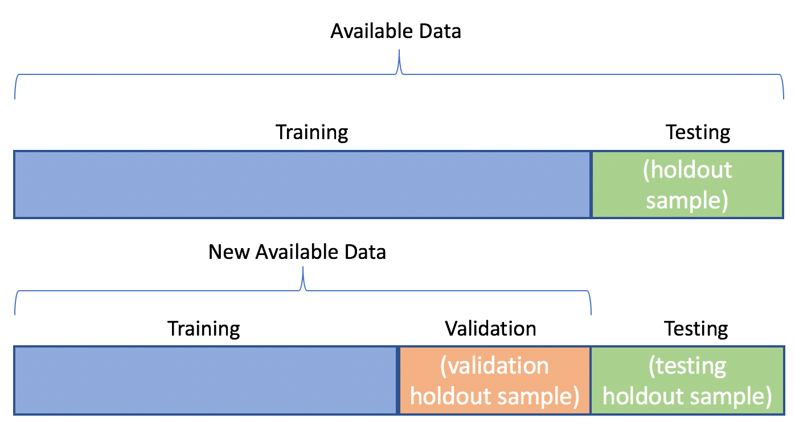

# GIẢI THÍCH THÀNH PHẦN HUẤN LUYỆN AI THEO PHƯƠNG PHÁP FEYNMAN

> **"Nếu bạn không thể giải thích điều gì đó cho một đứa trẻ 8 tuổi, nghĩa là chính bạn cũng chưa thực sự hiểu nó."** - Richard Feynman

<!-- HERO IMAGE: Minh họa Train/Val/Test -->

*🖼️ Tìm kiếm: "train validation test split machine learning diagram" - Sơ đồ chia dataset*

{{youtube:Zi-0rlM4RDs|Train Test Validation Split Explained}}

*🎥 Video: "Train/Test/Validation Split" - Giải thích trực quan về cách chia dữ liệu trong ML*

---

## 1. Richard Feynman là ai và tại sao chúng ta nên nghe ông ấy?

**Richard Feynman** không chỉ là một thiên tài vật lý nhận giải Nobel, mà còn được mệnh danh là **"The Great Explainer"** (Người giải thích vĩ đại). Ông có một "dị ứng" đặc biệt với những thuật ngữ bóng bẩy nhưng rỗng tuếch.

Triết lý của ông rất đơn giản: **"Nếu bạn không thể giải thích điều gì đó cho một đứa trẻ 8 tuổi, nghĩa là chính bạn cũng chưa thực sự hiểu nó."** 

Đối với một kỹ sư AIoT, phương pháp này chính là "bộ lọc" để đảm bảo chúng ta không chỉ học vẹt các thông số, mà thực sự làm chủ được logic bên dưới. Hãy cùng áp dụng cách này để hiểu về 3 tập dữ liệu quan trọng nhất trong AI: **Train, Val (Validation), và Test.**

---

## 2. Cuộc đối thoại: Chuyện học hành của một "Siêu trí tuệ"

Hãy tưởng tượng **AI** là một cậu học sinh, và bạn là **Giảng viên**. Mục tiêu của chúng ta là chuẩn bị cho cậu học sinh này tham gia một kỳ thi "Thế giới thực".

> **Học sinh:** "Thưa thầy, tại sao em phải chia đống dữ liệu này thành 3 phần khác nhau? Sao không đưa hết cho em học một thể cho nhanh?"

> **Giảng viên (Feynman):** "Để thầy kể cho em nghe về cách một người thực sự học một kỹ năng, chứ không phải học vẹt nhé."

---

### A. Tập dữ liệu TRAIN (Học kiến thức) - "Sách giáo khoa và Bài tập về nhà"

**Giải thích:**  
Đây là những bài toán mà thầy đưa cho em, có kèm theo cả lời giải chi tiết ở cuối sách.

**Cách học:**  
Em nhìn vào đề bài, tự giải, sau đó đối chiếu với đáp án. Nếu sai, em tự điều chỉnh lại cách suy nghĩ của mình. Em làm đi làm lại hàng nghìn lần cho đến khi thuộc lòng các dạng bài.

**Mục tiêu:**  
Giúp AI làm quen với các đặc điểm, hình ảnh hoặc con số cụ thể.

**Rủi ro:**  
Nếu em chỉ học thuộc lòng từng con chữ mà không hiểu quy luật, em sẽ bị **"Học tủ" (Overfitting)**. Gặp bài y hệt thì làm được, gặp bài khác một chút là "đứng hình".

<!-- ẢNH: Minh họa Overfitting vs Good Fit -->

*🖼️ Tìm kiếm: "overfitting vs underfitting machine learning graph" - Đồ thị so sánh overfitting*

{{youtube:DEMmkFC6IGM|Overfitting Explained}}

*🎥 Video: "Overfitting in Machine Learning" - Hiểu rõ hiện tượng overfitting*

---

### B. Tập dữ liệu VAL (Kiểm tra giữa kỳ) - "Bài kiểm tra thử trên lớp"

**Giải thích:**  
Khi thầy thấy em có vẻ ổn, thầy cho em làm một bài kiểm tra thử. Những câu hỏi này em **chưa từng thấy** trong tập Train, nhưng nó có dạng tương tự.

**Cách học:**  
Em tự giải mà không được nhìn đáp án. Thầy nhìn vào điểm số của em để biết: "À, cậu này đang học quá vẹt" hoặc "Cậu này cần tập trung thêm vào phần nhận diện hình ảnh".

**Mục tiêu:**  
Dùng kết quả này để **điều chỉnh thông số** (Tuning). Thầy sẽ thay đổi cách dạy hoặc bắt em học lại một số chương.

**Lưu ý:**  
Tập này giúp chúng ta chọn ra "phiên bản" tốt nhất của em trước khi đi thi thật.

---

### C. Tập dữ liệu TEST (Kỳ thi cuối kỳ) - "Thử thách thực tế"

**Giải thích:**  
Đây là ngày thi chính thức. Những câu hỏi này hoàn toàn mới lạ, thầy và em đều chưa từng thảo luận về chúng trước đó.

**Cách học:**  
Đây không phải là lúc để học nữa. Đây là lúc để **đánh giá sự thật**.

**Mục tiêu:**  
Điểm số ở tập này là con số duy nhất nói lên "Em có thực sự giỏi hay không?".

**Quy tắc tối thượng:**  
Tuyệt đối không được cho AI "nhìn trộm" tập Test trong lúc học. Nếu đã nhìn thấy đề thi trước khi thi, thì mọi kết quả đều là giả dối.

---

## 3. Tóm tắt cho Kỹ sư AIoT "Khó tính"

| Thành phần | Tên gọi dân dã | Vai trò kỹ thuật |
|------------|----------------|------------------|
| **Train Set** | Sách bài tập | Để Model học các đặc trưng và điều chỉnh trọng số (Weights). |
| **Validation Set** | Thi thử | Để lập trình viên điều chỉnh siêu tham số (Hyperparameters). |
| **Test Set** | Thi thật | Để đánh giá năng lực thực tế, không dùng để chỉnh sửa gì thêm. |

---

## 4. Áp dụng thực tế trong dự án AIoT

<!-- ẢNH: Pipeline huấn luyện AI -->

*🖼️ Tìm kiếm: "machine learning training pipeline diagram" - Sơ đồ quy trình huấn luyện AI*

{{youtube:dSCFk168vmo|Train Test Val Split Python}}

*🎥 Video: "Train Test Split in Python" - Hướng dẫn chia dữ liệu với sklearn*

### Ví dụ cụ thể: Nhận diện rác thải với YOLOv10

Giả sử bạn đang xây dựng hệ thống phân loại rác thải tự động:

**📚 Train Set (70% dữ liệu):**
- 7,000 ảnh các loại rác: nhựa, giấy, kim loại, thủy tinh
- AI học cách nhận diện đặc trưng của từng loại rác
- Model điều chỉnh weights sau mỗi epoch

**📊 Validation Set (20% dữ liệu):**
- 2,000 ảnh mà AI chưa thấy trong Training
- Sau mỗi epoch, kiểm tra accuracy trên Val Set
- Nếu Val loss tăng mà Train loss giảm → **Overfitting!**
- Điều chỉnh learning rate, thêm dropout, hoặc data augmentation

**🎯 Test Set (10% dữ liệu):**
- 1,000 ảnh hoàn toàn mới, chụp trong điều kiện thực tế
- Chỉ chạy test **1 lần duy nhất** khi đã hoàn tất training
- Kết quả là con số cuối cùng báo cáo với khách hàng

---

## 5. Những sai lầm thường gặp

### ❌ Sai lầm 1: Dùng Test Set để điều chỉnh model
```
Kỹ sư A: "Tôi test thấy accuracy thấp, để tôi thay đổi 
         learning rate rồi test lại."
```
**Vấn đề:** Bạn đã vô tình "học thuộc" Test Set, kết quả không còn khách quan.

**✅ Đúng:** Chỉ dùng Validation Set để điều chỉnh. Test Set chỉ chạy 1 lần cuối cùng.

---

### ❌ Sai lầm 2: Val Set quá nhỏ
```
Train: 95%, Val: 5% → Val Set chỉ có 50 ảnh
```
**Vấn đề:** 50 ảnh không đủ để đại diện cho thế giới thực, kết quả Val không tin cậy.

**✅ Đúng:** Ít nhất 15-20% cho Val Set, đảm bảo đủ sample để đánh giá.

---

### ❌ Sai lầm 3: Train và Val không cân bằng
```
Train: Toàn ảnh chụp ban ngày, ánh sáng tốt
Val: Toàn ảnh chụp ban đêm, thiếu sáng
```
**Vấn đề:** Model sẽ thất bại hoàn toàn trên Val Set vì chưa học cách xử lý điều kiện tối.

**✅ Đúng:** Đảm bảo Train/Val/Test có phân bố tương tự nhau về:
- Điều kiện ánh sáng
- Góc chụp
- Độ phân giải
- Background

---

## 6. Lời kết kiểu Feynman

> **"Đừng cố làm cho bài viết của bạn trông có vẻ nguy hiểm bằng những thuật ngữ toán học nếu bạn không thể giải thích nó bằng một ví dụ đời thường."**

---

## 7. 🛠️ Thực Hành: Code Hoàn Chỉnh Chia Dataset

### Bài toán: Phân loại rác thải với YOLOv8

**Cấu trúc thư mục ban đầu:**
```
raw_data/
├── images/
│   ├── plastic_001.jpg
│   ├── plastic_002.jpg
│   ├── paper_001.jpg
│   └── ... (1000 ảnh)
└── labels/
    ├── plastic_001.txt
    ├── plastic_002.txt
    └── ...
```

### Code Python hoàn chỉnh:

```python
"""
Script chia dataset Train/Val/Test cho YOLO
Tác giả: AIoT Engineer
"""

import os
import shutil
import random
from pathlib import Path
from collections import defaultdict

class DatasetSplitter:
    def __init__(self, 
                 source_dir: str, 
                 output_dir: str,
                 train_ratio: float = 0.7,
                 val_ratio: float = 0.2,
                 test_ratio: float = 0.1,
                 seed: int = 42):
        """
        Khởi tạo splitter với các tham số
        
        Args:
            source_dir: Thư mục chứa images/ và labels/
            output_dir: Thư mục xuất dataset đã chia
            train_ratio: Tỷ lệ Train (default 70%)
            val_ratio: Tỷ lệ Validation (default 20%)
            test_ratio: Tỷ lệ Test (default 10%)
            seed: Random seed để reproducible
        """
        assert abs(train_ratio + val_ratio + test_ratio - 1.0) < 1e-6, \
            "Tổng các ratio phải bằng 1.0"
        
        self.source_dir = Path(source_dir)
        self.output_dir = Path(output_dir)
        self.train_ratio = train_ratio
        self.val_ratio = val_ratio
        self.test_ratio = test_ratio
        
        random.seed(seed)
        
    def get_class_distribution(self) -> dict:
        """
        Phân tích phân bố class trong dataset
        Quan trọng: Đảm bảo mỗi split có phân bố tương tự
        """
        labels_dir = self.source_dir / "labels"
        class_counts = defaultdict(int)
        file_classes = {}
        
        for label_file in labels_dir.glob("*.txt"):
            with open(label_file, 'r') as f:
                classes_in_file = set()
                for line in f:
                    class_id = int(line.strip().split()[0])
                    classes_in_file.add(class_id)
                    class_counts[class_id] += 1
                file_classes[label_file.stem] = list(classes_in_file)
        
        return class_counts, file_classes
    
    def stratified_split(self, file_classes: dict) -> tuple:
        """
        Chia dataset theo stratified sampling
        Đảm bảo mỗi class xuất hiện đều trong Train/Val/Test
        """
        # Group files by their primary class
        class_files = defaultdict(list)
        for filename, classes in file_classes.items():
            primary_class = classes[0] if classes else -1
            class_files[primary_class].append(filename)
        
        train_files = []
        val_files = []
        test_files = []
        
        # Chia từng class riêng biệt
        for class_id, files in class_files.items():
            random.shuffle(files)
            n = len(files)
            
            n_train = int(n * self.train_ratio)
            n_val = int(n * self.val_ratio)
            
            train_files.extend(files[:n_train])
            val_files.extend(files[n_train:n_train + n_val])
            test_files.extend(files[n_train + n_val:])
        
        return train_files, val_files, test_files
    
    def copy_files(self, filenames: list, split_name: str):
        """Copy images và labels vào thư mục tương ứng"""
        images_out = self.output_dir / split_name / "images"
        labels_out = self.output_dir / split_name / "labels"
        
        images_out.mkdir(parents=True, exist_ok=True)
        labels_out.mkdir(parents=True, exist_ok=True)
        
        for filename in filenames:
            # Copy image (thử nhiều extension)
            for ext in ['.jpg', '.jpeg', '.png', '.bmp']:
                img_src = self.source_dir / "images" / f"{filename}{ext}"
                if img_src.exists():
                    shutil.copy(img_src, images_out / f"{filename}{ext}")
                    break
            
            # Copy label
            label_src = self.source_dir / "labels" / f"{filename}.txt"
            if label_src.exists():
                shutil.copy(label_src, labels_out / f"{filename}.txt")
    
    def create_yaml_config(self, class_names: list):
        """Tạo file data.yaml cho YOLO"""
        yaml_content = f"""
# Dataset configuration for YOLOv8
# Auto-generated by DatasetSplitter

path: {self.output_dir.absolute()}
train: train/images
val: val/images
test: test/images

# Classes
nc: {len(class_names)}
names: {class_names}
"""
        yaml_path = self.output_dir / "data.yaml"
        with open(yaml_path, 'w') as f:
            f.write(yaml_content.strip())
        
        print(f"✅ Created: {yaml_path}")
    
    def run(self, class_names: list):
        """Chạy toàn bộ pipeline"""
        print("=" * 50)
        print("🚀 BẮT ĐẦU CHIA DATASET")
        print("=" * 50)
        
        # 1. Phân tích dataset
        print("\n📊 Phân tích phân bố dữ liệu...")
        class_counts, file_classes = self.get_class_distribution()
        
        total_samples = len(file_classes)
        print(f"   Tổng số ảnh: {total_samples}")
        for class_id, count in sorted(class_counts.items()):
            class_name = class_names[class_id] if class_id < len(class_names) else f"class_{class_id}"
            print(f"   - {class_name}: {count} annotations")
        
        # 2. Stratified split
        print("\n✂️ Chia dataset (Stratified Sampling)...")
        train_files, val_files, test_files = self.stratified_split(file_classes)
        
        print(f"   Train: {len(train_files)} ({len(train_files)/total_samples*100:.1f}%)")
        print(f"   Val:   {len(val_files)} ({len(val_files)/total_samples*100:.1f}%)")
        print(f"   Test:  {len(test_files)} ({len(test_files)/total_samples*100:.1f}%)")
        
        # 3. Copy files
        print("\n📁 Copying files...")
        self.copy_files(train_files, "train")
        self.copy_files(val_files, "val")
        self.copy_files(test_files, "test")
        print("   ✅ Done!")
        
        # 4. Create YAML
        print("\n📝 Creating data.yaml...")
        self.create_yaml_config(class_names)
        
        # 5. Summary
        print("\n" + "=" * 50)
        print("✅ HOÀN THÀNH!")
        print("=" * 50)
        print(f"\n📂 Output directory: {self.output_dir}")
        print("\n🔥 Để train model, chạy:")
        print(f"   yolo train data={self.output_dir}/data.yaml model=yolov8n.pt epochs=100")


# Sử dụng
if __name__ == "__main__":
    splitter = DatasetSplitter(
        source_dir="./raw_data",
        output_dir="./trash_dataset",
        train_ratio=0.7,
        val_ratio=0.2,
        test_ratio=0.1,
        seed=42
    )
    
    class_names = ['plastic', 'paper', 'metal', 'glass', 'organic']
    splitter.run(class_names)
```

### Output khi chạy:

```
==================================================
🚀 BẮT ĐẦU CHIA DATASET
==================================================

📊 Phân tích phân bố dữ liệu...
   Tổng số ảnh: 1000
   - plastic: 350 annotations
   - paper: 250 annotations
   - metal: 180 annotations
   - glass: 120 annotations
   - organic: 100 annotations

✂️ Chia dataset (Stratified Sampling)...
   Train: 700 (70.0%)
   Val:   200 (20.0%)
   Test:  100 (10.0%)

📁 Copying files...
   ✅ Done!

📝 Creating data.yaml...
✅ Created: ./trash_dataset/data.yaml

==================================================
✅ HOÀN THÀNH!
==================================================

📂 Output directory: ./trash_dataset

🔥 Để train model, chạy:
   yolo train data=./trash_dataset/data.yaml model=yolov8n.pt epochs=100
```

---

## 8. 📈 Phân Tích Kết Quả Training

### Cách đọc Learning Curves

```python
import matplotlib.pyplot as plt
import pandas as pd

# Load results từ YOLO training
results = pd.read_csv('runs/detect/train/results.csv')

fig, axes = plt.subplots(2, 2, figsize=(12, 10))

# Plot 1: Train vs Val Loss
ax1 = axes[0, 0]
ax1.plot(results['epoch'], results['train/box_loss'], label='Train Loss', color='blue')
ax1.plot(results['epoch'], results['val/box_loss'], label='Val Loss', color='red')
ax1.set_xlabel('Epoch')
ax1.set_ylabel('Box Loss')
ax1.set_title('🔍 Phát hiện Overfitting')
ax1.legend()
ax1.grid(True)

# Annotate overfitting point
overfitting_epoch = 45  # Giả sử
ax1.axvline(x=overfitting_epoch, color='orange', linestyle='--', label='Overfitting starts')
ax1.annotate('⚠️ Val loss tăng\nTrain loss giảm\n→ OVERFITTING!', 
             xy=(overfitting_epoch, 0.05), fontsize=10,
             bbox=dict(boxstyle='round', facecolor='yellow', alpha=0.5))

# Plot 2: mAP progression
ax2 = axes[0, 1]
ax2.plot(results['epoch'], results['metrics/mAP50(B)'], label='mAP@50', color='green')
ax2.plot(results['epoch'], results['metrics/mAP50-95(B)'], label='mAP@50-95', color='purple')
ax2.set_xlabel('Epoch')
ax2.set_ylabel('mAP')
ax2.set_title('📈 Model Improvement')
ax2.legend()
ax2.grid(True)

plt.tight_layout()
plt.savefig('training_analysis.png', dpi=150)
plt.show()
```

### Checklist đánh giá model

| Hiện tượng | Chẩn đoán | Giải pháp |
|------------|-----------|-----------|
| Train loss ↓, Val loss ↓ | ✅ Học tốt | Tiếp tục training |
| Train loss ↓, Val loss ↑ | ⚠️ Overfitting | Early stopping, thêm augmentation, dropout |
| Train loss →, Val loss → | 😴 Underfitting | Tăng model size, học rate, epochs |
| Train loss ↑↓ liên tục | 🎢 Learning rate quá cao | Giảm learning rate |

---

## 9. 💡 Mẹo Vàng Từ Kinh Nghiệm Thực Tế

### Mẹo 1: K-Fold Cross Validation cho dataset nhỏ

Khi bạn chỉ có 200-500 ảnh, việc chia cố định sẽ gây bias. Dùng K-Fold:

```python
from sklearn.model_selection import StratifiedKFold

def kfold_split(file_classes, n_splits=5):
    """
    Chia dataset thành K folds
    Mỗi lần train trên K-1 folds, validate trên 1 fold còn lại
    """
    skf = StratifiedKFold(n_splits=n_splits, shuffle=True, random_state=42)
    
    files = list(file_classes.keys())
    labels = [file_classes[f][0] for f in files]  # Primary class
    
    for fold, (train_idx, val_idx) in enumerate(skf.split(files, labels)):
        train_files = [files[i] for i in train_idx]
        val_files = [files[i] for i in val_idx]
        
        print(f"Fold {fold + 1}: Train={len(train_files)}, Val={len(val_files)}")
        yield fold, train_files, val_files
```

### Mẹo 2: Leak Detection - Phát hiện data leak

```python
def check_data_leak(train_dir, val_dir, test_dir):
    """
    Kiểm tra xem có ảnh nào bị trùng giữa các tập không
    Data leak là lỗi nghiêm trọng!
    """
    import hashlib
    
    def get_file_hash(filepath):
        with open(filepath, 'rb') as f:
            return hashlib.md5(f.read()).hexdigest()
    
    train_hashes = {get_file_hash(f): f for f in Path(train_dir).glob("*")}
    val_hashes = {get_file_hash(f): f for f in Path(val_dir).glob("*")}
    test_hashes = {get_file_hash(f): f for f in Path(test_dir).glob("*")}
    
    # Check overlaps
    train_val_leak = set(train_hashes.keys()) & set(val_hashes.keys())
    train_test_leak = set(train_hashes.keys()) & set(test_hashes.keys())
    val_test_leak = set(val_hashes.keys()) & set(test_hashes.keys())
    
    if train_val_leak:
        print(f"🚨 LEAK! {len(train_val_leak)} ảnh trùng Train-Val")
    if train_test_leak:
        print(f"🚨 LEAK! {len(train_test_leak)} ảnh trùng Train-Test")
    if val_test_leak:
        print(f"🚨 LEAK! {len(val_test_leak)} ảnh trùng Val-Test")
    
    if not any([train_val_leak, train_test_leak, val_test_leak]):
        print("✅ Không có data leak!")
```

---

## 📚 Tài liệu tham khảo

- **"Deep Learning"** - Ian Goodfellow, Chapter 5: Machine Learning Basics
- **"Hands-On Machine Learning"** - Aurélien Géron
- **Stanford CS231n:** Lecture on Training Neural Networks
- **Google ML Crash Course:** Splitting Data

---

**Tác giả:** AIoT Engineer  
**Chuyên mục:** Kiến Thức  
**Cập nhật:** 27/12/2025  
**Tags:** `AI`, `Machine Learning`, `Train Val Test`, `Dataset`, `Feynman Method`

Khi bạn chia nhỏ dữ liệu đúng cách, bạn không chỉ đang huấn luyện AI, bạn đang xây dựng một **Logic chuẩn mực**.

### 🎯 Checklist cho mọi dự án AI:

- [ ] Train Set đủ lớn để model học được patterns (≥60%)
- [ ] Validation Set đủ đại diện để đánh giá trung thực (≥15%)
- [ ] Test Set hoàn toàn độc lập, không bao giờ dùng trong quá trình training (≥10%)
- [ ] Cả 3 tập đều có phân bố dữ liệu tương tự nhau
- [ ] Không bao giờ điều chỉnh model dựa trên kết quả Test Set

---

## 📚 Tài liệu tham khảo

- **"Surely You're Joking, Mr. Feynman!"** - Richard Feynman (Autobiography)
- **Deep Learning Specialization** - Andrew Ng (Coursera)
- **Hands-On Machine Learning** - Aurélien Géron

---

**Tác giả:** Hồ Đặng Hữu Đoan - AIoT Engineer  
**Chuyên mục:** Kiến thức AI  
**Cập nhật:** 25/12/2025  
**Tags:** `Machine Learning`, `Deep Learning`, `Data Science`, `AI Basics`, `Feynman Method`
