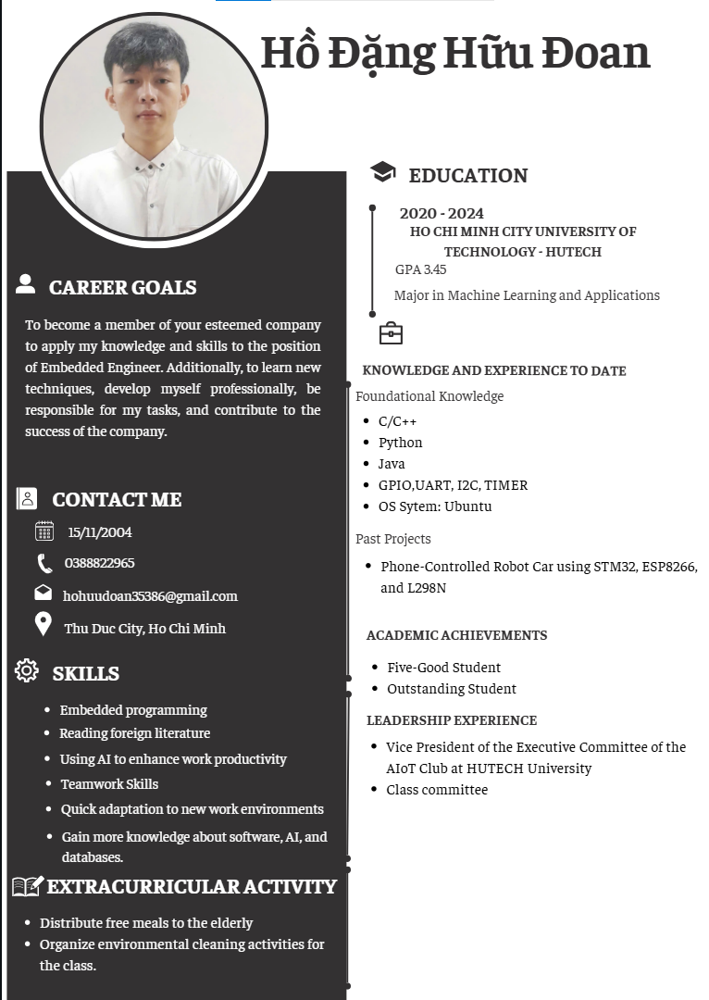
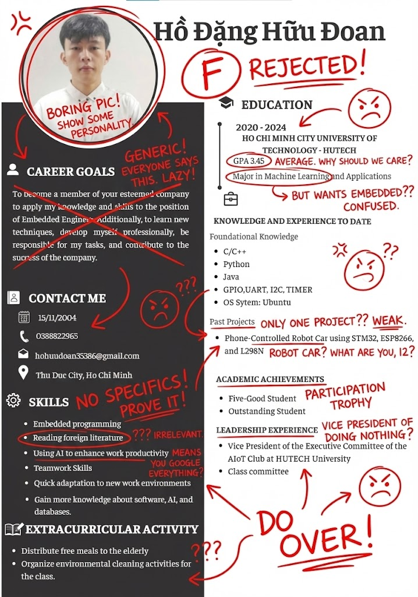

# Dùng AI "Cà Khịa" CV: Khi Sự Thật Làm Bạn "Đau", Nhưng Giúp Bạn Lớn


*CV của mình thời năm 3 - trước khi bị Gemini "cà khịa"*

Chào các bạn, nếu bạn là một sinh viên "non trẻ", chưa có nhiều kinh nghiệm thực chiến và đang loay hoay với chiếc CV đầu đời, thì bài viết này chính là dành cho bạn.

Gần đây, khi lướt mạng xã hội, tôi tình cờ đọc được một bài chia sẻ rất thú vị từ blogger **Việt Nguyễn AI (Bình Dân Học AI)**. Anh ấy giới thiệu một phương pháp dùng Gemini để "roast" (cà khịa/châm chọc) CV với câu lệnh (prompt) cực kỳ "gắt":

> *"Roast my resume, overlay this with insane roast scribble, red ink, doodles, remarks, and comments! Accurately position all annotations. No emojis."*

Thấy hay quá, tôi đã thử ngay với chính chiếc CV thời năm 3 của mình. Và kết quả? Nó thực sự là một "gáo nước lạnh" nhưng đầy thức tỉnh.

---

## 🚀 Hướng dẫn chi tiết: Cách dùng Gemini review CV

Bạn muốn thử ngay? Làm theo các bước sau:

### Bước 1: Chuẩn bị CV

- Chụp ảnh màn hình CV hoặc export sang PDF
- Đảm bảo chất lượng ảnh rõ nét, dễ đọc
- **Lưu ý:** Gemini hỗ trợ nhiều định dạng: JPG, PNG, PDF

### Bước 2: Truy cập Gemini

1. Mở trình duyệt và vào: **[gemini.google.com](https://gemini.google.com)**
2. Đăng nhập bằng tài khoản Google của bạn
3. Chọn phiên bản Gemini Advanced nếu có (để có feedback chi tiết hơn)

### Bước 3: Upload CV và nhập prompt

1. **Click vào nút "📎" (attach file)** hoặc kéo thả file CV vào khung chat
2. **Copy và paste đúng prompt này:**

```
🖌️ roast my resume, overlay this with insane roast scribble, red ink, doodles, remarks, and comments! accurately position all annotations. no emojis.
```

3. **Nhấn Enter** và chờ kết quả

### Bước 4: Nhận kết quả và phân tích

- Gemini sẽ trả về ảnh CV của bạn với **vết bút đỏ đầy ắp**
- Mỗi chú thích đều có ý nghĩa cụ thể
- Đọc kỹ từng nhận xét để hiểu vấn đề

### Bước 5: Lưu lại và cải thiện

- **Download ảnh** kết quả để so sánh
- **Ghi chú** những điểm cần sửa
- **Sửa CV** theo từng feedback
- **Thử lại** với Gemini để kiểm tra tiến bộ

> **💡 Mẹo nhỏ:** Nếu bạn thấy Gemini "quá khắt", hãy thử prompt nhẹ nhàng hơn: *"Review my resume professionally and highlight areas for improvement"*

---

## Tại sao chúng ta luôn thấy CV mình... ổn, cho đến khi bị "soi"?

Bạn có bao giờ thắc mắc tại sao khi tự làm CV, mình luôn thấy nó rất logic và hoàn hảo không? Đó là do **Thiên kiến xác nhận (Confirmation Bias)**.

### Về mặt tâm lý

Chúng ta có xu hướng yêu quý "đứa con tinh thần" của mình. Khi viết một dòng chữ vào CV, não bộ tự động lấp đầy những khoảng trống bằng những kỷ niệm và sự nỗ lực mà chúng ta đã trải qua. 

**Bạn thấy đó là "sự nỗ lực", nhưng AI (hoặc HR) chỉ thấy đó là "dòng chữ".**

### Góc nhìn nhà tuyển dụng

HR không có thời gian để thấu hiểu sự dũng cảm hay nỗ lực tiềm ẩn của bạn. Họ nhìn CV dưới lăng kính **Hiệu quả và Sự phù hợp (Fit & Impact)**. 

Trong khi bạn nghĩ mình viết thế là đủ, HR lại thấy:
- ❌ Thiếu dữ kiện
- ❌ Thiếu con số cụ thể
- ❌ Quá nhiều lý thuyết suông

---

## Màn "Cà Khịa" Đi Vào Lòng Đất Từ Gemini

Đây là chiếc CV xin thực tập hồi đầu năm 3 của tôi. Lúc đó, tôi thú thật mình như một tờ giấy trắng, chỉ có chút nền tảng lập trình và một "trái tim dũng cảm".


*Kết quả sau khi Gemini "cà khịa" CV - đầy vết bút đỏ!*

**Dưới đây là những gì Gemini đã "phun châu nhả ngọc" về hồ sơ của tôi:**

---

### 1. 🎯 Mục tiêu nghề nghiệp (Career Goals)

**Lời phê của Gemini:**
> *"GENERIC! EVERYONE SAYS THIS. LAZY!"*  
> *(Chung chung quá! Ai cũng nói thế này. Lười suy nghĩ à!)*

**Giải thích:**

HR phát ngán với những câu kiểu "đóng góp cho công ty" hay "phát triển bản thân". Họ cần sự **cụ thể**, ví dụ:

❌ **Sai:** "Đóng góp cho sự phát triển của công ty"

✅ **Đúng:** "Phát triển hệ thống RTOS cho thiết bị y tế" hoặc "Tối ưu firmware cho sản phẩm IoT tiết kiệm 30% pin"

---

### 2. 🤔 Sự mâu thuẫn giữa Ngành học và Mục tiêu

**Lời phê của Gemini:**
> *"BUT WANTS EMBEDDED?? CONFUSED."*  
> *(Học Machine Learning mà lại muốn làm Nhúng? Khó hiểu.)*

**Giải thích:**

Nếu bạn học ML nhưng ứng tuyển Embedded, bạn **phải giải thích được sợi dây liên kết** (như AIoT hoặc Edge AI). 

Nếu không, HR sẽ nghĩ bạn đang:
- Gửi nhầm CV
- Không biết mình muốn gì
- Apply đại cho có

**Cách fix:** Thêm dòng giải thích như: *"Định hướng Edge AI - kết hợp ML và Embedded để deploy AI trên thiết bị nhúng"*

---

### 3. 📊 Điểm số (GPA)

**Lời phê của Gemini:**
> *"GPA 3.45 AVERAGE. WHY SHOULD WE CARE?"*  
> *(GPA 3.45 cũng thường thôi. Có gì đáng chú ý đâu?)*

**Giải thích:**

GPA 3.45 là con số **khá**, nhưng chưa đủ để làm "vũ khí" duy nhất nếu bạn không có hoạt động chuyên môn khác nổi bật.

**Bài học:**
- GPA < 3.6: Cần có dự án, chứng chỉ bổ sung
- GPA < 3.2: Dự án và kỹ năng thực tế quan trọng hơn nhiều
- GPA > 3.8: Có thể highlight, nhưng vẫn cần dự án

---

### 4. 🛠️ Kỹ năng (Skills)

**Lời phê của Gemini:**
> *"NO SPECIFICS! PROVE IT!"*  
> *(Không có gì cụ thể cả! Chứng minh đi!)*

**Phân tích từng kỹ năng:**

| Kỹ năng ghi | Gemini nói | Vấn đề |
|-------------|------------|--------|
| Embedded programming | "NO SPECIFICS!" | Thiếu cụ thể: STM32? ESP32? ARM? |
| Reading foreign literature | "IRRELEVANT" | Không liên quan đến vị trí |
| Using AI to enhance productivity | "MEANS YOU GOOGLE EVERYTHING?" | HR sợ bạn phụ thuộc AI |

**Cách fix:**
```
❌ Embedded programming
✅ Embedded C/C++ (STM32, ESP32), FreeRTOS, I2C/SPI/UART

❌ Using AI
✅ Prompt Engineering với ChatGPT/Gemini để tăng 50% tốc độ debug
```

---

### 5. 📁 Dự án (Past Projects)

**Lời phê của Gemini:**
> *"ONLY ONE PROJECT?? WEAK."*  
> *(Có đúng một dự án thôi à? Yếu thế.)*

Về dự án xe Robot:
> *"ROBOT CAR? WHAT ARE YOU, 12?"*  
> *(Xe robot? Bạn là học sinh lớp 6 à?)*

**Giải thích:**

Xe robot là bài tập "vỡ lòng" của dân Embedded. **Ai cũng làm được!**

Để gây ấn tượng, bạn cần:
- ✅ Dự án có độ khó cao hơn
- ✅ Giải quyết vấn đề thực tế
- ✅ Có số liệu đo lường (accuracy, speed, cost saving)

**Ví dụ cải thiện:**

❌ **Trước:** "Phone-Controlled Robot Car using STM32, ESP8266, and L298N"

✅ **Sau:** "Smart Autonomous Robot với Computer Vision - Tự động né vật cản bằng YOLO, đạt độ chính xác 92%"

---

### 6. 🏆 Thành tích và Hoạt động

**Sinh viên 5 tốt:**
> *"PARTICIPATION TROPHY"*  
> *(Giải thưởng phong trào)*

HR cần các **cuộc thi kỹ thuật** hơn là danh hiệu mang tính hình thức.

**Vị trí lãnh đạo CLB:**
> *"VICE PRESIDENT OF DOING NOTHING?"*  
> *(Phó chủ tịch hội... ăn không ngồi rồi à?)*

Bạn cần ghi rõ mình đã **"làm"** được gì cho CLB, chứ không chỉ là cái danh hiệu.

**Cách fix:**

❌ **Trước:** "Vice President of AIoT Club"

✅ **Sau:** "Vice President of AIoT Club - Tổ chức 5 workshop với 200+ sinh viên tham gia, xây dựng 3 dự án IoT cho trường"

---

## 💡 Bài học rút ra: Từ dũng cảm đến chuyên nghiệp

Sau khi xem xong đánh giá của Gemini, tôi ước gì lúc đó mình có... **1000 chiếc mũ** để đội lên đầu cho bớt ngượng vì sự "ngây ngô" của mình 😅

Tôi tự hỏi tại sao ngày đó công ty lại nhận mình? 

Có lẽ họ đã nhìn thấy **sự dũng cảm và tiềm năng** đằng sau tờ giấy trắng đó. Tôi thực sự biết ơn công ty đã trao cơ hội, và tôi cũng tự hào vì mình đã báo đáp họ bằng cách **hoàn thành tốt mọi nhiệm vụ được giao**.

---

## ✅ Nhờ Gemini cà khịa, tôi mới biết:

| Trước | Sau |
|-------|-----|
| Không biết vấn đề nằm ở đâu | Nhận ra từng điểm yếu cụ thể |
| Nghĩ kiến thức đã đủ | Biết cần học thêm bao nhiêu |
| CV "tạm được" | Biết cách làm CV "Perfect" |

---

## 🤖 So sánh: Gemini vs ChatGPT khi review CV

Tôi đánh giá cao sự **khách quan** của Gemini:

| Tiêu chí | ChatGPT | Gemini |
|----------|---------|--------|
| Phong cách | Nhẹ nhàng, khuyến khích | Thẳng thắn, "phũ phàng" |
| Feedback | "CV của bạn khá tốt, có thể cải thiện..." | "WEAK! GENERIC! PROVE IT!" |
| Hiệu quả | Dễ chịu nhưng có thể bỏ sót vấn đề | Đau nhưng nhận ra hết vấn đề |

**Kết luận:** Nếu bạn cần **sự thật**, hãy dùng Gemini. Nếu bạn cần **sự động viên**, hãy dùng ChatGPT 😄

---

## 📝 Lời kết

> **"Dũng cảm là tốt, nhưng dũng cảm cộng với sự chuẩn bị kỹ lưỡng sẽ đưa bạn đi xa hơn."**

Đúng như câu châm ngôn tôi luôn tâm đắc:

> **"Nơi nào có ý chí, nơi đó có con đường."**

---

## 🎯 Action Items cho bạn

Nếu bạn đang có CV, hãy thử ngay:

1. **Mở Gemini** (gemini.google.com)
2. **Upload CV** của bạn
3. **Gõ prompt:** *"Roast my resume, overlay this with insane roast scribble, red ink, doodles, remarks, and comments! Accurately position all annotations. No emojis."*
4. **Đọc kết quả** và... chuẩn bị tâm lý 😅
5. **Sửa CV** dựa trên feedback

---

**Cảm ơn các bạn đã đọc câu chuyện của tôi!**

Nếu bạn thấy bài viết hữu ích, hãy chia sẻ cho bạn bè đang loay hoay với CV nhé! 🚀

---

*Bài viết được viết bởi: Hồ Đặng Hữu Đoan*  
*Ngày đăng: 27/12/2025*  
*Credit ý tưởng: Việt Nguyễn AI (Bình Dân Học AI)*
