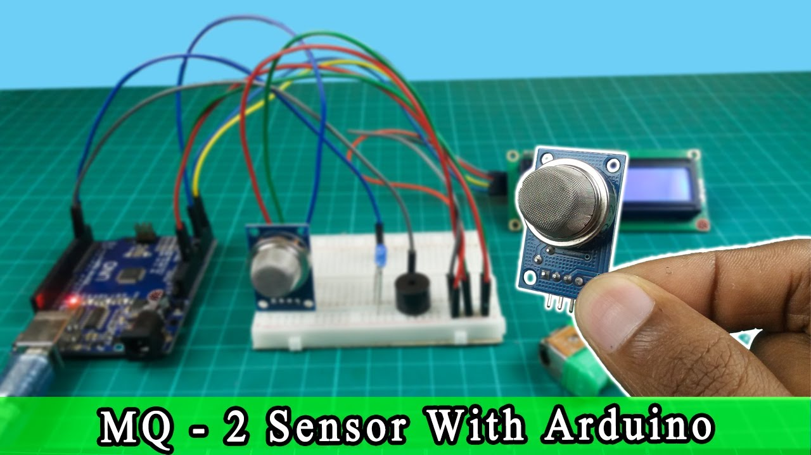

# So sánh phương pháp: "Em yêu khoa học" vs "Người làm theo phương pháp khoa học"

> **"Bạn thực sự làm chủ hệ thống, hay bạn chỉ đang 'diễn kịch' cùng các linh kiện điện tử?"**

<!-- HERO IMAGE: Cargo Cult Programming -->

*🖼️ Tìm kiếm: "cargo cult programming meme" hoặc "copy paste programmer comic" - Ảnh minh họa lập trình copy-paste*

{{youtube:y8OnoxKotPQ|Cargo Cult Programming}}

*🎥 Video: "Cargo Cult Programming" - Hiện tượng code mà không hiểu*

Trong thế giới Internet of Things (IoT), ranh giới giữa một chuyên gia thực thụ và một người làm hời hợt không nằm ở việc ai dùng linh kiện đắt tiền hơn. Nó nằm ở chỗ: **Bạn thực sự làm chủ hệ thống, hay bạn chỉ đang "diễn kịch" cùng các linh kiện điện tử.**

Dưới đây là bài so sánh về hai cách tiếp cận này qua những ví dụ thực tế đến mức "đau lòng".

---

## 1. Biết "cái tên" hay hiểu "bản chất"?

Hãy tưởng tượng bạn đang cầm trên tay một con cảm biến nhiệt độ.

### 👨‍🎓 Nhóm "Em yêu khoa học"

Họ giống như một người thuộc lòng tên loài chim bằng 20 thứ tiếng nhưng chẳng biết con chim đó ăn gì hay bay đi đâu. 

Họ có thể dõng dạc nói: 
> *"Tôi đang dùng giao thức MQTT, chạy trên nền ESP32 kết nối với Broker Mosquitto"*

Họ thuộc tên công nghệ như đọc thực đơn, nhưng nếu hỏi: 
> *"Tại sao gói tin bị mất khi có một chiếc máy khoan điện chạy bên cạnh?"*

Họ sẽ đứng hình. 😶

### 🔬 Người làm theo phương pháp khoa học

Họ không quan tâm đến tên gọi mỹ miều. Họ hiểu rằng đó thực chất là việc **điều khiển những hạt electron chạy qua dây dẫn sao cho chúng không bị nhiễu**. 

Họ không gọi tên "loài chim", họ quan sát cách nó đập cánh.

---

## 2. Ví dụ thực tế: Hệ thống cảnh báo cháy

<!-- ẢNH: Cảm biến khói và Arduino -->

*🖼️ Tìm kiếm: "MQ-2 smoke sensor arduino wiring" - Sơ đồ đấu nối cảm biến khói*

### ❌ Cách làm "Em yêu khoa học"

**Tư duy:**
- Cắm cảm biến khói vào → Đọc giá trị → Nếu cao thì hú còi
- "Chạy được rồi, xong!"

**Vấn đề:**
- Không biết cảm biến cần 2 phút để "làm nóng"
- Báo động giả khi có khói thuốc lá, hơi cồn
- Không có cơ chế xác nhận
- Không xử lý nhiễu điện từ

### ✅ Cách làm của người làm theo phương pháp khoa học

**Tư duy:**
- Đọc datasheet: Cảm biến cần preheat 2 phút
- Calibration: Đo giá trị nền trong môi trường sạch
- Lọc nhiễu: Lấy trung bình nhiều lần đo
- Xác nhận: Kiểm tra lại sau 5 giây để tránh false alarm
- So sánh delta, không phải giá trị tuyệt đối

**Kết quả:** 
Hệ thống ổn định, không báo động nhầm, hiểu rõ tại sao nó hoạt động.

{{youtube:xaELqAo4kkQ|How to use Oscilloscope}}

*🎥 Video: "How to Use an Oscilloscope" - Cách dùng oscilloscope để debug*

---

## 3. Hệ thống "Lâu đài cát" vs "Pháo đài đá"

### 🏖️ Kiểu "Em yêu khoa học" - Lâu đài cát

Hãy thử giải thích cho đứa trẻ 5 tuổi:

**Người làm hời hợt:** 
> *"Chú cắm cái dây này vào cái lỗ này, khi chú xịt bật lửa vào, cái đèn trên máy tính sẽ hiện màu đỏ. Hay không?"*

**Đứa trẻ hỏi:** 
> *"Thế nếu con mèo làm tuột cái dây này ra thì sao chú?"*

**Trả lời:** 
> *"À... thì chú cắm lại. Đừng hỏi khó thế!"*

**Phê phán:** Đây là kiểu hệ thống "nguyện cầu". Nó chỉ chạy được trong điều kiện hoàn hảo:
- ❌ Không có gió
- ❌ Không có mèo
- ❌ Người dùng phải cực kỳ nâng niu

### 🏰 Người làm theo phương pháp khoa học - Pháo đài đá

**Người chuyên nghiệp:**
> *"Cái máy này giống như một cái mũi điện tử không bao giờ ngủ. Nếu nó thấy mùi lạ, nó sẽ gửi một bức thư khẩn cấp. Để chắc chắn thư đến nơi, nó bắt người nhận phải ký tên xác nhận. Nếu không thấy ai ký tên, nó sẽ tự động gào lên tại chỗ vì nó biết mạng internet có thể bị hỏng bất cứ lúc nào"*

**Bản chất:** Họ không tin vào sự hoàn hảo. Họ thiết kế dựa trên giả định:
> **"Mọi thứ rồi sẽ hỏng, và mình phải có phương án dự phòng"**

**Cơ chế dự phòng:**
1. Thử gửi MQTT → Thất bại?
2. Thử gửi HTTP backup → Thất bại?
3. Lưu vào SD card → Thất bại?
4. Bật còi báo động local

**Tư tưởng:** Không có single point of failure.

---

## 4. Bẫy "Mì ăn liền" và Tư duy gốc

### 🍜 Debug kiểu "Vọc vạch"

Giống như việc bạn cố sửa một chiếc đồng hồ bằng cách **lắc thật mạnh** cho đến khi nó chạy lại.

**Quy trình:**
1. Lên diễn đàn hỏi: *"Tại sao code của em không chạy?"*
2. Copy một đoạn code khác trên mạng
3. Dán đè vào
4. Thấy chạy được là thở phào

**Vấn đề:** Họ không học, họ đang **"thử vận may"**.

### 🔍 Debug kiểu người làm theo phương pháp khoa học

Họ là những kẻ **"bi quan có đào tạo"**.

**Quy trình:**
1. Đọc datasheet để hiểu timing diagram
2. Dùng logic analyzer để bắt xung tín hiệu
3. Kiểm tra điện áp nguồn bằng oscilloscope
4. Đo dòng rò khi ở chế độ sleep
5. Viết test case để tái hiện lỗi
6. Sửa từ gốc rễ, không vá víu

### 🛠️ Ví Dụ Thực Hành: Debug I2C Không Ổn Định

**Tình huống:** Cảm biến BME280 đọc được lúc đầu, sau vài giờ mất liên lạc.

**❌ Cách "Em yêu khoa học":**
```cpp
// Thấy lỗi → restart ESP32
if (!bme.begin()) {
  ESP.restart();  // "Chữa cháy" tạm thời
}
```

**✅ Cách khoa học - Phân tích gốc rễ:**

**Bước 1: Kiểm tra tín hiệu I2C bằng Logic Analyzer**
```
Kết quả:
- SDA có spike khi WiFi transmit
- Clock stretching vượt quá timeout
- Địa chỉ ACK đôi khi bị miss
```

**Bước 2: Đo điện áp bằng oscilloscope**
```
Phát hiện:
- VCC sụt từ 3.3V → 2.9V khi WiFi burst
- I2C pull-up 10K quá yếu (rise time 2.5µs)
```

**Bước 3: Code diagnostic để logging:**
```cpp
#include <Wire.h>

// Struct lưu trữ I2C diagnostics
struct I2CDiag {
  uint32_t totalReads;
  uint32_t successReads;
  uint32_t nackErrors;
  uint32_t timeoutErrors;
  uint32_t busErrors;
  uint32_t lastErrorTime;
} i2cStats = {0};

// Wrapper function đọc I2C có logging
bool readI2CWithDiag(uint8_t addr, uint8_t reg, uint8_t* data, uint8_t len) {
  i2cStats.totalReads++;
  
  Wire.beginTransmission(addr);
  Wire.write(reg);
  uint8_t error = Wire.endTransmission(false);  // Repeated start
  
  if (error != 0) {
    i2cStats.lastErrorTime = millis();
    switch(error) {
      case 1: Serial.println("I2C: Data too long"); break;
      case 2: 
        i2cStats.nackErrors++;
        Serial.println("I2C: NACK on address"); 
        break;
      case 3: 
        i2cStats.nackErrors++;
        Serial.println("I2C: NACK on data"); 
        break;
      case 4: 
        i2cStats.busErrors++;
        Serial.println("I2C: Bus error"); 
        // Thử recovery
        i2cRecovery();
        break;
      case 5:
        i2cStats.timeoutErrors++;
        Serial.println("I2C: Timeout");
        break;
    }
    return false;
  }
  
  uint8_t received = Wire.requestFrom(addr, len);
  if (received != len) {
    Serial.printf("I2C: Expected %d, got %d\n", len, received);
    return false;
  }
  
  for(int i = 0; i < len; i++) {
    data[i] = Wire.read();
  }
  
  i2cStats.successReads++;
  return true;
}

// I2C Bus Recovery - Toggle SCL để release SDA
void i2cRecovery() {
  Serial.println("Attempting I2C recovery...");
  
  Wire.end();
  
  // Toggle SCL 9 lần để release slave
  pinMode(SCL_PIN, OUTPUT);
  pinMode(SDA_PIN, INPUT_PULLUP);
  
  for(int i = 0; i < 9; i++) {
    digitalWrite(SCL_PIN, LOW);
    delayMicroseconds(5);
    digitalWrite(SCL_PIN, HIGH);
    delayMicroseconds(5);
    
    // Check if SDA released
    if(digitalRead(SDA_PIN) == HIGH) {
      Serial.printf("SDA released after %d clocks\n", i+1);
      break;
    }
  }
  
  // Generate STOP condition
  pinMode(SDA_PIN, OUTPUT);
  digitalWrite(SDA_PIN, LOW);
  delayMicroseconds(5);
  digitalWrite(SCL_PIN, HIGH);
  delayMicroseconds(5);
  digitalWrite(SDA_PIN, HIGH);
  
  // Reinitialize I2C
  Wire.begin(SDA_PIN, SCL_PIN);
  Wire.setClock(100000);  // Giảm tốc độ sau recovery
  
  Serial.println("I2C recovery complete");
}

// In thống kê định kỳ
void printI2CStats() {
  float successRate = (i2cStats.totalReads > 0) ? 
    (float)i2cStats.successReads / i2cStats.totalReads * 100 : 0;
  
  Serial.println("\n=== I2C Statistics ===");
  Serial.printf("Total reads: %lu\n", i2cStats.totalReads);
  Serial.printf("Success rate: %.2f%%\n", successRate);
  Serial.printf("NACK errors: %lu\n", i2cStats.nackErrors);
  Serial.printf("Timeout errors: %lu\n", i2cStats.timeoutErrors);
  Serial.printf("Bus errors: %lu\n", i2cStats.busErrors);
  Serial.println("=====================\n");
}
```

**Bước 4: Giải pháp hardware:**
```
✅ Thay pull-up 10K → 2.2K (rise time giảm còn 0.6µs)
✅ Thêm tụ 100nF bypass gần VCC sensor
✅ Thêm ferrite bead 100Ω trên đường I2C
✅ Giảm clock I2C từ 400kHz → 100kHz
```

**Kết quả sau fix:**
```
Trước: Success rate 94.3%, NACK errors: 127
Sau:   Success rate 99.97%, NACK errors: 2 (trong 10,000 reads)
```

---

## 5. Ví dụ thực tế: Pin sụt nhanh

### Tình huống
Thiết bị IoT chạy pin bị sụt nguồn nhanh.

### ❌ Giải pháp "Em yêu khoa học"
> "Thay cục pin to hơn!"

**Phê phán:** Giải quyết phần ngọn, không tìm nguyên nhân gốc.

### ✅ Giải pháp khoa học

**Bước 1:** Đo dòng tiêu thụ ở từng chế độ
```
- Active mode: 120mA
- Light sleep: 15mA  
- Deep sleep: ??? (Cần đo)
```

**Bước 2:** Dùng ammeter mức µA để đo deep sleep
```
Phát hiện: 5.2mA trong deep sleep (quá cao!)
Lý thuyết: Chỉ nên 10-100µA
```

**Bước 3:** Rà soát từng module
```
- ESP32 core: 10µA ✅ (đúng datasheet)
- DHT22: 50µA ✅ (đúng datasheet)
- LED báo nguồn: 5mA ❌ NGUYÊN NHÂN!
- LDO regulator quiescent: 150µA ✅
```

**Bước 4:** Giải pháp
```cpp
// Tắt LED trước khi sleep
void goToSleep() {
  digitalWrite(LED_PIN, LOW);
  pinMode(LED_PIN, INPUT);  // High-Z để không rò dòng
  
  // Tắt các peripheral không cần
  adc_power_off();
  WiFi.disconnect(true);
  WiFi.mode(WIFI_OFF);
  
  esp_sleep_enable_timer_wakeup(SLEEP_TIME_US);
  esp_deep_sleep_start();
}
```

**Kết quả:**
- Trước: 5.2mA → Pin 2500mAh chạy được **16 ngày**
- Sau: 0.08mA → Pin 2500mAh chạy được **2.8 năm!** 🚀

> **Bài học:** Đừng vá víu bằng pin to hơn, hãy tìm thủ phạm thực sự!

---

## 6. Bảng So Sánh Tư Duy

| Khía cạnh | "Em Yêu Khoa Học" | Người Làm Khoa Học |
|-----------|-------------------|-------------------|
| **Debug** | Console.log khắp nơi, đoán mò | Logic analyzer, oscilloscope, đo điện |
| **Error Handling** | try-catch rồi bỏ qua | Log lỗi, retry, fallback, alert |
| **Testing** | "Chạy được là được" | Unit test, integration test, stress test |
| **Performance** | "Máy mạnh mà, kệ" | Profiling, bottleneck analysis |
| **Security** | Hardcode password | Encryption, secure boot, OTA signed |
| **Documentation** | "Code dễ hiểu mà" | Sơ đồ khối, decision log, API docs |
| **Scalability** | 1 device chạy OK | Test với 100, 1000 devices |

---

## 7. Checklist Tự Kiểm Tra - "Bạn Đang Ở Đâu?"

Hãy tự hỏi mình những câu hỏi sau:

### Về Hardware
- [ ] Bạn biết tại sao phải có tụ lọc 100nF gần chân VCC của IC?
- [ ] Bạn có dùng pull-up/pull-down resistor đúng chỗ không?
- [ ] Bạn có tính toán trở kháng đặc tính cho đường truyền dài không?
- [ ] Mạch của bạn có chống nhiễu EMI không?

### Về Software
- [ ] Bạn có xử lý timeout khi chờ response từ server?
- [ ] Bạn có cơ chế retry khi gửi packet thất bại?
- [ ] Bạn có log lại lỗi vào EEPROM/SD card không?
- [ ] Code của bạn có watchdog timer để tự reset khi treo không?

### Về Hệ thống
- [ ] Bạn có test trong điều kiện nguồn không ổn định?
- [ ] Bạn có test khi nhiệt độ môi trường thay đổi?
- [ ] Bạn có plan cho việc cập nhật firmware từ xa?
- [ ] Bạn có backup plan khi server chính chết?

---

## 8. Lời kết: Đừng tự lừa dối mình

> **"Sai lầm lớn nhất của những người làm kỹ thuật là tự lừa dối bản thân rằng mình đã hiểu vấn đề trong khi thực ra chỉ mới biết cái tên của nó."**

Làm việc kiểu **"Em yêu khoa học"** chỉ giúp bạn tạo ra những món **đồ chơi**.

Để tạo ra những **hệ thống thay đổi thế giới**, bạn phải ngừng việc "vẫy tay gọi máy bay" như những bộ tộc lạc hậu, mà hãy bắt đầu nghiên cứu xem làm thế nào để động cơ phản lực có thể hoạt động ổn định dưới áp suất cao.

---

## 9. Câu hỏi cho bạn

Hãy tự đánh giá dự án hiện tại của bạn:

**1. Nếu ngắt điện đột ngột, hệ thống có tự phục hồi được không?**

**2. Nếu WiFi mất trong 1 giờ, dữ liệu có bị mất không?**

**3. Nếu có 1000 thiết bị cùng lúc, server có chịu được không?**

**4. Bạn có thể giải thích cho người không phải chuyên ngành hiểu được không?**

Nếu trả lời "Không" cho bất kỳ câu nào → Bạn đang ở nhóm "Em yêu khoa học".

Nếu trả lời "Có" nhưng không chứng minh được → Bạn đang tự lừa dối mình.

Nếu trả lời "Có" và có test results để chứng minh → Chúc mừng, bạn đang trên con đường đúng! 🎯

---

## 📚 Tài liệu tham khảo

- **"Surely You're Joking, Mr. Feynman!"** - Richard Feynman
- **"The Art of Electronics"** - Paul Horowitz
- **"Designing Embedded Systems"** - Jack Ganssle
- **ESP32 Technical Reference Manual** - Espressif

---

**Tác giả:** Hồ Đặng Hữu Đoan - AIoT Engineer  
**Chuyên mục:** Kinh nghiệm  
**Cập nhật:** 26/12/2025  
**Tags:** `IoT`, `Best Practices`, `Debugging`, `System Design`, `Engineering Mindset`

---

**P/S:** Bạn có muốn tôi cùng bạn "mổ xẻ" thử một sơ đồ khối IoT mà bạn đang làm để xem nó thực sự là "pháo đài" hay chỉ là một "lâu đài cát" không? Hãy chia sẻ dự án của bạn ở comment! 💬
