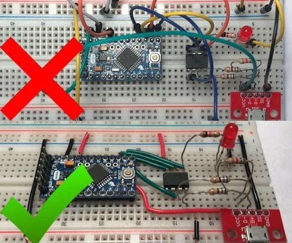
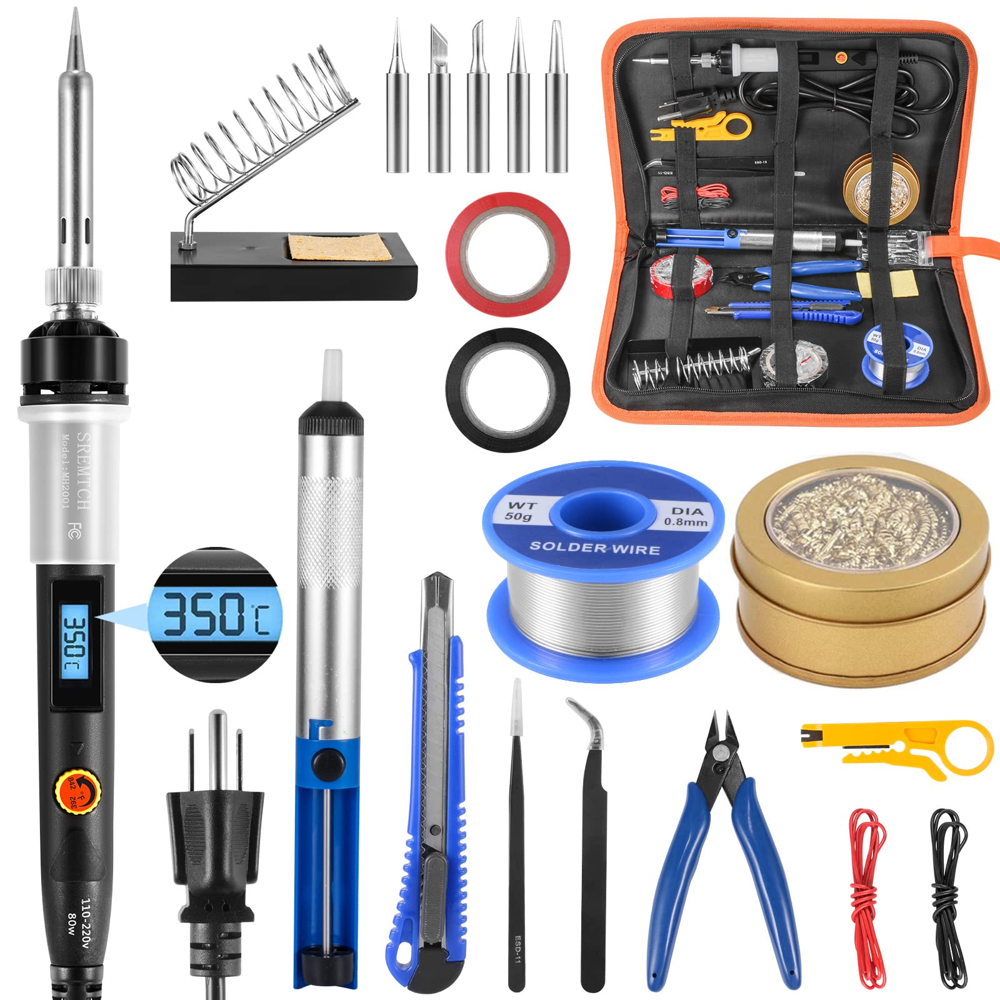

# Bẫy của dây cắm và testboard: Bài học xương máu từ dự án Smart Home

> **"Đừng để những sợi dây dỏm làm lãng phí chất xám của bạn"**

<!-- HERO IMAGE: Breadboard với dây rối -->

*🖼️ Tìm kiếm: "messy breadboard wires arduino" - Ảnh breadboard với dây rối*

{{youtube:6rmErwU5E-k|Breadboard vs PCB}}

*🎥 Video: "Breadboard to PCB" - Từ prototype đến sản phẩm*

Chào bạn, là một người cũng từng "ăn ngủ" cùng các mạch điện, tôi rất hiểu cảm giác bất lực khi một hệ thống lỗi mà mình không biết nó hỏng ở đâu. Hôm nay tôi muốn chia sẻ với bạn về cái bẫy mang tên **"dây cắm sẵn"** và **"testboard"** – những thứ vốn dĩ rất tiện lợi nhưng lại là nguyên nhân gây ra những thảm họa dở khóc dở cười.

---

## 1. Ưu điểm: Sự khởi đầu ngọt ngào

<!-- ẢNH: Breadboard gọn gàng -->

*🖼️ Tìm kiếm: "neat breadboard circuit arduino" - Mạch breadboard gọn gàng*

Không thể phủ nhận, dây cắm (jumper wires) đực-đực, cái-cái và testboard là những trợ thủ đắc lực khi bắt đầu. Chúng giúp chúng ta:

### ✅ Triển khai cực nhanh
Chỉ cần cắm và chạy, không cần dùng máy hàn khói nghi ngút.

### ✅ Dễ thay đổi
Cắm sai thì rút ra cắm lại, cực kỳ linh hoạt cho việc thử nghiệm các ý tưởng mới.

---

## 2. Nhược điểm: Những cái "bẫy" tiềm ẩn

Tuy nhiên, sự tiện lợi này lại đi kèm với những rủi ro mà nếu không cẩn thận, bạn sẽ tự hại chính mình:

### ❌ Sự bất lực về độ dài
Dây cắm sẵn thường có độ dài cố định (thường là 10cm, 20cm). Bạn không thể làm chủ được độ dài. Nếu cần dài hơn, bạn buộc phải ghép 2 sợi đực-cái lại với nhau. Chính cái **mối nối ở giữa** đó là nơi tiếp xúc cực kém, rất dễ tuột hoặc gây nhiễu.

### ❌ Tiếp xúc chập chờn
Lỗ trên testboard sau vài lần cắm sẽ bị dãn. Dây tín hiệu dỏm thì lõi nhôm mạ đồng rất giòn. Kết quả là mạch của bạn lúc chạy lúc không, chỉ cần một làn gió thổi qua hoặc chạm nhẹ tay vào là hệ thống "tắt ngỏm".

### ❌ Thời gian triển khai nhanh, thời gian sửa lỗi vô tận
Nó tạo ra một ảo tưởng rằng mạch đã xong, nhưng thực tế nó để lại vô số "cái bẫy" khiến bạn mất hàng giờ, hàng ngày để tìm lỗi.

### 📊 So Sánh Các Loại Dây Và Testboard

**Dây cắm (Jumper Wires):**

| Loại | Chất lượng | Giá | Ưu điểm | Nhược điểm |
|------|------------|-----|---------|------------|
| **Dupont rẻ tiền** | ⭐ | ~10K/40 sợi | Rẻ, dễ mua | Lõi nhôm, hay đứt ngầm |
| **Dupont chất lượng** | ⭐⭐⭐ | ~30K/40 sợi | Lõi đồng, bền hơn | Vẫn có vấn đề tiếp xúc |
| **Dây silicon mềm** | ⭐⭐⭐⭐ | ~50K/cuộn | Dẻo, không gãy | Cần tự bấm đầu connector |
| **Dây ribbon IDC** | ⭐⭐⭐⭐⭐ | ~20K/mét | Gọn, chuyên nghiệp | Cần kìm bấm IDC |

**Testboard (Breadboard):**

| Loại | Số lỗ | Chất lượng | Giá | Ghi chú |
|------|-------|------------|-----|--------|
| **MB-102 rẻ** | 830 | ⭐ | ~15K | Lỗ dễ lỏng, tiếp xúc kém |
| **MB-102 xịn** | 830 | ⭐⭐⭐ | ~40K | Nickel plated, bền hơn |
| **Solderless Pro** | 830 | ⭐⭐⭐⭐ | ~80K | Gold plated contacts |
| **Protoboard hàn** | N/A | ⭐⭐⭐⭐⭐ | ~20K | Hàn cố định, cực bền |

### 🔬 Cách Test Chất Lượng Dây Và Board

```cpp
// Code test độ ổn định của kết nối
// Nối chân 2 → chân 3 qua dây cần test

#define TEST_OUT 2
#define TEST_IN 3
#define NUM_TESTS 10000

void setup() {
  Serial.begin(115200);
  pinMode(TEST_OUT, OUTPUT);
  pinMode(TEST_IN, INPUT);
  
  Serial.println("=== Wire Quality Test ===");
  testWireQuality();
}

void testWireQuality() {
  int errors = 0;
  int transitions = 0;
  
  for(int i = 0; i < NUM_TESTS; i++) {
    // Test LOW
    digitalWrite(TEST_OUT, LOW);
    delayMicroseconds(10);
    if(digitalRead(TEST_IN) != LOW) errors++;
    
    // Test HIGH
    digitalWrite(TEST_OUT, HIGH);
    delayMicroseconds(10);
    if(digitalRead(TEST_IN) != HIGH) errors++;
    
    transitions += 2;
  }
  
  float errorRate = (float)errors / transitions * 100;
  
  Serial.printf("Total transitions: %d\n", transitions);
  Serial.printf("Errors: %d\n", errors);
  Serial.printf("Error rate: %.4f%%\n", errorRate);
  
  // Đánh giá
  if(errorRate == 0) {
    Serial.println("✅ EXCELLENT - Dây/board chất lượng tốt");
  } else if(errorRate < 0.01) {
    Serial.println("⚠️ ACCEPTABLE - Có thể dùng cho prototype");
  } else {
    Serial.println("❌ POOR - Thay dây/board ngay!");
  }
}

void loop() {
  // Shake test: Lắc mạch và xem có lỗi không
  static unsigned long lastCheck = 0;
  static int shakeErrors = 0;
  
  if(millis() - lastCheck > 100) {
    digitalWrite(TEST_OUT, HIGH);
    delayMicroseconds(10);
    if(digitalRead(TEST_IN) != HIGH) {
      shakeErrors++;
      Serial.printf("❌ Shake error #%d detected!\n", shakeErrors);
    }
    lastCheck = millis();
  }
}
```

---

## 3. Câu chuyện xương máu của tôi: Bài học từ ngôi nhà thông minh

Hôm qua, tôi làm dự án **Smart Home**. Ban đầu, mọi thứ rất tuyệt:
- ✅ Code nạp xong
- ✅ Cảm biến hiển thị thông số chuẩn xác
- ✅ Điều khiển đèn quạt mượt mà qua App Flutter tự viết

Tôi đắc ý đi ngủ.

### 🔥 Thảm họa ập đến

Sáng nay ngủ dậy, App bỗng nhiên báo lỗi:
- ❌ Dữ liệu nhảy loạn xạ
- ❌ Điều khiển lúc được lúc không
- ❌ Sensor đọc giá trị sai lệch

Tôi đinh ninh là do Code App Flutter có vấn đề hoặc Logic Server bị lỗi. Thế là tôi mất nguyên một ngày quên ăn quên uống, ngồi soi từng dòng code, xóa đi viết lại, "đập nát" cái App ra để cấu trúc lại từ đầu.

### 💡 Chân lý được bật mí

Nhưng bạn biết gì không? Sau **10 tiếng đồng hồ** hành hạ bản thân, tôi vô tình chạm nhẹ vào búi dây trên testboard, thế là dữ liệu lại hiện lên mượt mà. 

**Hóa ra, vấn đề nằm ở một sợi dây tín hiệu bị lỏng và đứt ngầm.** 

Cái App tội nghiệp của tôi đã bị tôi "vùi dập" chỉ vì một sợi dây dỏm giá vài trăm đồng.

---

## 4. Giải pháp: Hãy cầm máy hàn lên!

<!-- ẢNH: Máy hàn và dụng cụ -->

*🖼️ Tìm kiếm: "soldering station kit electronics" - Bộ dụng cụ hàn cơ bản*

{{youtube:Qps9woUGkvI|How to Solder}}

*🎥 Video: "How to Solder for Beginners" - Hướng dẫn hàn cho người mới bắt đầu*

Sau khi nhận ra chân lý, tôi đã gỡ bỏ toàn bộ testboard và **hàn cứng** mọi thứ. Kết quả là hệ thống chạy ổn định 24/7, mang đi lại thoải mái mà không lo suất dây tín hiệu.

### ⚠️ Nhược điểm của việc hàn (Bạn cần lưu ý)

**Khó tháo rời:**  
Đã hàn vào là rất khó để thay đổi linh kiện.

**Rủi ro hỏng linh kiện:**  
Nếu để mỏ hàn quá lâu, nhiệt độ cao sẽ làm hỏng IC hoặc cảm biến.

**Cần kỹ năng:**  
Bạn phải tập luyện thường xuyên để có mối hàn đẹp và chắc.

---

## 5. Cách hàn chuẩn "chuyên gia"

Để có một mối hàn chất lượng, không bị "hàn chay", bạn cần:

### 🔧 Chuẩn bị dụng cụ

**Thiếc hàn:**
- Mua loại tốt có sẵn lõi nhựa thông (flux core)
- Đường kính 0.8mm hoặc 1.0mm
- Tránh loại quá rẻ, thiếc không đủ, nhiều tạp chất

**Máy hàn:**
- Công suất 40-60W cho linh kiện nhỏ
- 80W cho IC lớn hoặc dây dẫn dày
- Có điều chỉnh nhiệt độ (300-350°C)

### 🧪 Bí quyết: Trợ hàn (Flux)

Đây là **chìa khóa vàng**! Hãy mua nhựa thông dạng lỏng, cho vào xi lanh và xịt vào điểm cần hàn trước khi đưa chì vào. Nó giúp:
- ✅ Chì chảy đều và bám cực chắc
- ✅ Loại bỏ oxy hóa trên bề mặt kim loại
- ✅ Giảm nhiệt độ cần thiết để hàn

### 🧽 Vệ sinh mũi hàn

Phải luôn có một miếng bọt biển ẩm hoặc bùi nhùi để vệ sinh mũi hàn thường xuyên, tránh oxy hóa làm đen mũi hàn. Mũi hàn sạch = nhiệt truyền tốt = hàn nhanh = linh kiện ít bị nóng.

### 📐 Kỹ thuật xi chì (Tinning)

Đừng bao giờ chụm hai thứ lại rồi mới đưa chì vào! Đây là **sai lầm phổ biến nhất** khiến mối hàn yếu.

**Cách đúng:**

1. **Xi một lớp chì mỏng lên cả 2 điểm tiếp xúc trước**
2. Đặt chúng lại gần nhau
3. Chạm mỏ hàn để chúng tự "hòa quyện" vào nhau
4. Rút mỏ hàn sau 2-3 giây

```
Sai:  [Chân linh kiện] + [Pad PCB] + [Mỏ hàn + Thiếc] → Hàn chay
Đúng: [Chân đã xi] + [Pad đã xi] + [Mỏ hàn chạm] → Mối hàn đẹp
```

---

## 6. Quy trình chuẩn khi làm dự án

### Giai đoạn 1: Prototyping (Testboard)
- ✅ Dùng testboard để thử nghiệm ý tưởng
- ✅ Kiểm tra code và logic
- ✅ Đảm bảo mạch hoạt động đúng

### Giai đoạn 2: Chuyển sang PCB hoặc hàn cố định
- ✅ Vẽ sơ đồ mạch rõ ràng
- ✅ Hàn cứng các linh kiện
- ✅ Test lại toàn bộ hệ thống

### Giai đoạn 3: Sản phẩm cuối cùng
- ✅ Đóng vỏ bảo vệ
- ✅ Ghi chú sơ đồ cho sau này
- ✅ Test độ bền trong 24-48h liên tục

### 🎯 Sơ Đồ Quy Trình Phát Triển Sản Phẩm

```
┌─────────────────────────────────────────────────────────────────────┐
│                    QUY TRÌNH PHÁT TRIỂN HARDWARE                   │
├─────────────────────────────────────────────────────────────────────┤
│                                                                     │
│  [Ý TƯỞNG]                                                         │
│      │                                                             │
│      ▼                                                             │
│  ┌───────────────┐                                                 │
│  │  BREADBOARD   │  ← Thử nghiệm nhanh, kiểm tra concept           │
│  │  (1-3 ngày)   │    Chấp nhận: Lỗi do tiếp xúc                  │
│  └───────┬───────┘                                                 │
│          │ ✅ Logic OK?                                            │
│          ▼                                                         │
│  ┌───────────────┐                                                 │
│  │  PROTOBOARD   │  ← Hàn cố định, test dài hạn                    │
│  │  (1-2 tuần)   │    Yêu cầu: Ổn định 48h+ liên tục              │
│  └───────┬───────┘                                                 │
│          │ ✅ Stable 48h?                                          │
│          ▼                                                         │
│  ┌───────────────┐                                                 │
│  │  PCB Rev 1    │  ← Thiết kế schematic + layout                  │
│  │  (2-4 tuần)   │    Order từ JLCPCB/PCBWay (~$5/5pcs)           │
│  └───────┬───────┘                                                 │
│          │ ✅ DFM Check?                                           │
│          ▼                                                         │
│  ┌───────────────┐                                                 │
│  │  PCB Rev 2+   │  ← Sửa lỗi, tối ưu layout                       │
│  │  (Production) │    Thêm: Test points, silkscreen, mounting     │
│  └───────┬───────┘                                                 │
│          │                                                         │
│          ▼                                                         │
│    [SẢN PHẨM]                                                      │
│                                                                     │
└─────────────────────────────────────────────────────────────────────┘
```

---

## 6.5. Hướng Dẫn Thiết Kế PCB Cho Người Mới

### 🖥️ Phần Mềm Thiết Kế PCB Miễn Phí

| Phần mềm | Độ khó | Giới hạn | Ghi chú |
|----------|--------|----------|--------|
| **EasyEDA** | ⭐ Dễ | 2 layer free | Online, tích hợp LCSC |
| **KiCad** | ⭐⭐⭐ Trung bình | Unlimited | Open source, chuyên nghiệp |
| **Fritzing** | ⭐ Dễ | Basic | Tốt cho breadboard view |
| **Eagle** | ⭐⭐ Trung bình | 2 layer, 80cm² | Autodesk, nhiều library |

### 📐 Checklist Thiết Kế PCB Đầu Tiên

**Schematic:**
- [ ] Đặt tụ bypass 100nF gần mỗi IC
- [ ] Có điện trở pull-up/pull-down đúng chỗ
- [ ] Có LED báo nguồn
- [ ] Có test points cho debug
- [ ] Đánh dấu rõ ràng: VCC, GND, Signal

**PCB Layout:**
- [ ] Ground plane liên tục (không bị cắt)
- [ ] Đường nguồn đủ rộng (>0.5mm cho 1A)
- [ ] Tụ bypass đặt SÁT chân IC
- [ ] Đường tín hiệu ngắn nhất có thể
- [ ] Khoảng cách linh kiện đủ để hàn tay

**Trước khi order:**
- [ ] Chạy DRC (Design Rule Check)
- [ ] Kiểm tra Gerber files bằng viewer online
- [ ] Double-check footprint vs linh kiện thực

### 💰 Chi Phí PCB Thực Tế

```
Ví dụ: PCB 2 layer, 100x100mm, 5 tấm

JLCPCB (Trung Quốc):
  PCB:        $2
  Shipping:   $5-15 (7-15 ngày)
  ─────────────────────
  Tổng:       ~$7-17 / 5 PCB ≈ 30K-80K VND/tấm

Nội địa VN:
  PCB:        50K-100K/tấm
  Thời gian:  3-5 ngày
  ─────────────────────
  Phù hợp khi cần gấp
```

### 🔧 Code Test PCB Mới

```cpp
// Chạy code này khi vừa hàn xong PCB mới
// Kiểm tra từng chức năng một cách có hệ thống

#define LED_PIN 13
#define SENSOR_PIN A0
#define BUTTON_PIN 2
#define RELAY_PIN 5

void setup() {
  Serial.begin(115200);
  while(!Serial) delay(10);
  
  Serial.println("\n╔═══════════════════════════════════╗");
  Serial.println("║    PCB MANUFACTURING TEST v1.0    ║");
  Serial.println("╚═══════════════════════════════════╝\n");
  
  runAllTests();
}

void runAllTests() {
  int passed = 0;
  int failed = 0;
  
  // Test 1: Power LED
  Serial.print("[TEST 1] Power LED... ");
  pinMode(LED_PIN, OUTPUT);
  digitalWrite(LED_PIN, HIGH);
  delay(500);
  Serial.println("✓ MANUAL CHECK: LED sáng?");
  passed++;
  
  // Test 2: Analog Input
  Serial.print("[TEST 2] Analog Input... ");
  int adc = analogRead(SENSOR_PIN);
  if(adc > 0 && adc < 1023) {
    Serial.printf("✓ PASSED (ADC=%d)\n", adc);
    passed++;
  } else {
    Serial.printf("✗ FAILED (ADC=%d, expected 1-1022)\n", adc);
    failed++;
  }
  
  // Test 3: Digital Input
  Serial.print("[TEST 3] Button Input... ");
  pinMode(BUTTON_PIN, INPUT_PULLUP);
  int btnState = digitalRead(BUTTON_PIN);
  Serial.printf("State=%s. Press button now...\n", btnState ? "HIGH" : "LOW");
  
  unsigned long timeout = millis() + 5000;
  while(millis() < timeout) {
    if(digitalRead(BUTTON_PIN) != btnState) {
      Serial.println("         ✓ Button detected!");
      passed++;
      break;
    }
  }
  if(millis() >= timeout) {
    Serial.println("         ✗ FAILED - No button response");
    failed++;
  }
  
  // Test 4: Digital Output
  Serial.print("[TEST 4] Relay Output... ");
  pinMode(RELAY_PIN, OUTPUT);
  digitalWrite(RELAY_PIN, HIGH);
  delay(200);
  digitalWrite(RELAY_PIN, LOW);
  Serial.println("✓ MANUAL CHECK: Relay clicked?");
  passed++;
  
  // Test 5: I2C Scan
  Serial.println("[TEST 5] I2C Bus Scan...");
  Wire.begin();
  int devices = 0;
  for(byte addr = 1; addr < 127; addr++) {
    Wire.beginTransmission(addr);
    if(Wire.endTransmission() == 0) {
      Serial.printf("         Found device at 0x%02X\n", addr);
      devices++;
    }
  }
  if(devices > 0) {
    Serial.printf("         ✓ Found %d I2C device(s)\n", devices);
    passed++;
  } else {
    Serial.println("         ⚠ No I2C devices (OK if none expected)");
  }
  
  // Summary
  Serial.println("\n╔═══════════════════════════════════╗");
  Serial.printf("║  RESULTS: %d PASSED, %d FAILED      ║\n", passed, failed);
  Serial.println("╚═══════════════════════════════════╝");
  
  if(failed == 0) {
    Serial.println("\n🎉 PCB manufacturing looks GOOD!");
  } else {
    Serial.println("\n⚠️ Check solder joints and connections!");
  }
}

void loop() {
  // Continuous monitoring mode
  static unsigned long lastPrint = 0;
  if(millis() - lastPrint > 1000) {
    Serial.printf("Uptime: %lu sec | ADC: %d | BTN: %s\n",
      millis()/1000,
      analogRead(SENSOR_PIN),
      digitalRead(BUTTON_PIN) ? "OPEN" : "PRESSED");
    lastPrint = millis();
  }
}
```

---

## 7. Checklist trước khi hàn

- [ ] Đã test mạch trên testboard và chạy ổn định ít nhất 1 giờ
- [ ] Đã vẽ sơ đồ mạch để tham khảo
- [ ] Có đủ dụng cụ: Máy hàn, thiếc, flux, bùi nhùi
- [ ] Có đồng hồ vạn năng để test sau khi hàn
- [ ] Có hút thiếc hoặc braid để sửa lỗi nếu hàn sai
- [ ] Không gian thông thoáng (khói thiếc độc hại!)

---

## 8. Lời khuyên cuối cùng

> **"Testboard là công cụ để học, PCB/hàn cứng là cách để sản phẩm hóa"**

Đừng để những sợi dây dỏm làm lãng phí chất xám của bạn. Khi mạch đã chạy ổn trên testboard, hãy chuyển sang hàn ngay để bảo vệ thành quả của mình.

### Kinh nghiệm vàng từ sai lầm:

1. **Không bao giờ tin tưởng testboard cho dự án dài hạn**
2. **Luôn có dự phòng: Hàn thêm 1 board backup**
3. **Đầu tư vào thiếc hàn và flux tốt, không tiếc tiền**
4. **Tập hàn trên linh kiện hỏng trước khi hàn dự án thật**

---

## 📚 Tài liệu tham khảo

- **How to Solder Through-Hole Components** - Adafruit
- **PCB Soldering Best Practices** - SparkFun
- **IPC-A-610 Standard** - Tiêu chuẩn hàn công nghiệp

---

**Tác giả:** Hồ Đặng Hữu Đoan - AIoT Engineer  
**Chuyên mục:** Kinh nghiệm  
**Cập nhật:** 26/12/2025  
**Tags:** `Hardware`, `Soldering`, `Debug`, `Best Practices`, `DIY Electronics`

---

**P/S:** Bạn đã chuẩn bị sẵn bộ máy hàn để nâng cấp dự án của mình chưa? Nếu cần tư vấn thêm về cách chọn loại thiếc hàn ít độc hại, hãy comment bên dưới nhé! 💬
