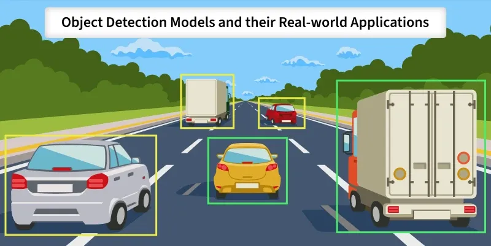

# 🤖 Computer Vision & AI cho AIoT


*🖼️ Tìm kiếm: "computer vision object detection YOLO" - AI nhận diện vật thể*

{{youtube:QtsI0TnwDZs|Computer Vision Explained}}

*🎥 Video: "Computer Vision Explained" - Thị giác máy tính là gì*

## Giới thiệu

**AI cho phần cứng = Computer Vision (Thị giác máy tính)**

AI là **trí thông minh** giúp hệ thống tự động ra quyết định và học hỏi từ dữ liệu. Trong lĩnh vực phần cứng IoT, Computer Vision là ứng dụng chính của AI.

---

## 💡 Triết lý học AI thực tế

### Sự thật về AI hiện nay:

✅ **Models có sẵn:** YOLOv8, YOLOv10, ResNet, MobileNet đều có sẵn  
✅ **Thuật toán có sẵn:** Không cần viết lại CNN từ đầu  
✅ **Platform có sẵn:** Roboflow, Edge Impulse - chỉ cần upload data  
✅ **Transfer Learning:** Dùng pre-trained model, fine-tune

### Thực tế công việc AI Engineer:

📊 **80% thời gian:** Gán nhãn dữ liệu (labeling data)  
🔧 **15% thời gian:** Training, fine-tuning, testing  
💻 **5% thời gian:** Deploy và optimize

### Công thức thành công:

**Dữ liệu nhiều + Dữ liệu chuẩn + Model tham số nhiều = Độ chính xác cao**

**Trade-off:**
- Model lớn → Accuracy cao → Cần hardware mạnh → Đắt
- Model nhỏ → Accuracy thấp → Hardware yếu → Rẻ

**Công việc thực tế:** Cân nhắc **Accuracy vs Hardware Cost**

---

## 📚 Kiến thức cần học

### 1. Python Foundation

#### NumPy - Arrays và operations
```python
import numpy as np
arr = np.array([1, 2, 3, 4, 5])
mean = np.mean(arr)
```

#### Pandas - Data manipulation
```python
import pandas as pd
df = pd.read_csv('sensor_data.csv')
temperature_mean = df['temperature'].mean()
```

#### Matplotlib - Visualization
```python
import matplotlib.pyplot as plt
plt.plot(df['time'], df['temperature'])
plt.show()
```

---

### 2. Machine Learning Basics

{{youtube:7eh4d6sabA0|Machine Learning Basics}}

*🎥 Video: "Machine Learning for Beginners" - ML cho người mới bắt đầu*

#### Scikit-learn

**Linear Regression:**
```python
from sklearn.linear_model import LinearRegression
model = LinearRegression()
model.fit(X_train, y_train)
predictions = model.predict(X_test)
```

**Classification:**
- Decision Tree
- Random Forest
- SVM
- KNN

**Metrics:**
- Accuracy
- Precision
- Recall
- F1-score
- Confusion Matrix

---

### 3. Deep Learning

{{youtube:aircAruvnKk|Neural Networks}}

*🎥 Video: "But what is a Neural Network?" - Giải thích Neural Network*

#### Neural Networks

**Architecture:**
```
Input Layer → Hidden Layers → Output Layer
```

**Activation Functions:**
- **ReLU:** f(x) = max(0, x) - Phổ biến nhất
- **Sigmoid:** f(x) = 1/(1+e^-x) - Binary classification
- **Softmax:** Multi-class classification

**Loss Functions:**
- **Binary Cross-Entropy:** Binary classification
- **Categorical Cross-Entropy:** Multi-class
- **MSE (Mean Squared Error):** Regression

**Optimizers:**
- **SGD:** Stochastic Gradient Descent
- **Adam:** Adaptive Moment Estimation - Phổ biến nhất
- **RMSprop**

#### Convolutional Neural Networks (CNN)

**Layers:**
- **Convolution:** Extract features
- **Pooling:** Reduce dimensions
- **Fully Connected:** Classification

**Popular Architectures:**
- LeNet
- AlexNet
- VGGNet
- ResNet
- MobileNet
- EfficientNet

---

### 4. Computer Vision

#### OpenCV

**Basic Operations:**
```python
import cv2

# Read image
img = cv2.imread('image.jpg')

# Convert color
gray = cv2.cvtColor(img, cv2.COLOR_BGR2GRAY)

# Resize
resized = cv2.resize(img, (640, 480))

# Edge detection
edges = cv2.Canny(gray, 50, 150)

# Show
cv2.imshow('Image', img)
cv2.waitKey(0)
```

**Color Spaces:**
- **RGB:** Red, Green, Blue
- **BGR:** OpenCV default
- **HSV:** Hue, Saturation, Value - Tốt cho color detection
- **Grayscale:** 1 channel

#### Object Detection

**YOLO (You Only Look Once) - PHỔ BIẾN NHẤT**

**Tại sao YOLO?**
- ✅ Real-time detection (30-60 FPS)
- ✅ Single-stage detector (nhanh)
- ✅ Dễ train custom dataset
- ✅ Ultralytics library (user-friendly)

**YOLO Versions:**
- **YOLOv5:** Stable, phổ biến
- **YOLOv8:** Mới hơn, tốt hơn
- **YOLOv10:** Mới nhất, optimize

**Model Sizes:**
- **YOLOv8n (nano):** Nhỏ nhất, cho ESP32, Raspberry Pi
- **YOLOv8s (small):** Raspberry Pi 4
- **YOLOv8m (medium):** Jetson Nano
- **YOLOv8l (large):** Desktop GPU
- **YOLOv8x (xlarge):** Accuracy cao nhất

**Training YOLOv8:**
```python
from ultralytics import YOLO

# Load pre-trained model
model = YOLO('yolov8n.pt')

# Train
model.train(
    data='data.yaml',
    epochs=100,
    imgsz=640,
    batch=16
)

# Inference
results = model('image.jpg')
```

**Other Detectors:**
- **SSD (Single Shot Detector):** Nhanh nhưng accuracy thấp
- **Faster R-CNN:** Accuracy cao nhưng chậm

#### Image Classification

**Transfer Learning:**
```python
from tensorflow.keras.applications import MobileNetV2
from tensorflow.keras.layers import Dense, GlobalAveragePooling2D
from tensorflow.keras.models import Model

# Load pre-trained model
base_model = MobileNetV2(
    weights='imagenet',
    include_top=False,
    input_shape=(224, 224, 3)
)

# Freeze base model
base_model.trainable = False

# Add custom layers
x = base_model.output
x = GlobalAveragePooling2D()(x)
x = Dense(128, activation='relu')(x)
output = Dense(5, activation='softmax')(x)

model = Model(inputs=base_model.input, outputs=output)
```

---

### 5. Edge AI Deployment

#### TensorFlow Lite

**Model Conversion:**
```python
import tensorflow as tf

# Convert to TFLite
converter = tf.lite.TFLiteConverter.from_keras_model(model)
tflite_model = converter.convert()

# Save
with open('model.tflite', 'wb') as f:
    f.write(tflite_model)
```

**Quantization:**
```python
# INT8 quantization (giảm kích thước 4x)
converter.optimizations = [tf.lite.Optimize.DEFAULT]
converter.target_spec.supported_types = [tf.int8]
```

**Inference on Raspberry Pi:**
```python
import tflite_runtime.interpreter as tflite

interpreter = tflite.Interpreter(model_path="model.tflite")
interpreter.allocate_tensors()

input_details = interpreter.get_input_details()
output_details = interpreter.get_output_details()

interpreter.set_tensor(input_details[0]['index'], input_data)
interpreter.invoke()
output = interpreter.get_tensor(output_details[0]['index'])
```

#### Hardware Options

**Raspberry Pi 4/5**
- ✅ Giá: ~1.5-2 triệu
- ✅ YOLOv8n: 5-10 FPS
- ✅ Python, Linux
- ⚠️ Không có GPU

**NVIDIA Jetson Nano**
- ✅ GPU 128-core Maxwell
- ✅ YOLOv8s/m: 20-30 FPS
- ✅ TensorRT optimization
- ⚠️ Giá: ~3-4 triệu

**Google Coral USB Accelerator**
- ✅ Edge TPU
- ✅ 30-60 FPS
- ✅ Plug vào Raspberry Pi
- ⚠️ Chỉ chạy TFLite INT8

**ESP32-CAM**
- ✅ Siêu rẻ (~100K)
- ⚠️ Chỉ chạy model cực nhỏ
- ⚠️ Khó lập trình

---

## 🗓️ Lộ trình học chi tiết (9 tháng)

### Tháng 1-2: Python và ML cơ bản

#### Tuần 1-2: Python Foundation
- Python cú pháp: variables, loops, functions, classes
- NumPy: Arrays, operations
- Pandas: DataFrame, read CSV, data manipulation
- Matplotlib: Plotting charts
- Jupyter Notebook workflow
- **Bài tập:** Analyze sensor data từ CSV file

#### Tuần 3-4: Traditional Machine Learning
- Scikit-learn library
- Linear Regression: Predict temperature
- Classification: Decision Tree, Random Forest
- Train/Test split, Cross-validation
- Metrics: Accuracy, Precision, Recall, F1
- **Dự án:** Predict equipment failure từ sensor data

#### Tuần 5-6: OpenCV cơ bản
- `cv2.imread()`, `cv2.imshow()`, `cv2.imwrite()`
- Color spaces: RGB, BGR, HSV, Grayscale
- Resize, crop, rotate images
- Thresholding, edge detection (Canny)
- Contour detection
- **Dự án:** Detect color objects (red ball, blue box)

#### Tuần 7-8: Neural Networks cơ bản
- Hiểu CNN architecture: Conv → Pool → FC
- Keras/TensorFlow: Sequential model
- Train MNIST (handwritten digits)
- Loss function, optimizer, metrics
- Save và load model
- **Dự án:** Train CNN phân loại 3-5 objects đơn giản

### Tháng 3-4: Deep Learning và YOLO

#### Tuần 9-10: Transfer Learning
- Pre-trained models: MobileNet, ResNet
- Fine-tuning last layers
- Data augmentation: Flip, rotate, brightness
- ImageNet dataset
- Train trên Google Colab (GPU miễn phí)
- **Dự án:** Classify 5 loại trái cây (100 images/class)

#### Tuần 11-12: Data Collection & Labeling
- Thu thập data: Camera, internet, scraping
- Labeling với **Roboflow**
- Bounding box annotation
- Train/Validation/Test split (70/20/10)
- Data augmentation trong Roboflow
- Export YOLO format
- **Thực hành:** Label 300 ảnh cho custom dataset

#### Tuần 13-14: YOLOv8 Training
- Cài Ultralytics: `pip install ultralytics`
- Load pre-trained: `YOLO('yolov8n.pt')`
- Train trên custom dataset
- `model.train(data='data.yaml', epochs=100)`
- Theo dõi: mAP, precision, recall
- Confusion matrix
- **Dự án:** Train YOLO detect 3 objects (apple, banana, orange)

#### Tuần 15-16: Model Evaluation & Optimization
- Test trên validation set
- Analyze false positives/negatives
- Tune hyperparameters: learning rate, batch size
- Augmentation strategies
- Khi nào cần thêm data?
- **Dự án:** Improve model từ 70% → 85% mAP

### Tháng 5-6: Edge AI Deployment

#### Tuần 17-18: TensorFlow Lite Conversion
- Export YOLO sang ONNX
- ONNX sang TensorFlow Lite
- Quantization: FP32 → INT8
- So sánh accuracy và speed
- Benchmark trên PC
- **Dự án:** Convert model và test inference time

#### Tuần 19-20: Raspberry Pi Setup
- Cài Raspberry Pi OS (64-bit)
- Setup camera: `libcamera`, `picamera2`
- Cài OpenCV, TFLite runtime
- Test camera: Capture và display
- Run YOLOv8 inference
- Optimize FPS (aim 5-10 FPS minimum)
- **Dự án:** Real-time detection trên Raspberry Pi

#### Tuần 21-22: AIoT Integration
- Raspberry Pi + AI + MQTT
- Detect object → Publish MQTT message
- ESP32 subscribe → Control actuator (servo, relay)
- Send detection count lên dashboard
- Store detection logs vào database
- **Dự án:** Smart trash bin (detect → sort → count)

#### Tuần 23-24: Dự án AIoT hoàn chỉnh

**Chọn 1 dự án:**

**Option 1: Smart Trash Bin**
- Raspberry Pi + Camera
- YOLOv8: Detect organic/inorganic/recycle
- ESP32: Control servo để sort
- MQTT: Communication
- Dashboard: Count mỗi loại rác
- Alert khi thùng đầy

**Option 2: Face Recognition Door Lock**
- Raspberry Pi + Camera
- Face detection + recognition
- ESP32: Control relay (electronic lock)
- MQTT: Send unlock command
- Dashboard: Log ai vào, lúc nào
- Telegram notification

**Option 3: People Counting System**
- Raspberry Pi + Camera
- YOLO detect people
- Count in/out
- Dashboard: Real-time count, historical chart
- Alert khi vượt quá capacity
- Store data in InfluxDB

**Option 4: PPE Detection (Safety)**
- Detect: Helmet, vest, gloves
- Alert khi worker không đeo PPE
- Log violations
- Dashboard: Safety compliance rate
- MQTT notification

---

## 🎯 Mục tiêu hoàn thành

Sau 9 tháng, bạn cần:
- ✅ Hiểu workflow AI: data → training → deployment
- ✅ Gán nhãn và train YOLOv8 trên custom dataset
- ✅ Deploy model lên Raspberry Pi chạy real-time
- ✅ Tích hợp AI + IoT: Detection → MQTT → Dashboard
- ✅ Hoàn thành 1 dự án AIoT full-stack

---

## 💡 Lời khuyên quan trọng

### ✅ NÊN:
- Dùng pre-trained model, tập trung vào data quality
- Dùng Google Colab GPU (miễn phí)
- Chọn model phù hợp với hardware
- Data nhiều, chuẩn, đa dạng

### ❌ ĐỪNG:
- Tốn thời gian viết thuật toán từ đầu
- Train trên CPU (mất vài ngày)
- Dùng model quá lớn cho embedded
- Ít data nhưng train nhiều epochs (overfitting)

---

## 📚 Tài nguyên học tập

### Online Courses:
- 🎓 [Fast.ai - Practical Deep Learning](https://fast.ai)
- 🎓 [Coursera - Deep Learning Specialization](https://coursera.org) - Andrew Ng
- 🎓 [Ultralytics YOLOv8 Docs](https://docs.ultralytics.com)

### YouTube Channels:
- 🎥 **Sentdex** - Python & AI
- 🎥 **Two Minute Papers** - AI research
- 🎥 **The Coding Train** - Creative coding

### Tools:
- 🛠️ [Roboflow](https://roboflow.com) - Data labeling
- 🛠️ [Google Colab](https://colab.research.google.com) - Free GPU
- 🛠️ [Edge Impulse](https://edgeimpulse.com) - Edge AI platform

### Sách:
- 📖 "Hands-On Machine Learning" - Aurélien Géron
- 📖 "Deep Learning" - Ian Goodfellow
- 📖 "TinyML" - Pete Warden

---

**Bước trước:** [← Internet of Things](../../lo-trinh-detail.html?path=content/lo-trinh-aiot/iot/index.md)

**Quay lại:** [← Lộ trình tổng quát](../../lo-trinh-detail.html?path=content/lo-trinh-aiot/tong-quat.md)
