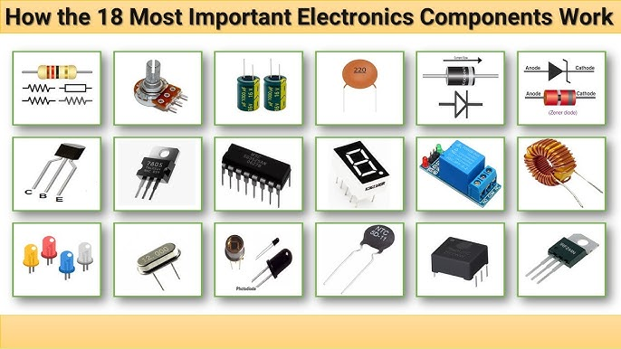

# 🔌 Điện tử cơ bản

*🖼️ Tìm kiếm: "electronic components resistor capacitor transistor" - Các linh kiện điện tử cơ bản*

{{youtube:6Maq5IyHSuc|Electronics Basics}}

*🎥 Video: "How Electronic Components Work" - Giải thích cách hoạt động của linh kiện*

## Giới thiệu

Điện tử là **nền tảng** để hiểu cách phần cứng hoạt động và giao tiếp với vi điều khiển. Không có kiến thức điện tử vững chắc, bạn sẽ gặp khó khăn khi:
- ❌ Không biết tại sao LED cháy khi không có điện trở
- ❌ Không đọc được datasheet để chọn linh kiện
- ❌ Không khắc phục được khi mạch bị lỗi
- ❌ Không thiết kế được phần cứng cho dự án

---

## 📚 Kiến thức cần học

### 1. Lý thuyết mạch điện cơ bản

#### Định luật Ohm
**V = I × R**
- **V (Voltage):** Điện áp, đơn vị Volt (V)
- **I (Current):** Dòng điện, đơn vị Ampere (A)
- **R (Resistance):** Điện trở, đơn vị Ohm (Ω)

**Ví dụ thực tế:**
- LED cần 20mA và 2V → Cần điện trở bao nhiêu nếu nguồn 5V?
- R = (5V - 2V) / 0.02A = 150Ω

#### Công suất
**P = V × I = I² × R = V² / R**
- **P (Power):** Công suất, đơn vị Watt (W)

**Ví dụ:**
- Điện trở 150Ω chạy 20mA tiêu thụ bao nhiêu công suất?
- P = I² × R = (0.02)² × 150 = 0.06W
- → Dùng điện trở 1/4W (0.25W) là đủ

#### Định luật Kirchhoff

**KCL (Kirchhoff's Current Law):**
- Tổng dòng điện vào một nút = Tổng dòng điện ra

**KVL (Kirchhoff's Voltage Law):**
- Tổng điện áp trong một vòng kín = 0

#### Mạch nối tiếp và song song

**Nối tiếp:**
- Rtotal = R1 + R2 + R3 + ...
- Dòng điện qua tất cả bằng nhau
- Điện áp chia theo tỉ lệ điện trở

**Song song:**
- 1/Rtotal = 1/R1 + 1/R2 + 1/R3 + ...
- Điện áp qua tất cả bằng nhau
- Dòng điện chia theo tỉ lệ nghịch điện trở

#### Mạch phân áp
**Vout = Vin × R2 / (R1 + R2)**

**Ứng dụng:** Đọc cảm biến analog, chia điện áp cho ADC

---

### 2. Linh kiện điện tử

#### A. Linh kiện thụ động

**Điện trở (Resistor)**
- Chức năng: Hạn chế dòng điện, phân áp
- Đọc mã màu: 4 vạch, 5 vạch
- Công suất: 1/8W, 1/4W, 1/2W, 1W, 2W
- Loại: Carbon film, metal film, wire wound
- Ứng dụng: Hạn dòng LED, pull-up/pull-down

**Tụ điện (Capacitor)**
- Chức năng: Lưu trữ năng lượng tạm, lọc nhiễu, khớp nối AC
- Loại:
  - **Ceramic:** Nhỏ, rẻ, lọc nhiễu cao tần (0.1µF, 10nF)
  - **Electrolytic:** Lớn, có cực tính, lọc nguồn (100µF, 1000µF)
  - **Tantalum:** Nhỏ gọn, ổn định, đắt tiền
- Ứng dụng: Lọc nhiễu nguồn, bypass cap, coupling

**Cuộn cảm (Inductor)**
- Chức năng: Lọc nhiễu, tích lũy năng lượng từ trường
- Ứng dụng: Buck/Boost converter, EMI filter

#### B. Linh kiện bán dẫn

**Diode**
- Chức năng: Dẫn điện một chiều
- Loại:
  - **1N4007:** Chỉnh lưu 1A, 1000V
  - **Schottky:** Forward voltage thấp (0.3V)
  - **Zener:** Ổn áp
- Ứng dụng: Chỉnh lưu AC→DC, bảo vệ cực tính

**LED (Light Emitting Diode)**
- Forward voltage: ~2V (red), ~3V (blue/white)
- Dòng điện: 5-20mA
- **Bắt buộc dùng điện trở hạn dòng!**
- Tính toán: R = (Vsource - VLED) / ILED

**Transistor NPN/PNP**
- Chức năng: Công tắc điện tử, khuếch đại
- Loại phổ biến: 2N2222, BC547, 2N3904
- 3 chân: Base (B), Collector (C), Emitter (E)
- Ứng dụng: Điều khiển relay, motor, LED công suất cao

**MOSFET**
- Chức năng: Công tắc hiệu suất cao
- Loại: N-channel (IRF540), P-channel (IRF9540)
- 3 chân: Gate (G), Drain (D), Source (S)
- Ưu điểm: Không tiêu thụ dòng Gate, chuyển mạch nhanh
- Ứng dụng: PWM motor, điều khiển tải lớn

#### C. Cảm biến (Sensors)

**LM35 - Cảm biến nhiệt độ analog**
- Output: 10mV/°C (0°C = 0V, 25°C = 0.25V)
- Nguồn: 5V
- Ứng dụng: Đo nhiệt độ chính xác

**DHT22 - Nhiệt độ & Độ ẩm digital**
- Output: Digital (1-wire protocol)
- Độ chính xác: ±0.5°C, ±2% RH
- Nguồn: 3.3V - 5V
- Ứng dụng: Weather station, smart home

**PIR (Passive Infrared) - Cảm biến chuyển động**
- Output: Digital (HIGH khi phát hiện chuyển động)
- Phạm vi: 3-7m
- Ứng dụng: Báo động, đèn tự động

**LDR (Light Dependent Resistor)**
- Điện trở thay đổi theo ánh sáng
- Tối: ~1MΩ, Sáng: ~1kΩ
- Dùng mạch phân áp để đọc
- Ứng dụng: Đèn tự động bật khi tối

**HC-SR04 - Siêu âm đo khoảng cách**
- Phạm vi: 2cm - 4m
- Độ chính xác: ±3mm
- Giao thức: Trigger pulse → Echo time
- Ứng dụng: Robot tránh vật cản, đo mức nước

#### D. Actuators (Thiết bị chấp hành)

**Relay**
- Chức năng: Công tắc điều khiển tải lớn (220V AC)
- Cuộn dây: 5V DC
- Tiếp điểm: NO (Normally Open), NC (Normally Closed), COM
- **Lưu ý:** Cần diode bảo vệ cho cuộn dây
- Ứng dụng: Điều khiển đèn, quạt, máy bơm

**Motor DC**
- Điện áp: 3V, 6V, 12V, 24V
- Điều khiển:
  - Chiều quay: H-Bridge (L298N, L293D)
  - Tốc độ: PWM
- Ứng dụng: Robot, xe điều khiển

**Servo Motor**
- Góc quay: 0-180° (standard), 0-360° (continuous)
- Điều khiển: PWM (50Hz, pulse width 1-2ms)
- Nguồn: 4.8V - 6V
- Ứng dụng: Cánh tay robot, khóa cửa

**Động cơ bước (Stepper Motor)**
- Góc bước: 1.8° (200 steps/vòng)
- Điều khiển: Step và Direction signal
- Driver: A4988, DRV8825
- Ứng dụng: Máy in 3D, CNC

---

### 3. Công cụ và kỹ năng thực hành

#### Đồng hồ vạn năng (Multimeter)
**Chức năng:**
- Đo điện áp: DC, AC
- Đo dòng điện: DC, AC
- Đo điện trở
- Test continuity (kiểm tra đoản mạch)
- Test diode

**Cách dùng:**
- Chọn chế độ đúng (V, A, Ω)
- Chọn range phù hợp
- Đo điện áp: Song song
- Đo dòng: Nối tiếp

#### Oscilloscope
**Chức năng:**
- Xem dạng sóng tín hiệu
- Đo tần số, chu kỳ, duty cycle
- Debug giao thức (UART, I2C, SPI)

#### Đọc datasheet
**Thông tin quan trọng:**
- Absolute Maximum Ratings (không được vượt quá!)
- Operating Conditions (điều kiện hoạt động bình thường)
- Pin Configuration (sơ đồ chân)
- Electrical Characteristics (thông số điện)
- Application Circuit (mạch ứng dụng mẫu)

#### Hàn mạch
**Công cụ:**
- Mỏ hàn 30-40W
- Thiếc hàn 0.8-1mm
- Dây hút thiếc / Bơm hút thiếc

**Kỹ thuật:**
- Làm nóng cả pad và chân linh kiện
- Cho thiếc chảy vào
- Rút mỏ hàn nhanh
- Chân hàn phải bóng, không thủng

#### Prototyping trên breadboard
- Dùng cho test mạch nhanh
- Không hàn, không cần PCB
- Jumper wires 22AWG
- Lưu ý: Breadboard có điện trở ký sinh

---

## 🗓️ Lộ trình học chi tiết (3 tháng)

### Tháng 1: Nền tảng lý thuyết

#### Tuần 1-2: Khái niệm điện cơ bản
- Học định luật Ohm: V = I × R
- Hiểu điện áp, dòng điện, điện trở, công suất
- Thực hành: Đo điện áp pin, đo điện trở với multimeter
- Bài tập: Tính điện trở cho LED 5V, 20mA

#### Tuần 3-4: Định luật Kirchhoff và mạch phân áp
- KCL và KVL
- Mạch nối tiếp, song song
- Công thức phân áp: Vout = Vin × R2/(R1+R2)
- Thực hành: Làm mạch phân áp với 2 điện trở
- Bài tập: Thiết kế mạch phân áp 12V → 5V

### Tháng 2: Linh kiện và thực hành

#### Tuần 5-6: Linh kiện thụ động
- Điện trở: Đọc mã màu, công suất (1/4W, 1/2W)
- Tụ điện: Ceramic, electrolytic, tantalum
- Cuộn cảm: Cách hoạt động, ứng dụng
- Thực hành: Đo các linh kiện, phân biệt loại
- Dự án mini: Mạch lọc nhiễu nguồn với tụ

#### Tuần 7-8: Linh kiện bán dẫn
- Diode: 1N4007, chỉnh lưu
- LED: Tính điện trở hạn dòng
- Transistor NPN (2N2222): Dùng như công tắc
- MOSFET (IRF540): Điều khiển tải lớn
- Thực hành: Điều khiển relay bằng transistor
- Dự án mini: Bật quạt 12V bằng transistor

### Tháng 3: Sensors, Actuators và Dự án

#### Tuần 9-10: Sensors cơ bản
- Đọc datasheet: Tìm thông số quan trọng (Vcc, output type)
- LM35: Cảm biến nhiệt độ analog
- DHT22: Digital temperature & humidity
- PIR: Motion sensor
- LDR: Light dependent resistor
- Thực hành: Đấu nối từng sensor, đo output

#### Tuần 11-12: Actuators và Dự án tổng hợp
- Relay: Điều khiển 220V AC
- Motor DC: Chiều quay, tốc độ
- Servo motor: Góc quay 0-180°
- **Dự án 1:** Đèn tự động bật khi tối (LDR + Relay)
- **Dự án 2:** Quạt tự động khi nóng (LM35 + Relay)
- **Dự án 3:** Cửa tự động (PIR + Servo)

---

## 🎯 Mục tiêu hoàn thành

Sau 3 tháng, bạn cần:
- ✅ Đọc và hiểu sơ đồ mạch điện tử
- ✅ Tính toán được giá trị linh kiện cần dùng
- ✅ Khắc phục được lỗi phần cứng cơ bản
- ✅ Tự thiết kế mạch đơn giản cho dự án
- ✅ Hoàn thành ít nhất 3 dự án thực tế

---

## 📚 Tài nguyên học tập

### YouTube Channels:
- 🎥 **GreatScott!** - Electronics basics
- 🎥 **ElectroBOOM** - Physics và electronics (hài hước)
- 🎥 **Andreas Spiess** - IoT và sensors

### Websites:
- 📘 [Electronics Tutorials](https://www.electronics-tutorials.ws)
- 📘 [All About Circuits](https://www.allaboutcircuits.com)
- 📘 [SparkFun Learn](https://learn.sparkfun.com)

### Sách nên đọc:
- 📖 "Make: Electronics" - Charles Platt
- 📖 "The Art of Electronics" - Paul Horowitz
- 📖 "Practical Electronics for Inventors" - Paul Scherz

---

**Bước tiếp theo:** [Hệ thống nhúng →](../../lo-trinh-detail.html?path=content/lo-trinh-aiot/embedded/index.md)

**Quay lại:** [← Lộ trình tổng quát](../../lo-trinh-detail.html?path=content/lo-trinh-aiot/tong-quat.md)
