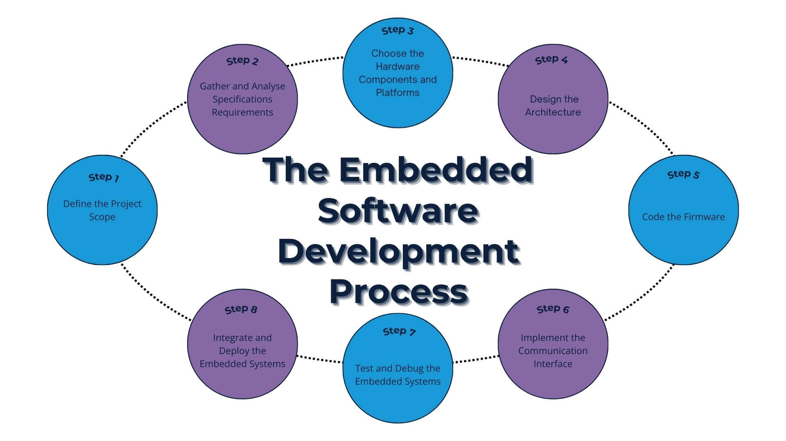

# 💻 Hệ thống nhúng (Embedded Systems)


*🖼️ Tìm kiếm: "STM32 Arduino ESP32 microcontroller boards" - Các board vi điều khiển*

{{youtube:oPn_adlC1Q0|Embedded Systems Basics}}

*🎥 Video: "What is Embedded Systems?" - Giới thiệu hệ thống nhúng cho người mới*

## Giới thiệu

Embedded Systems là **bộ não** của các thiết bị IoT, robot, ô tô, máy bay và hầu hết mọi thiết bị điện tử thông minh. Đây là nơi phần mềm gặp phần cứng!

**Embedded = Nhúng code vào chip điều khiển để điều khiển phần cứng**

---

## 📚 Kiến thức cần học

### 1. Vi điều khiển (Microcontroller - MCU)

#### Arduino (Bắt đầu cho người mới)
**Tại sao Arduino?**
- ✅ Dễ học nhất cho beginner
- ✅ Community khổng lồ, thư viện có sẵn
- ✅ Tài liệu tiếng Việt nhiều
- ✅ Hardware rẻ (~100K)

**Arduino boards:**
- **Arduino Uno:** Chuẩn nhất, ATmega328P, 16MHz
- **Arduino Nano:** Nhỏ gọn, breadboard-friendly
- **Arduino Mega:** 54 digital pins, 16 analog inputs

**Lập trình:**
- Ngôn ngữ: C/C++ đơn giản hóa
- Cấu trúc: `setup()` và `loop()`
- GPIO, PWM, ADC cơ bản
- Thư viện: Servo, Wire, SPI, SoftwareSerial

#### ESP32/ESP8266 (IoT-focused)
**Tại sao ESP32?**
- ✅ Wi-Fi + Bluetooth tích hợp sẵn
- ✅ Dual-core 240MHz (mạnh hơn Arduino nhiều)
- ✅ Giá rẻ (~100K)
- ✅ FreeRTOS built-in
- ✅ Phù hợp cho IoT

**Features:**
- WiFi 802.11 b/g/n
- Bluetooth Classic + BLE
- 34 GPIO pins
- 18 ADC channels (12-bit)
- 2 DAC channels
- Hardware PWM
- Deep Sleep mode (~10µA)

**Programming:**
- Arduino IDE (dễ)
- ESP-IDF (professional)
- MicroPython (beginner-friendly)

#### STM32 (Professional level)
**Tại sao STM32?**
- ✅ Chuẩn công nghiệp (90% công ty dùng)
- ✅ ARM Cortex-M architecture
- ✅ Hiệu suất cao, chính xác
- ✅ ADC 12-bit chính xác
- ✅ Nhiều dòng sản phẩm

**Dòng sản phẩm:**
- **STM32F1:** Entry-level, Blue Pill (~50K)
- **STM32F4:** High-performance, DSP
- **STM32L:** Low-power
- **STM32H7:** Siêu mạnh, 480MHz

**Tools:**
- **STM32CubeMX:** Graphical config
- **STM32CubeIDE:** Eclipse-based IDE
- **HAL Library:** Hardware Abstraction Layer
- **ST-Link:** Debug và flash

---

### 2. Giao thức truyền thông

{{youtube:IyGwvGzrqp8|Communication Protocols}}

*🎥 Video: "UART, SPI, I2C Explained" - Giải thích các giao thức truyền thông*

#### A. Serial Communication (Nối tiếp)

**UART (Universal Asynchronous Receiver-Transmitter)**
- **Pins:** TX (transmit), RX (receive)
- **Baud rate:** 9600, 115200, ...
- **Full-duplex:** Gửi và nhận đồng thời
- **Ứng dụng:** GPS, GSM module, debug Serial Monitor

**Ví dụ Arduino:**
```cpp
Serial.begin(9600);
Serial.println("Hello World");
```

**I2C (Inter-Integrated Circuit)**
- **Pins:** SDA (data), SCL (clock)
- **Multi-master, multi-slave**
- **Địa chỉ:** 7-bit hoặc 10-bit
- **Tốc độ:** 100kHz (standard), 400kHz (fast)
- **Ứng dụng:** OLED, RTC, BME280, MPU6050

**Devices phổ biến:**
- OLED 128x64: Địa chỉ 0x3C
- BME280: Địa chỉ 0x76 hoặc 0x77
- RTC DS3231: Địa chỉ 0x68

**SPI (Serial Peripheral Interface)**
- **Pins:** MOSI (Master Out), MISO (Master In), SCK (Clock), CS (Chip Select)
- **Full-duplex:** Nhanh nhất
- **Tốc độ:** Có thể đạt MHz
- **Ứng dụng:** SD card, NRF24L01, TFT display, Ethernet

**CAN (Controller Area Network)**
- Dùng trong ô tô, công nghiệp
- Chống nhiễu tốt
- Khoảng cách xa (40m - 1km)
- Multi-master

#### B. Wireless Communication

**WiFi**
- ESP32, ESP8266
- 2.4GHz
- Phạm vi: 50-100m
- Tiêu thụ: ~80mA active

**Bluetooth/BLE**
- Bluetooth Classic: Audio, Serial
- BLE: Low Energy, sensors
- Phạm vi: 10-100m

**LoRa**
- Long Range: 2-20km
- Low power
- Low data rate
- Dùng cho: Smart agriculture, smart city

**Zigbee**
- Mesh network
- Low power
- 2.4GHz
- Smart home devices

---

### 3. Real-Time Operating System (RTOS)

{{youtube:F321087yYy4|FreeRTOS Tutorial}}

*🎥 Video: "FreeRTOS ESP32 Tutorial" - Hướng dẫn FreeRTOS cho ESP32*

#### FreeRTOS
**Tại sao cần RTOS?**
- Chạy nhiều task đồng thời
- Priority scheduling
- Real-time response
- Memory management

**Khái niệm:**
- **Task:** Một thread độc lập
- **Queue:** Truyền data giữa tasks
- **Semaphore:** Đồng bộ giữa tasks
- **Mutex:** Bảo vệ shared resource

**Ví dụ ESP32 FreeRTOS:**
```cpp
void Task1(void *pvParameters) {
    while(1) {
        // Task 1 code
        vTaskDelay(100 / portTICK_PERIOD_MS);
    }
}

void setup() {
    xTaskCreate(Task1, "Task 1", 1000, NULL, 1, NULL);
}
```

---

### 4. Interrupt (Ngắt)

**External Interrupt:**
- Phản ứng nhanh với sự kiện bên ngoài
- Nút nhấn, sensor, pulse

**Timer Interrupt:**
- Thực hiện tác vụ định kỳ
- Chính xác về thời gian

**Quy tắc viết ISR (Interrupt Service Routine):**
- ❌ Không dùng `delay()`
- ❌ Không dùng `Serial.print()`
- ✅ Ngắn gọn, nhanh
- ✅ Chỉ set flag hoặc gửi queue

---

### 5. Timer và PWM

**Timer:**
- Đếm thời gian chính xác
- Tạo delay không block
- Measure frequency

**PWM (Pulse Width Modulation):**
- Điều khiển độ sáng LED
- Tốc độ motor
- Servo position
- Duty cycle: 0-100%

**Ví dụ:**
```cpp
analogWrite(LED_PIN, 128); // 50% duty cycle
```

---

### 6. ADC và DAC

**ADC (Analog to Digital Converter):**
- Đọc giá trị analog từ sensor
- Arduino: 10-bit (0-1023)
- ESP32: 12-bit (0-4095)
- STM32: 12-bit (0-4095)

**Voltage calculation:**
```
Voltage = (ADC_value / ADC_max) * Vref
```

**DAC (Digital to Analog Converter):**
- Tạo ra analog output
- ESP32 có 2 DAC channels
- Dùng cho: Audio, wave generation

---

### 7. Power Management

**Sleep Modes:**
- **Light Sleep:** CPU pause, peripherals on
- **Deep Sleep:** Tất cả off, chỉ RTC on
- **Modem Sleep:** WiFi off

**ESP32 Deep Sleep:**
```cpp
esp_sleep_enable_timer_wakeup(10 * 1000000); // 10s
esp_deep_sleep_start();
```

**Tiết kiệm pin:**
- Deep sleep khi không dùng
- Turn off WiFi khi không cần
- Reduce clock speed
- Optimize code

---

## 🗓️ Lộ trình học chi tiết (6 tháng)

### Tháng 1-2: Arduino - Bắt đầu với Embedded

#### Tuần 1: Hello World Embedded
- Cài đặt Arduino IDE
- Hiểu cấu trúc: `setup()` và `loop()`
- Blink LED (Hello World của embedded)
- `digitalWrite()`, `delay()`
- **Dự án:** Đèn LED nhấp nháy với pattern khác nhau

#### Tuần 2: Digital I/O
- `digitalRead()`: Đọc nút nhấn
- Pull-up resistor (internal và external)
- Debouncing: Chống dội nút nhấn
- **Dự án:** Bật/tắt LED bằng nút nhấn, toggle, long press

#### Tuần 3-4: Analog I/O và PWM
- `analogRead()`: Đọc giá trị 0-1023
- `analogWrite()`: PWM (0-255)
- Điều khiển độ sáng LED
- Đọc potentiometer, LDR
- **Dự án:** Điều khiển servo bằng potentiometer

#### Tuần 5-6: Serial Communication
- UART cơ bản: TX, RX
- `Serial.begin(9600)`
- `Serial.print()`, `Serial.println()`
- `Serial.read()`, `Serial.available()`
- **Dự án:** Điều khiển LED qua Serial Monitor

#### Tuần 7-8: Sensors và LCD
- Đọc DHT22: Temperature & Humidity
- Hiển thị lên LCD 16x2 (I2C)
- Thư viện: DHT, LiquidCrystal_I2C
- **Dự án milestone:** Weather Station mini

### Tháng 3-4: ESP32 - IoT Ready MCU

#### Tuần 9-10: Làm quen ESP32
- So sánh ESP32 vs Arduino
- Cài đặt ESP32 board trong Arduino IDE
- GPIO, ADC của ESP32
- WiFi cơ bản: `WiFi.begin()`, `WiFi.status()`
- **Dự án:** Kết nối WiFi và in IP address

#### Tuần 11-12: I2C và SPI
- I2C: `Wire.begin()`, `Wire.write()`, `Wire.read()`
- Kết nối OLED 128x64 (I2C)
- SPI: `SPI.begin()`, `SPI.transfer()`
- Kết nối SD card module (SPI)
- **Dự án:** Data logger ghi vào SD card

#### Tuần 13-14: HTTP và Web Server
- HTTP Client: GET, POST request
- Gửi data lên web API
- ESP32 làm Web Server
- Control LED từ web browser
- **Dự án:** Web-based LED control

#### Tuần 15-16: MQTT và Deep Sleep
- MQTT: Publish và Subscribe
- PubSubClient library
- Deep Sleep mode tiết kiệm pin
- Wake up từ timer, external interrupt
- **Dự án milestone:** IoT sensor node với MQTT

### Tháng 5-6: STM32 - Professional Level

#### Tuần 17-18: Setup và GPIO
- Cài đặt STM32CubeIDE
- Tạo project với CubeMX
- Clock configuration
- GPIO output: Blink LED
- GPIO input: Button với interrupt
- **Dự án:** Multiple LED patterns với buttons

#### Tuần 19-20: Timer và PWM
- Timer cơ bản: TIM2, TIM3
- Timer interrupt: `HAL_TIM_PeriodElapsedCallback()`
- PWM: `HAL_TIM_PWM_Start()`
- Điều khiển servo, motor DC với PWM
- **Dự án:** Motor controller với speed control

#### Tuần 21-22: UART, I2C, SPI với HAL
- UART: `HAL_UART_Transmit()`, `HAL_UART_Receive()`
- I2C: `HAL_I2C_Master_Transmit()`
- SPI: `HAL_SPI_TransmitReceive()`
- Interrupt mode và DMA mode
- **Dự án:** Multi-sensor system (UART + I2C + SPI)

#### Tuần 23-24: ADC, DMA và Debug
- Multi-channel ADC với DMA
- `HAL_ADC_Start_DMA()`
- Breakpoint debugging với ST-Link
- Live watch variables
- **Dự án milestone:** Data acquisition system 4 channels

### Bonus: Git và GitHub (xuyên suốt)
- Tuần 4: `git init`, `git add`, `git commit`
- Tuần 8: `git branch`, `git merge`
- Tuần 12: Push lên GitHub, tạo repository
- Tuần 16: `.gitignore`, README.md
- Tuần 20: Pull Request, code review
- Tuần 24: GitHub Actions cơ bản (optional)

---

## 🎯 Mục tiêu hoàn thành

Sau 6 tháng, bạn cần:
- ✅ Lập trình C/C++ thành thạo trên MCU
- ✅ Hiểu kiến trúc ARM Cortex-M
- ✅ Sử dụng thành thạo UART, I2C, SPI
- ✅ Debug với breakpoint và logic analyzer
- ✅ Làm việc nhóm với Git/GitHub
- ✅ Hoàn thành 3-5 dự án milestone

---

## 📚 Tài nguyên học tập

### Online Courses:
- 🎓 [Arduino Tutorial - Official](https://www.arduino.cc/en/Tutorial/HomePage)
- 🎓 [ESP32 Tutorial - Random Nerd Tutorials](https://randomnerdtutorials.com/esp32/)
- 🎓 [STM32 Tutorial - Phil's Lab](https://www.youtube.com/@PhilsLab)

### YouTube Channels:
- 🎥 **DroneBot Workshop** - Arduino, ESP32 tutorials
- 🎥 **Andreas Spiess** - ESP32, IoT projects
- 🎥 **Phil's Lab** - STM32 professional

### Sách:
- 📖 "Mastering STM32" - Carmine Noviello
- 📖 "Embedded Systems" - Jonathan Valvano
- 📖 "Making Embedded Systems" - Elecia White

---

**Bước trước:** [← Điện tử cơ bản](../../lo-trinh-detail.html?path=content/lo-trinh-aiot/dien-tu-cb/index.md)

**Bước tiếp theo:** [Internet of Things →](../../lo-trinh-detail.html?path=content/lo-trinh-aiot/iot/index.md)

**Quay lại:** [← Lộ trình tổng quát](../../lo-trinh-detail.html?path=content/lo-trinh-aiot/tong-quat.md)
