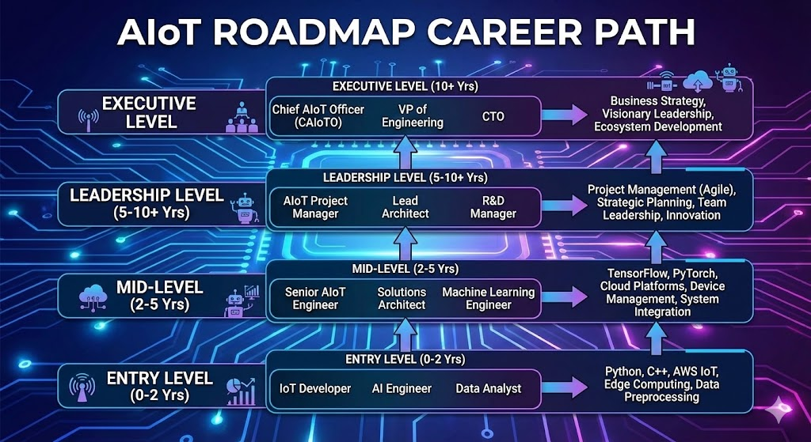

# 🚀 Lộ trình để trở thành Kỹ sư AIoT

*🖼️ Tìm kiếm: "AIoT engineer roadmap infographic" - Lộ trình kỹ sư AIoT*

{{youtube:LlhmzVL5bm8|What is IoT and AIoT}}

*🎥 Video: "IoT & AIoT Explained" - Giải thích AIoT cho người mới bắt đầu*

## 📌 Giới thiệu

**AIoT (Artificial Intelligence of Things)** là sự kết hợp hoàn hảo giữa **AI (Trí tuệ nhân tạo)** và **IoT (Internet of Things)**, tạo ra các hệ thống thông minh có khả năng tự động hóa, học hỏi và ra quyết định mà không cần sự can thiệp của con người.

Để trở thành một **Kỹ sư AIoT** chuyên nghiệp, bạn cần nắm vững **4 trụ cột chính**:

1. 🔌 **Điện tử cơ bản**
2. 💻 **Embedded Systems**
3. 🌐 **IoT (Internet of Things)**
4. 🤖 **AI & Computer Vision**

---

## 🌍 Xu hướng AIoT hiện nay

### Tại sao AIoT lại quan trọng?

Trong kỷ nguyên 4.0, việc kết hợp AI vào IoT không còn là tùy chọn mà là **bắt buộc**. Các thiết bị IoT truyền thống chỉ thu thập và gửi dữ liệu, nhưng **AIoT** đi xa hơn:

✅ **Phân tích dữ liệu thời gian thực** ngay trên thiết bị (Edge AI)  
✅ **Ra quyết định tự động** mà không cần cloud  
✅ **Học hỏi từ dữ liệu** và cải thiện hiệu suất theo thời gian  
✅ **Tiết kiệm băng thông** và giảm độ trễ

### Ứng dụng thực tế

- 🏠 **Smart Home:** Nhà thông minh tự điều chỉnh nhiệt độ, ánh sáng dựa trên thói quen người dùng
- 🏭 **Industry 4.0:** Nhà máy thông minh với robot tự động phát hiện lỗi sản phẩm
- 🚗 **Autonomous Vehicles:** Xe tự lái sử dụng AI để nhận diện và ra quyết định
- 🌾 **Smart Agriculture:** Nông nghiệp thông minh tự động tưới tiêu dựa trên AI dự đoán thời tiết
- 🏥 **Healthcare:** Thiết bị y tế thông minh theo dõi sức khỏe và cảnh báo sớm

### Thị trường AIoT

📊 **Dự báo thị trường:**
- Thị trường AIoT toàn cầu dự kiến đạt **76.3 tỷ USD vào năm 2030**
- Tốc độ tăng trưởng: **38.7% CAGR** (2023-2030)
- Nhu cầu tuyển dụng kỹ sư AIoT tăng **200%** trong 5 năm qua

---

## 🗺️ Lộ trình chi tiết

### 📍 Giai đoạn 1: Điện tử cơ bản (3-6 tháng)

Điện tử là **nền tảng** để hiểu cách phần cứng hoạt động và giao tiếp với vi điều khiển.

#### Kiến thức cần học:

**1. Lý thuyết mạch điện cơ bản**
- Định luật Ohm (V = I × R)
- Định luật Kirchhoff (KCL, KVL)
- Phân tích mạch AC/DC
- Phân cực điện áp, dòng điện

**2. Linh kiện điện tử**
- ⚡ **Linh kiện thụ động:** Điện trở, tụ điện, cuộn cảm
- 🔌 **Linh kiện bán dẫn:** Diode, transistor, MOSFET
- 🎛️ **Cảm biến:** Nhiệt độ (DHT22, DS18B20), ánh sáng (LDR), chuyển động (PIR), khoảng cách (HC-SR04)
- 🔧 **Actuators:** Relay, motor DC, servo motor, động cơ bước

**3. Công cụ và kỹ năng thực hành**
- 📐 Đọc và vẽ sơ đồ mạch (schematic)
- 🔍 Sử dụng đồng hồ vạn năng (multimeter)
- 📊 Sử dụng oscilloscope để debug
- 🔥 Hàn mạch (through-hole và SMD)
- 🖥️ Prototyping trên breadboard

#### Lộ trình chi tiết (3 tháng):

**Tháng 1: Nền tảng lý thuyết**

**Tuần 1-2: Khái niệm điện cơ bản**
- Học định luật Ohm: V = I × R
- Hiểu điện áp, dòng điện, điện trở, công suất
- Thực hành: Đo điện áp pin, đo điện trở với multimeter
- Bài tập: Tính điện trở cho LED 5V, 20mA

**Tuần 3-4: Định luật Kirchhoff và mạch phân áp**
- KCL và KVL
- Mạch nối tiếp, song song
- Công thức phân áp: Vout = Vin × R2/(R1+R2)
- Thực hành: Làm mạch phân áp với 2 điện trở
- Bài tập: Thiết kế mạch phân áp 12V → 5V

**Tháng 2: Linh kiện và thực hành**

**Tuần 5-6: Linh kiện thụ động**
- Điện trở: Đọc mã màu, công suất (1/4W, 1/2W)
- Tụ điện: Ceramic, electrolytic, tantalum
- Cuộn cảm: Cách hoạt động, ứng dụng
- Thực hành: Đo các linh kiện, phân biệt loại
- Dự án mini: Mạch lọc nhiễu nguồn với tụ

**Tuần 7-8: Linh kiện bán dẫn**
- Diode: 1N4007, chỉnh lưu
- LED: Tính điện trở hạn dòng
- Transistor NPN (2N2222): Dùng như công tắc
- MOSFET (IRF540): Điều khiển tải lớn
- Thực hành: Điều khiển relay bằng transistor
- Dự án mini: Bật quạt 12V bằng transistor

**Tháng 3: Sensors, Actuators và Dự án**

**Tuần 9-10: Sensors cơ bản**
- Đọc datasheet: Tìm thông số quan trọng (Vcc, output type)
- LM35: Cảm biến nhiệt độ analog
- DHT22: Digital temperature & humidity
- PIR: Motion sensor
- LDR: Light dependent resistor
- Thực hành: Đấu nối từng sensor, đo output

**Tuần 11-12: Actuators và Dự án tổng hợp**
- Relay: Điều khiển 220V AC
- Motor DC: Chiều quay, tốc độ
- Servo motor: Góc quay 0-180°
- Dự án 1: Đèn tự động bật khi tối (LDR + Relay)
- Dự án 2: Quạt tự động khi nóng (LM35 + Relay)
- Dự án 3: Cửa tự động (PIR + Servo)

---

### 📍 Giai đoạn 2: Embedded Systems (6-12 tháng)

Embedded Systems là **bộ não** của các thiết bị IoT, quản lý phần cứng và xử lý dữ liệu.

#### Kiến thức cần học:

**1. Vi điều khiển (Microcontroller)**

**Arduino (Bắt đầu cho người mới)**
- Arduino Uno, Nano, Mega
- Lập trình C/C++ cho Arduino
- GPIO, PWM, ADC
- Thư viện Arduino cơ bản

**ESP32/ESP8266 (IoT-focused)**
- Wi-Fi, Bluetooth tích hợp
- FreeRTOS multitasking
- Deep sleep & power management
- OTA (Over-The-Air) updates

**STM32 (Professional level)**
- ARM Cortex-M architecture
- STM32CubeMX configuration
- HAL và LL drivers
- Real-time debugging với ST-Link

**2. Giao thức truyền thông**

**Nối tiếp (Serial Communication):**
- 📡 **UART:** Giao tiếp với GPS, GSM module
- 🔗 **I2C:** Kết nối nhiều cảm biến (OLED, BME280)
- ⚡ **SPI:** Giao tiếp nhanh với SD card, NRF24L01

**Không dây (Wireless):**
- 📶 **Wi-Fi:** ESP32, ESP8266
- 🔵 **Bluetooth/BLE:** Kết nối smartphone
- 📻 **LoRa:** Truyền tải xa (Smart Agriculture)
- 🌐 **Zigbee:** Mạng mesh cho Smart Home

**3. Real-Time Operating System (RTOS)**
- FreeRTOS trên ESP32
- Task scheduling, priority
- Queue, Semaphore, Mutex
- Memory management

#### Lộ trình chi tiết (6 tháng):

**Tháng 1-2: Arduino - Bắt đầu với Embedded**

**Tuần 1: Hello World Embedded**
- Cài đặt Arduino IDE
- Hiểu cấu trúc: `setup()` và `loop()`
- Blink LED (Hello World của embedded)
- `digitalWrite()`, `delay()`
- Dự án: Đèn LED nhấp nháy với pattern khác nhau

**Tuần 2: Digital I/O**
- `digitalRead()`: Đọc nút nhấn
- Pull-up resistor (internal và external)
- Debouncing: Chống dội nút nhấn
- Dự án: Bật/tắt LED bằng nút nhấn, toggle, long press

**Tuần 3-4: Analog I/O và PWM**
- `analogRead()`: Đọc giá trị 0-1023
- `analogWrite()`: PWM (0-255)
- Điều khiển độ sáng LED
- Đọc potentiometer, LDR
- Dự án: Điều khiển servo bằng potentiometer

**Tuần 5-6: Serial Communication**
- UART cơ bản: TX, RX
- `Serial.begin(9600)`
- `Serial.print()`, `Serial.println()`
- `Serial.read()`, `Serial.available()`
- Dự án: Điều khiển LED qua Serial Monitor

**Tuần 7-8: Sensors và LCD**
- Đọc DHT22: Temperature & Humidity
- Hiển thị lên LCD 16x2 (I2C)
- Thư viện: DHT, LiquidCrystal_I2C
- **Dự án milestone:** Weather Station mini

**Tháng 3-4: ESP32 - IoT Ready MCU**

**Tuần 9-10: Làm quen ESP32**
- So sánh ESP32 vs Arduino
- Cài đặt ESP32 board trong Arduino IDE
- GPIO, ADC của ESP32
- WiFi cơ bản: `WiFi.begin()`, `WiFi.status()`
- Dự án: Kết nối WiFi và in IP address

**Tuần 11-12: I2C và SPI**
- I2C: `Wire.begin()`, `Wire.write()`, `Wire.read()`
- Kết nối OLED 128x64 (I2C)
- SPI: `SPI.begin()`, `SPI.transfer()`
- Kết nối SD card module (SPI)
- Dự án: Data logger ghi vào SD card

**Tuần 13-14: HTTP và Web Server**
- HTTP Client: GET, POST request
- Gửi data lên web API
- ESP32 làm Web Server
- Control LED từ web browser
- Dự án: Web-based LED control

**Tuần 15-16: MQTT và Deep Sleep**
- MQTT: Publish và Subscribe
- PubSubClient library
- Deep Sleep mode tiết kiệm pin
- Wake up từ timer, external interrupt
- **Dự án milestone:** IoT sensor node với MQTT

**Tháng 5-6: STM32 - Professional Level**

**Tuần 17-18: Setup và GPIO**
- Cài đặt STM32CubeIDE
- Tạo project với CubeMX
- Clock configuration
- GPIO output: Blink LED
- GPIO input: Button với interrupt
- Dự án: Multiple LED patterns với buttons

**Tuần 19-20: Timer và PWM**
- Timer cơ bản: TIM2, TIM3
- Timer interrupt: `HAL_TIM_PeriodElapsedCallback()`
- PWM: `HAL_TIM_PWM_Start()`
- Điều khiển servo, motor DC với PWM
- Dự án: Motor controller với speed control

**Tuần 21-22: UART, I2C, SPI với HAL**
- UART: `HAL_UART_Transmit()`, `HAL_UART_Receive()`
- I2C: `HAL_I2C_Master_Transmit()`
- SPI: `HAL_SPI_TransmitReceive()`
- Interrupt mode và DMA mode
- Dự án: Multi-sensor system (UART + I2C + SPI)

**Tuần 23-24: ADC, DMA và Debug**
- Multi-channel ADC với DMA
- `HAL_ADC_Start_DMA()`
- Breakpoint debugging với ST-Link
- Live watch variables
- **Dự án milestone:** Data acquisition system 4 channels

**Bonus: Git và GitHub (xuyên suốt)**
- Tuần 4: `git init`, `git add`, `git commit`
- Tuần 8: `git branch`, `git merge`
- Tuần 12: Push lên GitHub, tạo repository
- Tuần 16: `.gitignore`, README.md
- Tuần 20: Pull Request, code review
- Tuần 24: GitHub Actions cơ bản (optional)

---

### 📍 Giai đoạn 3: IoT (Internet of Things) (6-9 tháng)

IoT là **hệ thần kinh** kết nối thiết bị với Internet và cho phép điều khiển từ xa.

#### Kiến thức cần học:

**1. Giao thức IoT**

**MQTT (Message Queuing Telemetry Transport)**
- Publish/Subscribe model
- QoS (Quality of Service) levels
- MQTT broker: Mosquitto, HiveMQ
- Retain messages, Last Will and Testament

**HTTP/HTTPS RESTful API**
- GET, POST, PUT, DELETE methods
- JSON data format
- API authentication (API key, OAuth)
- Webhooks

**WebSocket**
- Real-time bidirectional communication
- Socket.io cho web dashboard

**CoAP (Constrained Application Protocol)**
- Lightweight protocol cho thiết bị low-power

**2. Cloud Platforms**

**AWS IoT Core**
- AWS IoT Device SDK
- Thing Shadow (Device Twin)
- IoT Rules Engine
- Lambda functions

**Google Cloud IoT**
- Cloud Pub/Sub
- Cloud Functions
- BigQuery cho phân tích dữ liệu

**Microsoft Azure IoT Hub**
- Device Provisioning Service
- Azure IoT Edge
- Azure Digital Twins

**Firebase (Google)**
- Realtime Database
- Firestore
- Cloud Functions
- Authentication

**ThingsBoard (Open Source)**
- Dashboard visualization
- Rule engine
- Device management

**3. Database & Data Storage**
- **Time-series DB:** InfluxDB, TimescaleDB
- **NoSQL:** MongoDB, Firebase
- **SQL:** PostgreSQL, MySQL
- **Cache:** Redis

**4. Backend Development**
- **Node.js:** Express.js server
- **Python:** Flask, FastAPI
- **Docker:** Containerization
- **API Documentation:** Swagger, Postman

#### Lộ trình chi tiết (6 tháng):

**Tháng 1: MQTT và Backend Foundation**

**Tuần 1-2: MQTT cơ bản**
- Cài đặt Mosquitto broker trên PC/Raspberry Pi
- ESP32 publish data: temperature, humidity
- Python script subscribe và print data
- QoS levels: 0, 1, 2 - khi nào dùng?
- Retained messages và Last Will
- Dự án: Temperature monitoring với MQTT

**Tuần 3-4: JavaScript/Node.js Backend**
- Cài Node.js, npm
- Express.js: Tạo REST API đơn giản
- Routes: GET, POST, PUT, DELETE
- MQTT client trong Node.js
- Nhận data từ ESP32 qua MQTT, lưu vào array
- Dự án: Backend API nhận và trả về sensor data

**Tháng 2: Linux, Database và Docker**

**Tuần 5-6: Linux cơ bản**
- Cài Ubuntu/Raspberry Pi OS
- Commands: `cd`, `ls`, `mkdir`, `rm`, `nano`
- `chmod`, `chown`: File permissions
- `systemctl`: Quản lý services
- `ssh`: Remote access
- Cron jobs: Tự động chạy script
- Dự án: Setup Mosquitto broker trên Raspberry Pi

**Tuần 7-8: Database**
- Cài đặt InfluxDB (time-series database)
- InfluxDB CLI: Create database, write, query
- ESP32 → MQTT → Node.js → InfluxDB
- Query data theo time range
- Cài MongoDB (NoSQL) - optional
- Dự án: Lưu sensor data vào InfluxDB

**Tuần 9: Docker cơ bản**
- Cài Docker và Docker Compose
- `docker run`, `docker ps`, `docker stop`
- `Dockerfile`: Build custom image
- `docker-compose.yml`: Multi-container
- Chạy Mosquitto + InfluxDB trong Docker
- Dự án: Docker stack cho IoT

**Tháng 3: Cloud Platform và Dashboard**

**Tuần 10-11: Cloud IoT Platform**
- Chọn 1 platform:
  - **ThingsBoard (khuyến khích):** Self-hosted, miễn phí
  - **AWS IoT Core:** Professional nhưng phức tạp
  - **Firebase:** Dễ nhất cho beginner
- Tạo device, generate credentials
- ESP32 kết nối lên cloud
- Publish telemetry data
- Subscribe control commands
- Dự án: ESP32 + ThingsBoard

**Tuần 12: Dashboard Building**
- ThingsBoard dashboard: Widgets, gauges, charts
- Grafana + InfluxDB (alternative)
- Panels: Time series, gauge, stat
- Variables và filters
- Alert rules: Email, Telegram notification
- Dự án: Real-time monitoring dashboard

**Tháng 4: Frontend và Dự án tổng hợp**

**Tuần 13-14: Frontend Web (React hoặc Vue)**
- HTML, CSS, JavaScript cơ bản
- React.js setup với Create React App
- Components, State, Props
- Fetch API: Gọi backend REST API
- WebSocket cho real-time update
- Dự án: Web dashboard tự code

**Tuần 15-16: Dự án tổng hợp IoT**

**Chọn 1 trong 3 hướng:**

**Option 1: Smart Home System**
- ESP32 + DHT22 + Relay + PIR
- MQTT broker (Mosquitto)
- Node.js backend + InfluxDB
- Dashboard (ThingsBoard hoặc React)
- Tính năng:
  - Hiển thị nhiệt độ, độ ẩm real-time
  - Điều khiển đèn, quạt từ dashboard
  - Alert khi phát hiện chuyển động
  - Historical data chart

**Option 2: Smart Agriculture**
- ESP32 + Soil moisture + Relay (pump)
- Tự động tưới khi đất khô
- Lịch sử độ ẩm đất
- Manual control từ dashboard
- Notification khi cần tưới

**Option 3: Environmental Monitoring**
- Multiple ESP32 nodes (3-5 locations)
- BME280: Temperature, humidity, pressure
- Tất cả gửi lên 1 broker
- Dashboard hiển thị multi-location
- So sánh data giữa các vị trí

---

### 📍 Giai đoạn 4: AI & Computer Vision (9-12 tháng)

AI là **trí thông minh** giúp hệ thống tự động ra quyết định và học hỏi từ dữ liệu.

#### Kiến thức cần học:

**1. Nền tảng AI & Machine Learning**

**Python cơ bản**
- NumPy, Pandas, Matplotlib
- Data preprocessing
- Exploratory Data Analysis (EDA)

**Machine Learning**
- Supervised Learning: Linear Regression, Decision Tree, Random Forest
- Unsupervised Learning: K-Means, PCA
- Model evaluation: Accuracy, Precision, Recall, F1-score
- Scikit-learn library

**Deep Learning**
- Neural Networks cơ bản
- Activation functions: ReLU, Sigmoid, Softmax
- Backpropagation & Gradient Descent
- Overfitting & Regularization (Dropout, L2)

**2. Computer Vision**

**Image Processing (OpenCV)**
- Image filtering, thresholding
- Edge detection (Canny, Sobel)
- Contour detection
- Color space conversion (RGB, HSV, Grayscale)

**Deep Learning cho Computer Vision**

**Convolutional Neural Networks (CNN)**
- Convolution, Pooling layers
- CNN architectures: LeNet, AlexNet, VGGNet

**Object Detection**
- 🎯 **YOLO (You Only Look Once):** YOLOv5, YOLOv8, YOLOv10
- 🔍 **SSD (Single Shot Detector)**
- 📦 **Faster R-CNN**

**Image Classification**
- ResNet, MobileNet, EfficientNet
- Transfer Learning
- Fine-tuning pre-trained models

**Frameworks & Tools**
- **TensorFlow/Keras:** Training và deployment
- **PyTorch:** Research và prototyping
- **Ultralytics:** YOLOv8/v10 training
- **Roboflow:** Dataset labeling và augmentation
- **Google Colab:** GPU training miễn phí

**3. Edge AI (AI trên thiết bị nhúng)**

**Model Optimization**
- **Quantization:** Giảm kích thước model (INT8, FP16)
- **Pruning:** Loại bỏ weights không quan trọng
- **Knowledge Distillation:** Chuyển knowledge từ model lớn sang nhỏ

**Edge AI Platforms**
- **TensorFlow Lite:** Deploy trên mobile và embedded
- **ONNX Runtime:** Cross-platform inference
- **OpenVINO:** Intel optimization
- **Edge Impulse:** End-to-end Edge AI platform

**Hardware cho Edge AI**
- 🍓 **Raspberry Pi 4/5:** Computer vision projects
- 🎥 **ESP32-CAM:** Low-cost camera module
- 🚀 **Google Coral:** Edge TPU cho inference nhanh
- 🤖 **NVIDIA Jetson Nano:** Powerful edge AI
- 📱 **Arduino Portenta H7:** AI on Arduino

**4. AI cho IoT**
- Predictive Maintenance
- Anomaly Detection
- Time-series forecasting (LSTM, GRU)
- Natural Language Processing (Voice Assistant)

#### Lộ trình chi tiết (9 tháng):

**Tháng 1-2: Python và Machine Learning cơ bản**

**Tuần 1-2: Python Foundation**
- Python cú pháp: variables, loops, functions, classes
- NumPy: Arrays, operations
- Pandas: DataFrame, read CSV, data manipulation
- Matplotlib: Plotting charts
- Jupyter Notebook workflow
- Bài tập: Analyze sensor data từ CSV file

**Tuần 3-4: Traditional Machine Learning**
- Scikit-learn library
- Linear Regression: Predict temperature
- Classification: Decision Tree, Random Forest
- Train/Test split, Cross-validation
- Metrics: Accuracy, Precision, Recall, F1
- Dự án: Predict equipment failure từ sensor data

**Tuần 5-6: OpenCV cơ bản**
- `cv2.imread()`, `cv2.imshow()`, `cv2.imwrite()`
- Color spaces: RGB, BGR, HSV, Grayscale
- Resize, crop, rotate images
- Thresholding, edge detection (Canny)
- Contour detection
- Dự án: Detect color objects (red ball, blue box)

**Tuần 7-8: Neural Networks cơ bản**
- Hiểu CNN architecture: Conv → Pool → FC
- Keras/TensorFlow: Sequential model
- Train MNIST (handwritten digits)
- Loss function, optimizer, metrics
- Save và load model
- Dự án: Train CNN phân loại 3-5 objects đơn giản

**Tháng 3-4: Deep Learning và YOLO**

**Tuần 9-10: Transfer Learning**
- Pre-trained models: MobileNet, ResNet
- Fine-tuning last layers
- Data augmentation: Flip, rotate, brightness
- ImageNet dataset
- Train trên Google Colab (GPU miễn phí)
- Dự án: Classify 5 loại trái cây (100 images/class)

**Tuần 11-12: Data Collection & Labeling**
- Thu thập data: Camera, internet, scraping
- Labeling với Roboflow
- Bounding box annotation
- Train/Validation/Test split (70/20/10)
- Data augmentation trong Roboflow
- Export YOLO format
- Thực hành: Label 300 ảnh cho custom dataset

**Tuần 13-14: YOLOv8 Training**
- Cài Ultralytics: `pip install ultralytics`
- Load pre-trained: `YOLO('yolov8n.pt')`
- Train trên custom dataset
- `model.train(data='data.yaml', epochs=100)`
- Theo dõi: mAP, precision, recall
- Confusion matrix
- Dự án: Train YOLO detect 3 objects (apple, banana, orange)

**Tuần 15-16: Model Evaluation & Optimization**
- Test trên validation set
- Analyze false positives/negatives
- Tune hyperparameters: learning rate, batch size
- Augmentation strategies
- Khi nào cần thêm data?
- Dự án: Improve model từ 70% → 85% mAP

**Tháng 5-6: Edge AI Deployment**

**Tuần 17-18: TensorFlow Lite Conversion**
- Export YOLO sang ONNX
- ONNX sang TensorFlow Lite
- Quantization: FP32 → INT8
- So sánh accuracy và speed
- Benchmark trên PC
- Dự án: Convert model và test inference time

**Tuần 19-20: Raspberry Pi Setup**
- Cài Raspberry Pi OS (64-bit)
- Setup camera: `libcamera`, `picamera2`
- Cài OpenCV, TFLite runtime
- Test camera: Capture và display
- Run YOLOv8 inference
- Optimize FPS (aim 5-10 FPS minimum)
- Dự án: Real-time detection trên Raspberry Pi

**Tuần 21-22: AIoT Integration**
- Raspberry Pi + AI + MQTT
- Detect object → Publish MQTT message
- ESP32 subscribe → Control actuator (servo, relay)
- Send detection count lên dashboard
- Store detection logs vào database
- Dự án: Smart trash bin (detect → sort → count)

**Tuần 23-24: Dự án AIoT hoàn chỉnh**

**Chọn 1 dự án:**

**Option 1: Smart Trash Bin**
- Raspberry Pi + Camera
- YOLOv8: Detect organic/inorganic/recycle
- ESP32: Control servo để sort
- MQTT: Communication
- Dashboard: Count mỗi loại rác
- Alert khi thùng đầy

**Option 2: Face Recognition Door Lock**
- Raspberry Pi + Camera
- Face detection + recognition
- ESP32: Control relay (electronic lock)
- MQTT: Send unlock command
- Dashboard: Log ai vào, lúc nào
- Telegram notification

**Option 3: People Counting System**
- Raspberry Pi + Camera
- YOLO detect people
- Count in/out
- Dashboard: Real-time count, historical chart
- Alert khi vượt quá capacity
- Store data in InfluxDB

**Option 4: PPE Detection (Safety)**
- Detect: Helmet, vest, gloves
- Alert khi worker không đeo PPE
- Log violations
- Dashboard: Safety compliance rate
- MQTT notification
- Transfer Learning
- Fine-tuning pre-trained models

**Frameworks & Tools**
- **TensorFlow/Keras:** Training và deployment
- **PyTorch:** Research và prototyping
- **Ultralytics:** YOLOv8/v10 training
- **Roboflow:** Dataset labeling và augmentation
- **Google Colab:** GPU training miễn phí

**3. Edge AI (AI trên thiết bị nhúng)**

**Model Optimization**
- **Quantization:** Giảm kích thước model (INT8, FP16)
- **Pruning:** Loại bỏ weights không quan trọng
- **Knowledge Distillation:** Chuyển knowledge từ model lớn sang nhỏ

**Edge AI Platforms**
- **TensorFlow Lite:** Deploy trên mobile và embedded
- **ONNX Runtime:** Cross-platform inference
- **OpenVINO:** Intel optimization
- **Edge Impulse:** End-to-end Edge AI platform

**Hardware cho Edge AI**
- 🍓 **Raspberry Pi 4/5:** Computer vision projects
- 🎥 **ESP32-CAM:** Low-cost camera module
- 🚀 **Google Coral:** Edge TPU cho inference nhanh
- 🤖 **NVIDIA Jetson Nano:** Powerful edge AI
- 📱 **Arduino Portenta H7:** AI on Arduino

**4. AI cho IoT**
- Predictive Maintenance
- Anomaly Detection
- Time-series forecasting (LSTM, GRU)
- Natural Language Processing (Voice Assistant)

#### Phương hướng thực hành:

**Mục tiêu:** Từ zero đến deploy AI model trên embedded device

**Roadmap học AI cho embedded (quan trọng: học theo thứ tự):**

**Phase 1: Python & ML Foundation (Tháng 1-3)**
- **Tuần 1-4:** Python cơ bản + NumPy, Pandas
- **Tuần 5-8:** Machine Learning với Scikit-learn
  - Làm 1 bài toán classification đơn giản (Iris dataset)
  - Hiểu train/test split, accuracy, confusion matrix
- **Tuần 9-12:** Image Processing với OpenCV
  - Đọc, resize, filter ảnh
  - Color space conversion, edge detection
  - **Mini project:** Phát hiện màu sắc hoặc shape

**Phase 2: Deep Learning & Computer Vision (Tháng 4-6)**
- **Tháng 4:** Neural Networks cơ bản với Keras
  - Hiểu cách CNN hoạt động
  - Train MNIST (số viết tay) để hiểu training pipeline
- **Tháng 5:** Transfer Learning với pre-trained model
  - Dùng MobileNet/ResNet để classify custom dataset
  - Dataset nhỏ (100-200 ảnh) là đủ
  - **Project:** Phân loại 3-5 objects (apple, banana, orange)
- **Tháng 6:** Object Detection với YOLO
  - Dùng YOLOv8 để detect objects
  - Học cách label data với Roboflow
  - Train custom dataset trên Google Colab
  - **Project:** Detect 2-3 objects đơn giản

**Phase 3: Edge AI Deployment (Tháng 7-9)**
- **Tháng 7:** TensorFlow Lite conversion
  - Convert trained model sang .tflite
  - Quantization để giảm kích thước
  - Test inference speed
- **Tháng 8:** Deploy trên Raspberry Pi
  - Setup camera module
  - Run inference realtime
  - Optimize FPS (aim for 5-10 FPS)
- **Tháng 9:** Edge AI với ESP32-CAM (optional)
  - Deploy model siêu nhỏ trên ESP32
  - Hiểu giới hạn của low-power device

**Dự án cuối kỳ (chọn 1, phù hợp level):**

**Level 1 (Beginner):** Phân loại đối tượng
- Detect 3-5 loại objects đơn giản
- Raspberry Pi + Camera
- Display result trên LCD/OLED

**Level 2 (Intermediate):** Smart system với action
- Face Recognition Door Lock
- Hoặc: Phân loại rác + servo đẩy rác vào ngăn đúng
- Raspberry Pi + Servo/Relay

**Level 3 (Advanced):** AIoT integration
- Object detection + IoT cloud
- Send alert khi detect object cụ thể
- Dashboard hiển thị count và historical data
- Ví dụ: Đếm người vào/ra, detect PPE vi phạm

---

## 🔄 Lộ trình tích hợp (AIoT Complete)

### Giai đoạn cuối: Kết hợp tất cả

Sau khi nắm vững **4 trụ cột**, bạn cần **tích hợp** chúng lại để tạo ra hệ thống AIoT hoàn chỉnh.

#### Kiến trúc hệ thống AIoT chuẩn:

**[Sensors] → [MCU/Embedded] → [Edge AI] → [IoT Gateway] → [Cloud AI] → [Dashboard]**

Ứng với các lớp: **Điện tử → Embedded → AI (Edge) → IoT → AI (Cloud)**

#### Kỹ năng cần có:

1. **System Design:** Thiết kế kiến trúc hệ thống AIoT end-to-end
2. **Power Management:** Tối ưu tiêu thụ điện năng cho thiết bị IoT
3. **Security:** Bảo mật dữ liệu và thiết bị IoT
4. **OTA Updates:** Cập nhật firmware từ xa
5. **DevOps:** CI/CD cho embedded và cloud

#### Dự án tổng hợp AIoT:

### 🏆 Dự án 1: Smart Home AIoT System

**Mô tả:** Hệ thống nhà thông minh với AI phân tích hành vi người dùng

**Công nghệ:**
- **Điện tử:** Cảm biến nhiệt độ, độ ẩm, ánh sáng, PIR, relay
- **Embedded:** ESP32 điều khiển thiết bị, FreeRTOS multitasking
- **IoT:** MQTT giao tiếp với cloud, Web dashboard realtime
- **AI:** 
  - AI dự đoán thời điểm người dùng về nhà (LSTM)
  - Computer Vision nhận diện người qua camera
  - Voice Assistant điều khiển bằng giọng nói

**Tính năng:**
- ✅ Tự động bật/tắt đèn khi phát hiện chuyển động
- ✅ Điều chỉnh nhiệt độ dựa trên thói quen người dùng
- ✅ Nhận diện khuôn mặt để mở khóa cửa
- ✅ Cảnh báo qua Telegram khi phát hiện người lạ
- ✅ Dashboard hiển thị dữ liệu realtime

---

### 🏆 Dự án 2: Smart Agriculture với AIoT

**Mô tả:** Hệ thống nông nghiệp thông minh tự động tưới tiêu và phát hiện bệnh cây

**Công nghệ:**
- **Điện tử:** Cảm biến độ ẩm đất, nhiệt độ, ánh sáng, van điện từ
- **Embedded:** STM32 + LoRa module cho truyền tải xa
- **IoT:** ThingsBoard dashboard, MQTT broker
- **AI:** 
  - AI dự đoán nhu cầu nước (Random Forest)
  - Computer Vision phát hiện bệnh cây (YOLOv8)
  - Time-series forecasting thời tiết (LSTM)

**Tính năng:**
- ✅ Tự động tưới tiêu dựa trên độ ẩm đất và thời tiết
- ✅ Phát hiện sớm bệnh cây qua hình ảnh lá
- ✅ Dự báo năng suất dựa trên dữ liệu lịch sử
- ✅ Cảnh báo khi có sâu bệnh
- ✅ Dashboard phân tích chi tiết

---

### 🏆 Dự án 3: Industrial AIoT - Quality Control

**Mô tả:** Hệ thống kiểm tra chất lượng sản phẩm tự động bằng AI

**Công nghệ:**
- **Điện tử:** Conveyor belt control, reject mechanism
- **Embedded:** Raspberry Pi 4 + ESP32
- **IoT:** AWS IoT Core, S3 storage
- **AI:** 
  - Defect Detection (YOLOv10)
  - Anomaly Detection (Autoencoder)
  - Predictive Maintenance (LSTM)

**Tính năng:**
- ✅ Nhận diện lỗi sản phẩm với độ chính xác >95%
- ✅ Tự động loại bỏ sản phẩm lỗi
- ✅ Dự đoán khi máy móc cần bảo trì
- ✅ Thống kê số lượng lỗi theo thời gian
- ✅ Alert tự động khi tỷ lệ lỗi vượt ngưỡng

---

## 📚 Tài nguyên học tập

### Sách nên đọc:

**Điện tử & Embedded:**
- 📖 "The Art of Electronics" - Paul Horowitz
- 📖 "Embedded Systems: Introduction to ARM Cortex-M Microcontrollers" - Jonathan Valvano
- 📖 "Making Embedded Systems" - Elecia White

**IoT:**
- 📖 "Internet of Things: A Hands-On Approach" - Arshdeep Bahga
- 📖 "Designing Connected Products" - Claire Rowland

**AI & Computer Vision:**
- 📖 "Hands-On Machine Learning with Scikit-Learn, Keras, and TensorFlow" - Aurélien Géron
- 📖 "Deep Learning for Computer Vision" - Rajalingappaa Shanmugamani
- 📖 "TinyML" - Pete Warden, Daniel Situnayake

### Online Courses:

**Embedded Systems:**
- Udemy: "Mastering Microcontroller with Embedded Driver Development"
- Coursera: "Introduction to Embedded Systems" - UC Irvine

**IoT:**
- Coursera: "An Introduction to Programming the Internet of Things (IoT)" - UC Irvine
- edX: "Internet of Things" - Microsoft

**AI & Deep Learning:**
- Coursera: "Deep Learning Specialization" - Andrew Ng
- Fast.ai: "Practical Deep Learning for Coders"
- Ultralytics: "YOLOv8 Training Tutorial"

### YouTube Channels:

- 🎥 **Andreas Spiess** - IoT projects and tutorials
- 🎥 **GreatScott!** - Electronics basics
- 🎥 **Sentdex** - Python & AI tutorials
- 🎥 **DroneBot Workshop** - Arduino, ESP32, IoT
- 🎥 **The Coding Train** - Creative coding & AI

### Community & Forums:

- 💬 **Reddit:** r/embedded, r/arduino, r/esp32, r/MachineLearning
- 💬 **Stack Overflow:** Hỏi đáp kỹ thuật
- 💬 **Discord:** IoT Vietnam, Arduino Community
- 💬 **GitHub:** Tham gia open-source projects

---

## ⏱️ Timeline tổng hợp

- **Tháng 1-6:** 🔌 Điện tử cơ bản
- **Tháng 7-12:** 💻 Embedded Systems
- **Tháng 13-18:** 🌐 IoT (Internet of Things)
- **Tháng 19-24:** 🤖 AI & Computer Vision
- **Tháng 25+:** 🔄 Tích hợp AIoT & Dự án thực tế

**Tổng thời gian:** 24-30 tháng (2-2.5 năm) để trở thành **AIoT Engineer** chuyên nghiệp

---

## 💡 Lời khuyên

### Cho người mới bắt đầu:

1. ✅ **Học từng bước, đừng vội:** Nền tảng vững chắc quan trọng hơn học nhanh
2. ✅ **Practice > Theory:** 80% thời gian làm dự án thực tế
3. ✅ **Start small, scale up:** Bắt đầu từ Arduino, sau đó chuyển sang ESP32, STM32
4. ✅ **Build projects, not just code:** Mỗi giai đoạn phải có 3-5 dự án hoàn chỉnh
5. ✅ **Join communities:** Tham gia group, forum để học hỏi từ người khác
6. ✅ **Document your work:** Viết blog, làm video chia sẻ kiến thức

### Những sai lầm thường gặp:

❌ **Học quá nhiều thứ cùng lúc** → Tập trung vào 1 skill mỗi lần  
❌ **Chỉ học theory không làm project** → 1 dự án = 10 bài tutorial  
❌ **Copy-paste code mà không hiểu** → Debug code để hiểu rõ  
❌ **Không biết debug** → Debug là kỹ năng quan trọng nhất  
❌ **Bỏ qua việc đọc datasheet** → Datasheet là tài liệu quan trọng nhất

---

## 🎯 Lời kết

Trở thành **Kỹ sư AIoT** không phải là một hành trình dễ dàng, nhưng nó **hoàn toàn khả thi** nếu bạn:

- 🔥 **Kiên trì** học hỏi mỗi ngày
- 💪 **Thực hành** bằng các dự án thực tế
- 🤝 **Chia sẻ** kiến thức với cộng đồng
- 📈 **Cải thiện** liên tục

> "Công nghệ không phải để thay thế con người, mà để giúp con người sống tốt hơn."

**AIoT** là tương lai, và **bạn** có thể là một phần của nó! 🚀

---

*Bài viết được viết bởi: Hồ Đặng Hữu Đoan - AIoT Engineer*  
*Cập nhật: 25/12/2025*
