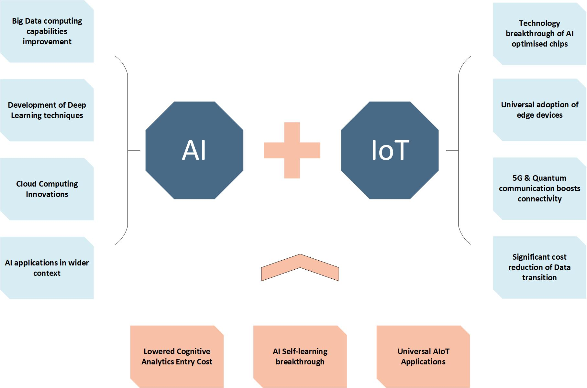

# 🗺️ Lộ trình để trở thành Kỹ sư AIoT


*🖼️ Tìm kiếm: "embedded systems IoT AI learning path" - Lộ trình học AIoT*

{{youtube:h0gWfVCSGQQ|IoT Full Course}}

*🎥 Video: "IoT Full Course for Beginners" - Khóa học IoT đầy đủ*

## 🎯 Triết lý học AIoT

Để trở thành **Kỹ sư AIoT**, bạn không chỉ cần biết code mà còn phải **hiểu phần cứng**, **biết khắc phục sự cố**, và **thiết kế hệ thống phù hợp** với mục đích công việc.

**AIoT** không phải là 4 mảng riêng biệt mà là sự kết hợp:
- **Điện tử** = Nền tảng phần cứng
- **Embedded** = Não bộ điều khiển  
- **IoT** = Embedded + Internet
- **AI** = Computer Vision trên phần cứng

---

## 🎯 Lộ trình tổng quát

```
Điện tử cơ bản (Phần cứng)
         ↓
Lập trình nhúng (Embedded)
         ↓
Internet of Things (IoT = Embedded + Internet)
         ↓
AI & Computer Vision (AI trên phần cứng)
```

---

## � Giai đoạn 1: Điện tử cơ bản

### Tại sao phải học điện tử?

**Để code trên phần cứng, ta phải hiểu phần cứng!**

Nếu không hiểu điện tử:
- ❌ Không biết tại sao LED cháy khi không có điện trở
- ❌ Không đọc được datasheet để chọn linh kiện
- ❌ Không khắc phục được khi mạch bị lỗi
- ❌ Không thiết kế được phần cứng cho dự án

### Kiến thức cần học:

#### 1. Các khái niệm điện cơ bản
- **Điện áp (Voltage - V):** Hiệu điện thế, đơn vị Volt
- **Dòng điện (Current - I):** Cường độ dòng điện, đơn vị Ampere
- **Điện trở (Resistance - R):** Cản trở dòng điện, đơn vị Ohm
- **Công suất (Power - P):** Năng lượng tiêu thụ, đơn vị Watt

#### 2. Các định luật và công thức tính toán
- **Định luật Ohm:** V = I × R
- **Công suất:** P = V × I = I²×R = V²/R
- **Định luật Kirchhoff:**
  - KCL: Tổng dòng vào = Tổng dòng ra tại một nút
  - KVL: Tổng điện áp trong một vòng kín = 0
- **Mạch nối tiếp vs song song**
- **Phân áp (Voltage Divider):** Vout = Vin × R2/(R1+R2)

#### 3. Các linh kiện cơ bản

**Linh kiện thụ động:**
- **Điện trở (Resistor):** Giới hạn dòng, phân áp
- **Tụ điện (Capacitor):** Lọc nhiễu, lưu trữ năng lượng tạm
- **Cuộn cảm (Inductor):** Lọc nhiễu, Buck/Boost converter

**Linh kiện bán dẫn:**
- **Diode:** Chỉnh lưu, bảo vệ cực tính
- **LED:** Đèn báo hiệu
- **Transistor (BJT - NPN/PNP):** Công tắc điện tử, khuếch đại
- **MOSFET:** Công tắc hiện đại, hiệu suất cao
- **IC ổn áp:** LM7805, AMS1117 (tạo nguồn ổn định)

**Sensors:**
- DHT22 (nhiệt độ, độ ẩm)
- LM35 (nhiệt độ analog)
- LDR (cảm biến ánh sáng)
- PIR (chuyển động)
- HC-SR04 (khoảng cách siêu âm)

**Actuators:**
- Relay (công tắc điều khiển tải lớn)
- Motor DC
- Servo Motor
- Động cơ bước (Stepper Motor)

#### 4. Kỹ năng thực hành
- **Sử dụng đồng hồ vạn năng:** Đo điện áp, dòng, điện trở
- **Đọc datasheet:** Hiểu thông số linh kiện, sơ đồ chân
- **Hàn mạch:** Through-hole và SMD (nếu có thể)
- **Vẽ sơ đồ mạch:** Hiểu ký hiệu điện tử chuẩn
- **Prototyping trên breadboard**

### Mục tiêu:
✅ Đọc và hiểu sơ đồ mạch điện tử  
✅ Tính toán được giá trị linh kiện cần dùng  
✅ Khắc phục được lỗi phần cứng cơ bản  
✅ Tự thiết kế mạch đơn giản cho dự án

---

## 💻 Giai đoạn 2: Lập trình nhúng (Embedded Systems)

### Khái niệm:

**Embedded** = Nhúng code vào chip điều khiển để điều khiển phần cứng

Đây là bộ não của mọi thiết bị IoT, robot, ô tô, máy bay, thiết bị y tế,...

### Ngôn ngữ lập trình:

#### Ngôn ngữ chính (BẮT BUỘC):
- **C:** Ngôn ngữ phổ biến nhất trong embedded
- **C++:** Object-oriented, dùng cho Arduino và ESP32
- **Python:** MicroPython, CircuitPython cho một số board

#### Ngôn ngữ nâng cao (NÊN HỌC):
- **Assembly:** Hiểu sâu về kiến trúc CPU, tối ưu performance cực mạnh
  - Đây là **lợi thế lớn** khi debug low-level hoặc optimize critical code
  - Hiểu được register, interrupt, memory mapping

### Kiến trúc vi xử lý nên học:

#### 🎯 Đề xuất: ARM Cortex-M (STM32)

**Tại sao?**

✅ **Chuẩn công nghiệp:** 90% công ty dùng ARM Cortex-M  
✅ **Hiệu suất cao:** 32-bit, xung nhịp 72MHz - 480MHz  
✅ **Tài liệu phong phú:** Datasheet, reference manual chi tiết  
✅ **Ecosystem lớn:** STM32CubeIDE, HAL library, community mạnh  
✅ **Giá rẻ:** Blue Pill (STM32F103) chỉ ~50K VNĐ  
✅ **Nhiều dòng sản phẩm:** Từ low-power đến high-performance

**Kiến thức về OS và Kiến trúc máy tính giúp ích rất nhiều:**
- Nếu học tốt **Hệ điều hành** → hiểu ngay RTOS, scheduler, interrupt
- Nếu học tốt **Kiến trúc máy tính** → hiểu pipeline, cache, memory hierarchy

#### Các vi xử lý khác nên biết:

**ESP32 (Espressif):**
- ✅ WiFi + Bluetooth tích hợp
- ✅ Giá rẻ (~100K), dễ học với Arduino IDE
- ✅ Phù hợp cho IoT nhanh
- ⚠️ ADC không chính xác bằng STM32

**Arduino (AVR):**
- ✅ Dễ nhất cho người mới
- ✅ Community và thư viện khổng lồ
- ⚠️ 8-bit, hiệu suất thấp
- ⚠️ Không phù hợp dự án công nghiệp

**RP2040 (Raspberry Pi Pico):**
- ✅ Dual-core ARM Cortex-M0+
- ✅ PIO (Programmable I/O) độc đáo
- ✅ Giá siêu rẻ (~60K)

### Kiến thức cần có khi học vi xử lý:

#### 1. GPIO (General Purpose Input/Output)
- Digital Input: Đọc nút nhấn, sensor digital
- Digital Output: Điều khiển LED, relay
- Pull-up / Pull-down resistor
- Debouncing (chống dội nút nhấn)

#### 2. Interrupt (Ngắt)
- External Interrupt: Phản ứng nhanh với sự kiện bên ngoài
- Timer Interrupt: Thực hiện tác vụ định kỳ
- Priority và nested interrupt
- Interrupt Service Routine (ISR) - Quy tắc viết ISR ngắn gọn

#### 3. Timer/Counter
- Basic Timer: Đếm thời gian
- PWM (Pulse Width Modulation): Điều khiển độ sáng LED, tốc độ motor
- Input Capture: Đo tần số, chu kỳ tín hiệu
- Output Compare: Tạo tín hiệu có thời gian chính xác

#### 4. ADC (Analog to Digital Converter)
- Đọc giá trị analog từ cảm biến (0-3.3V → 0-4095)
- Resolution: 10-bit, 12-bit, 16-bit
- Sampling rate và conversion time
- Multi-channel ADC với DMA

#### 5. Communication Protocols (Giao thức truyền dữ liệu)

**UART (Universal Asynchronous Receiver-Transmitter):**
- Truyền nối tiếp, 2 dây: TX, RX
- Baud rate: 9600, 115200,...
- Dùng cho: GPS, GSM module, debug Serial Monitor

**I2C (Inter-Integrated Circuit):**
- 2 dây: SDA (data), SCL (clock)
- Multi-master, multi-slave
- Địa chỉ 7-bit hoặc 10-bit
- Dùng cho: OLED, RTC, sensors (BME280, MPU6050)

**SPI (Serial Peripheral Interface):**
- 4 dây: MOSI, MISO, SCK, CS
- Tốc độ cao (MHz)
- Full-duplex
- Dùng cho: SD card, NRF24L01, display TFT

**CAN (Controller Area Network):**
- Dùng trong ô tô, công nghiệp
- Chống nhiễu tốt, khoảng cách xa
- Multi-master

**USB:**
- USB HID (Human Interface Device)
- USB CDC (Virtual COM Port)

#### 6. DMA (Direct Memory Access)
- Truyền dữ liệu không qua CPU
- Tăng hiệu suất khi xử lý data lớn
- Dùng cho ADC multi-channel, UART buffer

#### 7. Power Management
- Sleep modes: Sleep, Deep Sleep, Stop
- Wake-up sources: Timer, interrupt, RTC
- Tối ưu pin cho IoT battery-powered

#### 8. Watchdog Timer
- Reset tự động nếu chương trình bị treo
- Quan trọng cho hệ thống cần độ tin cậy cao

### Công cụ lập trình:

#### Cho người mới:
**Arduino IDE:**
- ✅ Giao diện đơn giản
- ✅ Setup nhanh, không cần config phức tạp
- ✅ Thư viện có sẵn nhiều
- ⚠️ Hạn chế cho dự án phức tạp

#### Cho chuyên nghiệp:

**Visual Studio Code + Extensions:**
- ✅ IDE mạnh mẽ, gợi ý code thông minh
- ✅ Git tích hợp sẵn → làm nhóm dễ dàng
- ✅ Extensions: PlatformIO, ESP-IDF, Arduino
- ✅ Remote debug, IntelliSense

**PlatformIO (chạy trên VS Code):**
- ✅ Hỗ trợ nhiều platform: ESP32, STM32, Arduino,...
- ✅ Library manager tốt
- ✅ Unit testing

**STM32CubeIDE (cho STM32):**
- ✅ Graphical config với CubeMX
- ✅ HAL library chuẩn từ STMicro
- ✅ Debug mạnh mẽ với ST-Link

**Keil MDK (cho STM32):**
- ⚠️ Khá khó dùng cho người mới
- ⚠️ Giao diện cũ, không có gợi ý code tốt
- ⚠️ License đắt
- ❌ **Không khuyến khích** - Dùng STM32CubeIDE hoặc VS Code tốt hơn

### ⚠️ QUAN TRỌNG: Học Git và GitHub!

**Tại sao?**
- ✅ Version control: Quản lý code, rollback khi lỗi
- ✅ Collaboration: Team làm việc song song không xung đột
- ✅ Portfolio: Nhà tuyển dụng xem GitHub profile
- ✅ Backup code: Không sợ mất code

**Học gì?**
- `git init`, `git add`, `git commit`, `git push`
- Branching: `main`, `dev`, `feature branches`
- Pull Request và code review
- `.gitignore` để không đẩy file không cần thiết

### Mục tiêu:
✅ Lập trình C/C++ thành thạo trên MCU  
✅ Hiểu kiến trúc ARM Cortex-M  
✅ Sử dụng thành thạo UART, I2C, SPI  
✅ Debug với breakpoint và logic analyzer  
✅ Làm việc nhóm với Git/GitHub

---

## 🌐 Giai đoạn 3: Internet of Things (IoT)

### Khái niệm:

**IoT = Embedded + Internet**

Thiết bị, thông tin từ sensors, điều khiển actuators được kết nối Internet, đưa lên Cloud, hiển thị trên App/Web để người dùng kiểm tra và điều khiển từ xa.

### Kiến thức cần học:

#### 1. Ngôn ngữ lập trình Backend/Frontend

**JavaScript (JVS) - Khuyến khích học:**
- ✅ **Phổ biến nhất** trong web development
- ✅ **React Native:** Code một lần chạy cả iOS + Android
- ✅ **Node.js:** Backend server mạnh mẽ
- ✅ **React/Vue:** Frontend web hiện đại
- ✅ **Một ngôn ngữ làm full-stack:** Frontend + Backend + Mobile

**PHP:**
- Cũ nhưng vẫn dùng nhiều
- Hosting rẻ, dễ deploy
- WordPress, Laravel

**Python:**
- FastAPI, Flask cho backend
- Django cho full-stack
- Dễ học, syntax sạch

#### 2. Linux - QUAN TRỌNG!

**Tại sao phải học Linux?**

✅ **Server chạy Linux:** 90% server IoT, Cloud đều là Linux  
✅ **Raspberry Pi chạy Linux:** Dùng để làm gateway, edge computing  
✅ **Docker chạy tốt trên Linux**  
✅ **SSH, cron job, systemd:** Quản lý service tự động  
✅ **Chi phí thấp:** Không mất tiền license như Windows Server  
✅ **Bảo mật tốt hơn, ổn định hơn**

**Học gì?**
- Basic commands: `cd`, `ls`, `mkdir`, `rm`, `cp`, `mv`
- File permissions: `chmod`, `chown`
- Process management: `ps`, `top`, `kill`, `systemctl`
- Network: `ifconfig`, `ping`, `ssh`, `scp`
- Text editor: `nano`, `vim`
- Package manager: `apt`, `yum`
- Cron jobs cho automation

#### 3. Docker

**Tại sao cần Docker?**

✅ **Containerization:** Đóng gói app + dependencies thành một container  
✅ **Portable:** Chạy được ở đâu cũng giống nhau (dev, staging, production)  
✅ **Dễ deploy:** `docker-compose up -d` là xong  
✅ **Cô lập:** Mỗi service một container, không conflict  
✅ **Scale dễ dàng:** Tăng số container khi traffic cao

**Học gì?**
- Docker image và container
- `Dockerfile`: Build custom image
- `docker-compose.yml`: Chạy nhiều container cùng lúc
- Volume: Lưu trữ persistent data
- Network: Container giao tiếp với nhau

**Ví dụ stack IoT với Docker:**
- Container 1: Mosquitto MQTT broker
- Container 2: InfluxDB database
- Container 3: Grafana dashboard
- Container 4: Node-RED automation

#### 4. Giao thức truyền thông IoT

**MQTT (Message Queuing Telemetry Transport) - PHỔ BIẾN NHẤT:**
- ✅ Lightweight, tiết kiệm bandwidth
- ✅ Publish/Subscribe pattern
- ✅ QoS levels: 0, 1, 2
- ✅ Broker: Mosquitto, HiveMQ, EMQX
- ✅ Dùng cho: Smart home, sensors network

**HTTP/HTTPS REST API:**
- GET, POST, PUT, DELETE
- JSON payload
- Stateless
- Dùng cho: Web integration, one-time data push

**WebSocket:**
- Real-time bidirectional communication
- Low latency
- Dùng cho: Live dashboard, chat, streaming data

**CoAP (Constrained Application Protocol):**
- Giống HTTP nhưng cho thiết bị low-power
- UDP-based
- Dùng cho: Battery-powered sensors

**AMQP (Advanced Message Queuing Protocol):**
- Tin cậy cao, message queue
- RabbitMQ
- Dùng cho: Enterprise IoT

**LoRaWAN:**
- Long range (10-20km)
- Low power
- Dùng cho: Smart agriculture, smart city

**Zigbee:**
- Mesh network
- Low power
- Dùng cho: Smart home devices

**Bluetooth Low Energy (BLE):**
- Short range (10-100m)
- Very low power
- Dùng cho: Wearables, beacons

#### 5. Cloud Platforms

**AWS IoT Core:**
- Device Shadow (Digital Twin)
- Rules Engine
- Lambda functions
- Scalable, enterprise-grade

**Google Cloud IoT (Deprecated - dùng alternatives):**
- Firebase Realtime Database
- Cloud Functions
- Firestore

**Microsoft Azure IoT Hub:**
- Device management
- Azure Digital Twins
- Enterprise focus

**ThingsBoard (Open Source):**
- ✅ Miễn phí, self-hosted
- ✅ Dashboard builder
- ✅ Rule engine
- ✅ Device management

**Blynk:**
- Mobile app builder
- Dễ dùng cho hobbyist

#### 6. Database

**Time-series Database:**
- **InfluxDB:** Tốt nhất cho IoT time-series data
- **TimescaleDB:** PostgreSQL extension

**NoSQL:**
- **MongoDB:** Document-based, flexible schema
- **Firebase:** Realtime sync

**SQL:**
- **PostgreSQL:** Powerful, open source
- **MySQL:** Popular, dễ học

**Cache:**
- **Redis:** In-memory, cực nhanh cho real-time data

### Mục tiêu:
✅ Xây dựng hệ thống IoT hoàn chỉnh: Device → Cloud → Dashboard  
✅ Sử dụng thành thạo MQTT và HTTP  
✅ Deploy app lên Linux server với Docker  
✅ Tạo dashboard real-time với Grafana hoặc web app

---

## 🤖 Giai đoạn 4: AI & Computer Vision

### Quan điểm thực tế về AI trong phần cứng:

**AI cho phần cứng chủ yếu là Computer Vision (Thị giác máy tính)**

### 💡 Triết lý học AI của người đi làm thực tế:

#### Sự thật về AI hiện nay:

✅ **Models có sẵn:** YOLOv8, YOLOv10, ResNet, MobileNet,... đều có sẵn  
✅ **Thuật toán có sẵn:** Không cần viết lại CNN, transformer từ đầu  
✅ **Platform có sẵn:** Roboflow, Edge Impulse - chỉ cần upload data và train  
✅ **Transfer Learning:** Dùng pre-trained model, fine-tune trên dataset của bạn

#### Thực tế công việc AI Engineer:

📊 **80% thời gian:** Gán nhãn dữ liệu (labeling data)  
🔧 **15% thời gian:** Training, fine-tuning, testing  
💻 **5% thời gian:** Deploy và optimize

#### Công thức thành công:

```
Dữ liệu nhiều + Dữ liệu chuẩn + Model tham số nhiều = Độ chính xác cao
```

**Trade-off:**
- Model lớn → Độ chính xác cao → Cần phần cứng mạnh → Đắt tiền
- Model nhỏ → Độ chính xác thấp hơn → Chạy trên phần cứng yếu → Rẻ tiền

**Công việc thực tế:** Cân nhắc giữa **độ chính xác** vs **chi phí phần cứng**

### Kiến thức cần học:

#### 1. Thuật ngữ AI cơ bản

**Machine Learning:**
- Supervised Learning: Classification, Regression
- Unsupervised Learning: Clustering
- Reinforcement Learning

**Deep Learning:**
- Neural Networks: Input → Hidden Layers → Output
- Activation functions: ReLU, Sigmoid, Softmax
- Loss function: Cross-entropy, MSE
- Optimizer: SGD, Adam
- Backpropagation

**Computer Vision:**
- Image Classification: Ảnh này là gì?
- Object Detection: Vật gì, ở đâu trong ảnh?
- Semantic Segmentation: Phân loại từng pixel
- Instance Segmentation: Phân biệt từng object riêng lẻ

#### 2. Các models AI thường dùng cho phần cứng

**Object Detection (Phổ biến nhất trong IoT):**

**YOLO Series (You Only Look Once):**
- **YOLOv8:** Cân bằng speed và accuracy
- **YOLOv10:** Mới nhất, optimize hơn
- **YOLOv8n (nano):** Nhỏ nhất, cho embedded
- **YOLOv8s (small):** Cho Raspberry Pi
- **YOLOv8m (medium):** Cho Jetson Nano
- Real-time detection, 30-60 FPS

**SSD (Single Shot Detector):**
- Nhanh nhưng accuracy thấp hơn YOLO

**MobileNet:**
- Optimize cho mobile và embedded
- Rất nhẹ, chạy được trên smartphone

**EfficientNet:**
- Cân bằng tốt giữa size và accuracy

**Image Classification:**
- ResNet, VGG, Inception
- Transfer learning từ ImageNet

#### 3. Workflow thực tế

**Bước 1: Thu thập dữ liệu**
- Chụp ảnh/quay video objects cần detect
- Đủ ánh sáng, góc độ, background khác nhau
- Tối thiểu: 100-300 ảnh/class
- Tốt: 500-1000 ảnh/class

**Bước 2: Gán nhãn (Labeling)**
- Dùng **Roboflow**, **LabelImg**, **CVAT**
- Vẽ bounding box quanh object
- Chọn class name
- Export sang YOLO format

**Bước 3: Data Augmentation**
- Flip, rotate, brightness, crop
- Tăng số lượng data không cần chụp thêm
- Roboflow làm tự động

**Bước 4: Training**
- Dùng **Google Colab** (GPU miễn phí)
- Load pre-trained YOLOv8
- Fine-tune trên dataset của bạn
- 50-100 epochs
- Theo dõi mAP (mean Average Precision)

**Bước 5: Testing & Evaluation**
- Test trên validation set
- Kiểm tra Precision, Recall, F1-score
- Confusion matrix
- Nếu accuracy thấp → Thêm data, train thêm

**Bước 6: Export model**
- Export sang **.pt** (PyTorch)
- Convert sang **TensorFlow Lite** (.tflite) cho embedded
- Quantization để giảm kích thước

**Bước 7: Deploy lên phần cứng**
- Raspberry Pi 4/5: YOLOv8n, 10-15 FPS
- Jetson Nano: YOLOv8s/m, 20-30 FPS
- Google Coral TPU: YOLOv8n TFLite, 30-60 FPS
- ESP32-CAM: Chỉ chạy model cực nhỏ hoặc dùng Edge Impulse

#### 4. Tools & Platforms

**Data Labeling:**
- Roboflow (khuyến khích nhất)
- LabelImg
- CVAT

**Training:**
- Google Colab (GPU miễn phí)
- Kaggle Notebooks
- Ultralytics YOLOv8 CLI

**Edge AI Platforms:**
- Edge Impulse: Train và deploy end-to-end
- TensorFlow Lite
- ONNX Runtime

**Hardware:**
- Raspberry Pi 4/5 (2GB RAM trở lên)
- NVIDIA Jetson Nano (mạnh hơn nhiều)
- Google Coral USB Accelerator (TPU)
- ESP32-CAM (chỉ cho model rất nhỏ)

#### 5. Python Libraries

**Cơ bản:**
- NumPy: Xử lý array
- Pandas: Xử lý data
- Matplotlib: Visualization

**Computer Vision:**
- OpenCV: Đọc ảnh, video, preprocessing
- Pillow: Xử lý ảnh đơn giản

**Deep Learning:**
- **PyTorch:** Research, flexible
- **TensorFlow/Keras:** Production, deployment tốt
- **Ultralytics:** YOLOv8 train và inference

#### 6. Kiến thức nâng cao (Optional)

- Model optimization: Pruning, quantization
- TensorRT (NVIDIA) cho Jetson
- OpenVINO (Intel)
- Edge TPU Compiler (Google Coral)
- Custom training loop với PyTorch
- Augmentation nâng cao: Mixup, CutMix

### Dự án thực tế AIoT:

**Level 1: Basic**
- Phân loại 3-5 objects đơn giản
- Raspberry Pi + Camera + YOLOv8n
- Hiển thị kết quả lên màn hình

**Level 2: Intermediate**
- Face Recognition door lock
- Trash classification với servo
- People counting system

**Level 3: Advanced**
- Smart factory defect detection
- License plate recognition
- PPE detection (safety helmet, vest)
- Real-time tracking với MQTT + dashboard

### Lời khuyên:

❌ **ĐỪNG:** Tốn thời gian viết lại thuật toán từ đầu  
✅ **NÊN:** Dùng pre-trained model, tập trung vào data quality  

❌ **ĐỪNG:** Train trên CPU → mất vài ngày  
✅ **NÊN:** Dùng Google Colab GPU → vài giờ xong  

❌ **ĐỪNG:** Dùng model quá lớn cho embedded → FPS thấp  
✅ **NÊN:** Chọn model phù hợp với phần cứng  

❌ **ĐỪNG:** Ít data nhưng train nhiều epochs → Overfitting  
✅ **NÊN:** Data nhiều, chuẩn, đa dạng → Model generalize tốt

### Mục tiêu:
✅ Hiểu workflow AI từ data → training → deployment  
✅ Gán nhãn và train YOLOv8 trên custom dataset  
✅ Deploy model lên Raspberry Pi chạy real-time  
✅ Tích hợp AI + IoT: Detection → MQTT → Dashboard  

---

## 📊 Tổng kết

### Timeline thực tế:

- **Điện tử cơ bản:** 2-3 tháng
- **Embedded Systems:** 4-6 tháng
- **IoT:** 3-4 tháng
- **AI & Computer Vision:** 3-6 tháng

**TỔNG:** 12-18 tháng để trở thành AIoT Engineer đủ để đi làm

### Mindset quan trọng:

💡 **80% Practice, 20% Theory:** Học bằng cách làm dự án thực tế  
💡 **Đọc datasheet là quan trọng nhất:** Đừng ngại 100-200 trang PDF  
💡 **Debug là kỹ năng cốt lõi:** Biết debug = biết sửa mọi bug  
💡 **GitHub là CV của bạn:** Build portfolio với dự án có ý nghĩa  
💡 **Cộng đồng là nguồn học tập tốt:** Đừng ngại hỏi khi gặp khó khăn  

### Lộ trình tiếp theo:

1. [Điện tử cơ bản chi tiết](../../lo-trinh-detail.html?path=content/lo-trinh-aiot/dien-tu-cb/index.md)
2. [Embedded với ESP32 và STM32](../../lo-trinh-detail.html?path=content/lo-trinh-aiot/embedded/index.md)
3. [IoT Protocols và Cloud](../../lo-trinh-detail.html?path=content/lo-trinh-aiot/iot/index.md)
4. [Computer Vision thực chiến](../../lo-trinh-detail.html?path=content/lo-trinh-aiot/computer-vision/index.md)

---

**Chúc bạn thành công trên con đường AIoT! 🚀**

*Bài viết được viết bởi: Hồ Đặng Hữu Đoan - AIoT Engineer*  
*Cập nhật: 25/12/2025*
